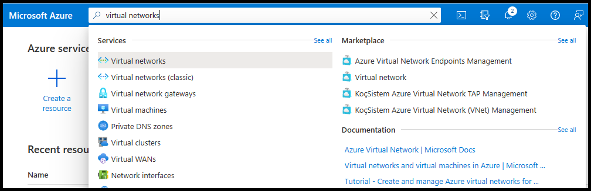
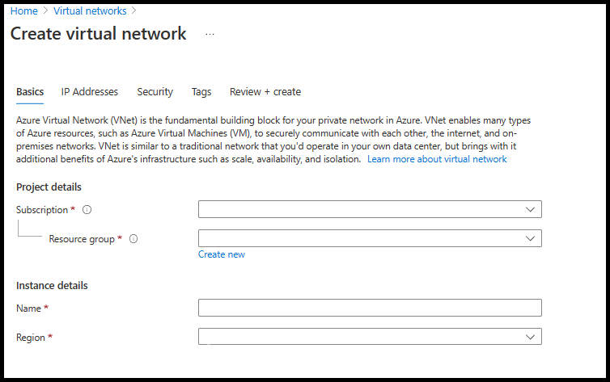
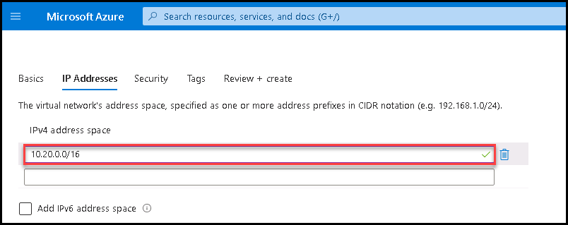
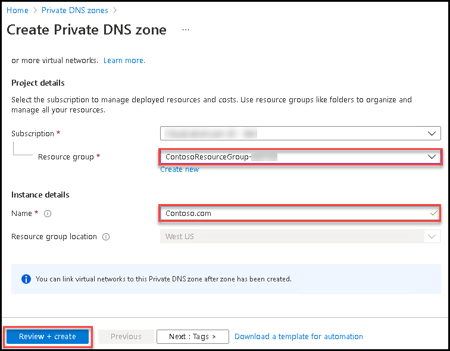
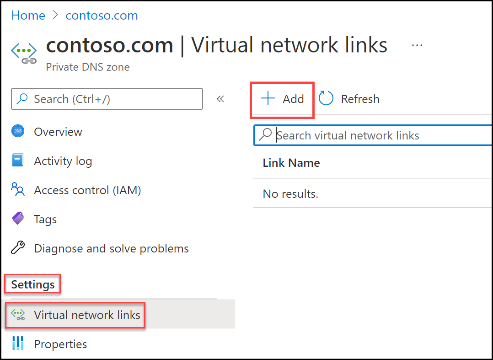
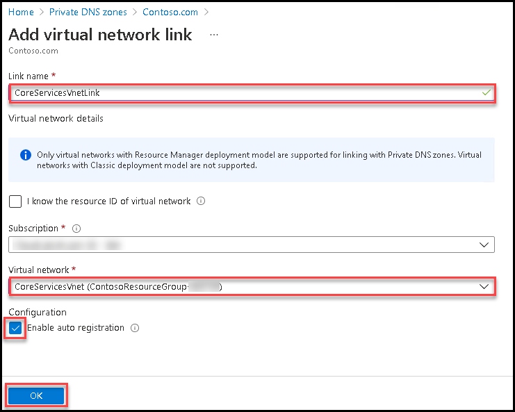
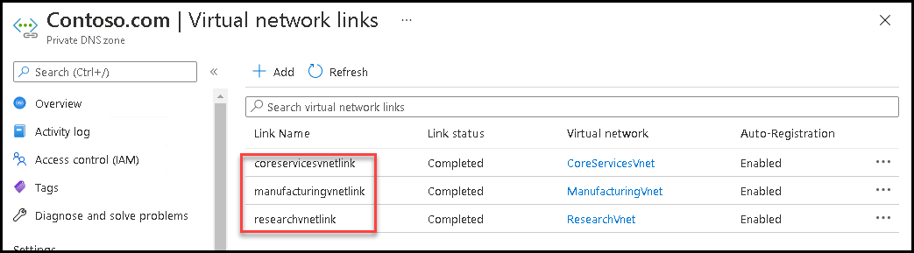

# M01 - Unit 6 Configure DNS settings in azure

## Exercise scenario 
In this unit, you will configure DNS name resolution for Contoso Ltd. You will create a private DNS zone named contoso.com, link the VNets for registration and resolution, and then create two virtual machines and test the configuration.

In this exercise, you will:

+ Task 1: Create the Contoso resource group
+ Task 2: Create the CoreServicesVnet virtual network and subnet
+ Task 3: Create the ManufacturingVnet virtual network and subnets
+ Task 4: Create the ResearchVnet virtual network and subnets
+ Task 5: Create a private DNS Zone
+ Task 6: Link subnet for auto registration
+ Task 7: Create Virtual Machines to test the configuration
+ Task 8: Verify records are present in the DNS zone
+ Task 9: Connect to the Test VMs using RDP


## Task 1: Create the Contoso resource group

1. Go to [Azure portal](https://portal.azure.com/).

2. On the home page, under **Azure services**, select **Resource groups**.  

3. In the Resource groups, select **+ Create**.

4. Use the information in the following table to create the resource group.

| **Tab**         | **Option**                                 | **Value**            |
| --------------- | ------------------------------------------ | -------------------- |
| Basics          | Resource group                             | ContosoResourceGroup-<inject key="DeploymentID" enableCopy="true"/>|
|                 | Region                                     | (US) East US         |
| Tags            | No changes required                        |                      |
| Review + create | Review your settings and select **Create** |                      |


5. In Resource groups, verify that **ContosoResourceGroup** appears in the list.


## Task 2: Create the CoreServicesVnet virtual network and subnet

1. On the Azure portal home page, navigate to the Global Search bar and search **Virtual Networks** and select virtual networks under services.  
2. Select **Create** on the Virtual networks page.  
3. Use the information in the following table to create the CoreServicesVnet virtual network.  
   ‎Remove or overwrite the default IP Address space

 

| **Tab**      | **Option**         | **Value**            |
| ------------ | ------------------ | -------------------- |
| Basics       | Resource Group     | ContosoResourceGroup-<inject key="DeploymentID" enableCopy="false"/> |
|              | Name               | CoreServicesVnet     |
|              | Region             | (US) East US         |
| IP Addresses | IPv4 address space | 10.20.0.0/16         |

 4. Use the information in the following table to create the CoreServicesVnet subnets.

 5. To begin creating each subnet, select **+ Add subnet**. To finish creating each subnet, select **Add**.

| **Subnet**             | **Option**           | **Value**              |
| ---------------------- | -------------------- | ---------------------- |
| DatabaseSubnet         | Subnet name          | DatabaseSubnet         |
|                        | Subnet address range | 10.20.20.0/24          |

6. To finish creating the CoreServicesVnet and its associated subnets, select **Review + create**.

7. Verify your configuration passed validation, and then select **Create**.
 
8. Repeat steps 1 -8 for each VNet based on the tables below.

## Task 3: Create the ManufacturingVnet virtual network and subnets


| **Tab**      | **Option**         | **Value**             |
| ------------ | ------------------ | --------------------- |
| Basics       | Resource Group     | ContosoResourceGroup-<inject key="DeploymentID" enableCopy="false"/>  |
|              | Name               | ManufacturingVnet     |
|              | Region             | (Europe) West Europe  |
| IP Addresses | IPv4 address space | 10.30.0.0/16          |


| **Subnet**                | **Option**           | **Value**                 |
| ------------------------- | -------------------- | ------------------------- |
| ManufacturingSystemSubnet | Subnet name          | ManufacturingSystemSubnet |
|                           | Subnet address range | 10.30.10.0/24             |

## Task 4: Create the ResearchVnet virtual network and subnets


| **Tab**      | **Option**         | **Value**            |
| ------------ | ------------------ | -------------------- |
| Basics       | Resource Group     | ContosoResourceGroup-<inject key="DeploymentID" enableCopy="false"/> |
|              | Name               | ResearchVnet         |
|              | Region             | Southeast Asia       |
| IP Addresses | IPv4 address space | 10.40.0.0/16         |

| **Subnet**           | **Option**           | **Value**            |
| -------------------- | -------------------- | -------------------- |
| ResearchSystemSubnet | Subnet name          | ResearchSystemSubnet |
|                      | Subnet address range | 10.40.0.0/24         |


## Task 5: Create a private DNS Zone

1. Go to [Azure Portal](https://portal.azure.com/).

2. On the Azure home page, in the search bar, type dns, and then select **Private DNS zones**.  
   ‎

3. In Private DNS zones, select **+ Create**.

4. Use the information in the following table to create the private DNS zone.

| **Tab**         | **Option**                             | **Value**            |
| --------------- | -------------------------------------- | -------------------- |
| Basics          | Resource group                         | ContosoResourceGroup-<inject key="DeploymentID" enableCopy="false"/> |
|                 | Name                                   | Contoso.com          |
| Tags            | No changes required                    |                      |
| Review + create | Review your settings and select Create |                      |

   ‎

5. Wait until the deployment is complete, and then select **Go to resource**.

6. Verify that the zone has been created.

## Task 6: Link subnet for auto registration

1. On the Azure home page, in the search bar, type dns, and then select Private DNS zones then select newly created **Contoso.com**. In Contoso.com, under **Settings**, select **Virtual network links**.

2. On Contoso.com | Virtual network links, select **+ Add**.



3. Use the information in the following table to add the virtual network link.

| **Option**                          | **Value**                               |
| ----------------------------------- | --------------------------------------- |
| Link name                           | CoreServicesVnetLink                    |
| Subscription                        | No changes required                     |
| Virtual Network                     | CoreServicesVnet (ContosoResourceGroup-<inject key="DeploymentID" enableCopy="false"/>) |
| Enable auto registration            | Selected                                |
| Review your settings and select OK. |                                         |

   ‎

4. Select **Refresh**.

5. Verify that the CoreServicesVnetLink has been created, and that auto-registration is enabled.

6. Repeat steps 2 - 5 for the ManufacturingVnet, using the information in the following table: 

| **Option**                          | **Value**                                |
| ----------------------------------- | ---------------------------------------- |
| Link name                           | ManufacturingVnetLink                    |
| Subscription                        | No changes required                      |
| Virtual Network                     | ManufacturingVnet (ContosoResourceGroup-<inject key="DeploymentID" enableCopy="false"/>) |
| Enable auto registration            | Selected                                 |
| Review your settings and select OK. |                                          |


7. Select **Refresh**.

8. Verify that the ManufacturingVnetLink has been created, and that auto-registration is enabled.

9. Repeat steps 2 - 5 for the ResearchVnet, using the information in the following table: 

| **Option**                          | **Value**                           |
| ----------------------------------- | ----------------------------------- |
| Link name                           | ResearchVnetLink                    |
| Subscription                        | No changes required                 |
| Virtual Network                     | ResearchVnet (ContosoResourceGroup-<inject key="DeploymentID" enableCopy="false"/>) |
| Enable auto registration            | Selected                            |
| Review your settings and select OK. |                                     |


10. Select **Refresh**.

11. Verify that the ResearchVnetLink has been created, and that auto-registration is enabled.

   ‎ 

##  Task 7: Create Virtual Machines to test the configuration

In this section, you will create two test VMs to test the Private DNS zone configuration.

1. On the Azure portal, open the **PowerShell** session within the **Cloud Shell** pane.
    
    > **Note:** If this is the first time opening Cloud Shell, you might be prompted to create a storage account. Select **Show advanced settings** provide your details and then click on **Create storage**.

2. On the toolbar of the Cloud Shell pane, select the **Upload/Download files** icon, in the drop-down menu, select **Upload** and upload the following files **azuredeploy.json** and **azuredeploy.parameters.json** into the Cloud Shell home directory one by one from the source folder **F:\Allfiles\Exercises\M01**.

3. Deploy the following ARM templates to create the VMs needed for this exercise:

   ```powershell
   $RGName = "ContosoResourceGroup-<inject key="DeploymentID" enableCopy="false"/>"
   
   New-AzResourceGroupDeployment -ResourceGroupName $RGName -TemplateFile azuredeploy.json -TemplateParameterFile azuredeploy.parameters.json
   ```
  
4. When the deployment is complete, go to the Azure portal home page, and then select **Virtual Machines**.

5. Verify that both virtual machines have been created.
 

## Task 8: Verify records are present in the DNS zone

1. On the Azure Portal home page, select **Private DNS zones**.

2. In Private DNS zones, select **contoso.com**.

3. Verify that host (A) records are listed for both VMs, as shown:


 

4. Make a note of the names and IP addresses of the VMs.

 

### Task 9: Connect to the Test VMs using RDP

1. On the Azure Portal home page, select **Virtual Machines**.

2. Select **TestVM1**.

3. In TestVM1, select **Connect &gt; RDP**.


4. In TestVM1 | Connect, select **Download RDP file**.

5. Save the RDP file to your desktop.

6. On the Azure Portal home page, select **Virtual Machines**.

7. Select **TestVM2**.

8. In TestVM2, select **Connect &gt; RDP**.

9. In TestVM2 | Connect, select **Download RDP file**.

10. Save the RDP file to your desktop.

11. Connect to TestVM1 using the RDP file, and the username and password you specified when you created the VM.

12. Connect to TestVM2 using the RDP file, and the username and password you specified when you created the VM.

| **Username**                        | **Password**                        |
| ----------------------------------- | ----------------------------------- |
| TestUser                            | TestPa$$w0rd!                       |


13. On both VMs, in **Choose privacy settings for your device**, select **Accept**.

14. On both VMs, in **Networks**, select **Yes**.

15. On TestVM1, open a command prompt and enter the command ipconfig /all.

16. Verify that the IP address is the same as the one you noted in the DNS zone.

17. On the start menu of TestVM1 type **Command Prompt** and click to open it then Enter the command nslookup <your-second-vm-name>.contoso.com.
   >Note: <your-second-vm-name> for example: testvm2.


 Congratulations! You have created a private DNS Zone, added a name resolution and auto-registration link, and tested name resolution in your configuration. 
