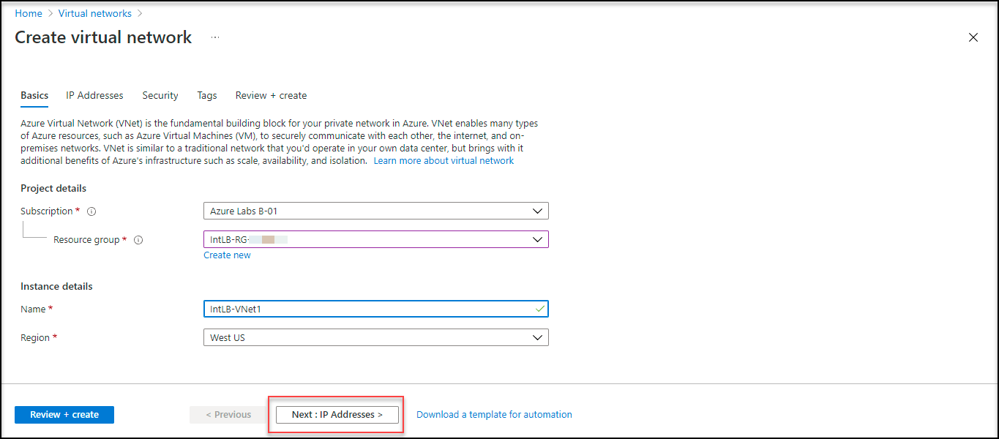
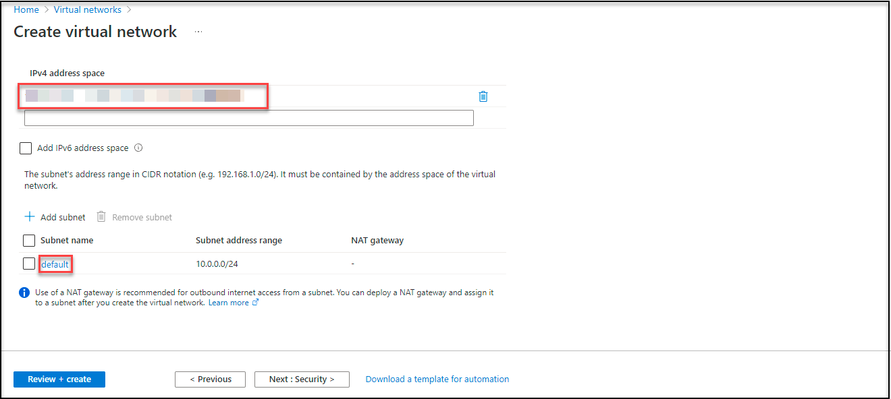
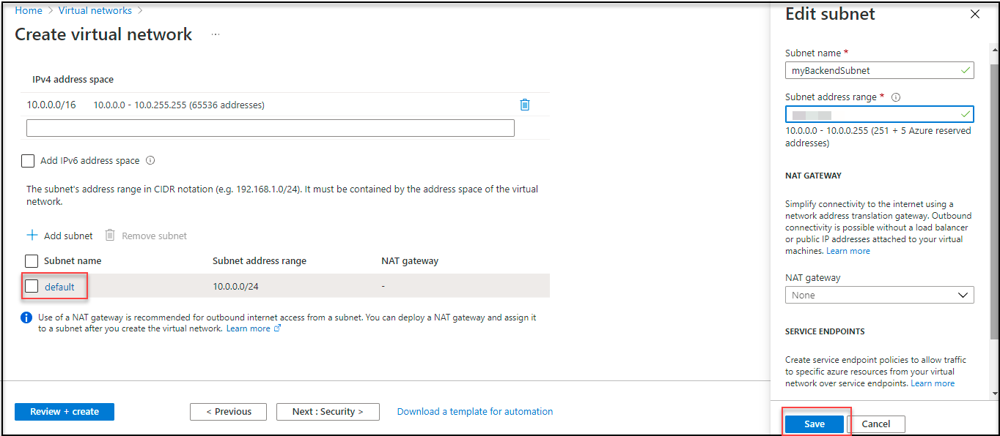
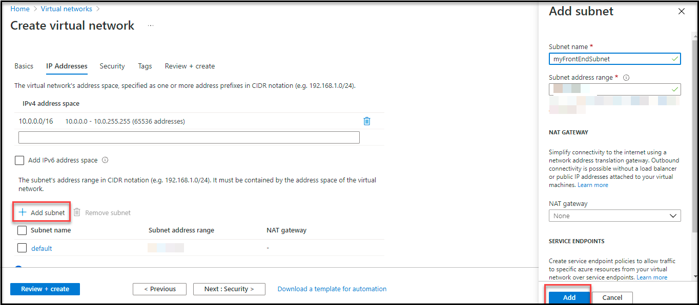
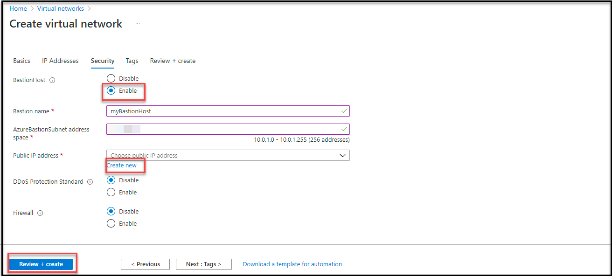
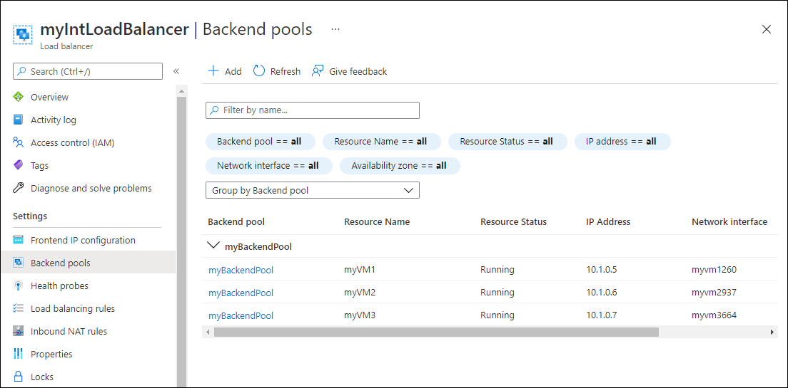
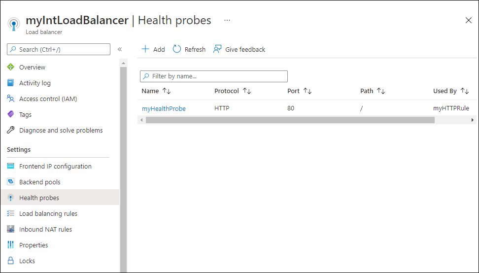
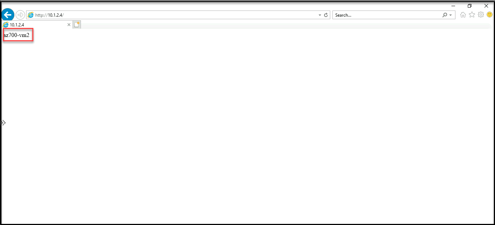

# M04-Unit 4 Create and configure an Azure load balancer

In this exercise, you will create an internal load balancer for the fictional Contoso Ltd organization. 

The steps to create an internal load balancer, are very similar to those you have already learned about in this module, to create a public load balancer. The key difference is that with a public load balancer the front end is accessed via a public IP address, and you test connectivity from a host which is located outside your virtual network; whereas, with an internal load balancer, the front end is a private IP address inside your virtual network, and you test connectivity from a host inside the same network.

The diagram below illustrates the environment you will be deploying in this exercise.


 
In this exercise, you will:

+ Task 1: Create the virtual network
+ Task 2: Create backend servers
+ Task 3: Create the load balancer
+ Task 4: Create load balancer resources
+ Task 5: Test the load balancer

## Task 1: Create the virtual network

In this section, you will create a virtual network and a subnet.

1. Log in to the Azure portal.

2. On the Azure portal home page, click **Create a resource**, then **Networking**, then select **Virtual Network** (if this resource type is not listed on the page, use the search box at the top of the page to search for it and select it).

3. Click **Create**.


4. On the **Basics** tab, use the information in the table below to create the virtual network.

   | **Setting**    | **Value**                                                |
   | -------------- | ------------------------------------------               |
   | Subscription   | Select your subscription                                 |
   | Resource group | Select **Existing rg**  Name: **IntLB-RG-<inject key="DeploymentID" enableCopy="false"/>** |
   | Name           | **IntLB-VNet**                                           |
   | Region         | **Default selected by Resource Group**                   |

 

5. Click **Next : IP Addresses**.



6. On the **IP Addresses** tab, in the **IPv4 address space** box,  remove the default and type **10.1.0.0/16**.



7. Under **Subnet name**, remove if **default** subnet is present.

8. Click on **Add Subnet**, provide a subnet name of **myBackendSubnet**, and a subnet address range of **10.1.0.0/24**, select **Add**.



10. Click **Add Subnet**, provide a subnet name of **myFrontEndSubnet**, and a subnet address range of **10.1.2.0/24**. Click **Add**.



11. Click **Next : Security**.

12. Under **BastionHost** select **Enable**, then enter the information from the table below.

    | **Setting**                       | **Value**                                     |
    | --------------------------------- | --------------------------------------------- |
    | Bastion name                      | **myBastionHost**                             |
    | AzureBastionSubnet address  space | **10.1.1.0/24**                               |
    | Public IP address                 | Select **Create  new**  Name: **myBastionIP** |



13. Click **Review + create**.

13. Click **Create**.

## Task 2: Create backend servers

In this section, you will create three VMs, that will be in the same availability set, for the backend pool of the load balancer, add the VMs to the backend pool, and then install IIS on the three VMs to test the load balancer.

1. From the Azure portal, open the **Azure Cloud Shell** by clicking on the icon in the top right of the Azure Portal.

 

2. When prompted to select either **Bash** or **PowerShell**, select **PowerShell**.

3. When prompted, select **Show advanced settings** and then select **Use existing** and choose existing resource group. Then select **Create new** against Storage account as well as File Share and provide a unique value in both of the fields and then click on **Create storage**, and wait for the Azure Cloud Shell to initialize. 
 
4. In your lab VM Navigate to the location that is specified. **C:\AllFiles\AZ-700-Designing-and-Implementing-Microsoft-Azure-Networking-Solutions-prod\Allfiles\Exercises\M04**.

5. In the toolbar of the Cloud Shell pane, click the Upload/Download files icon, in the drop-down menu, click Upload and upload the following files **azuredeploy.json, azuredeploy.parameters.vm1.json, azuredeploy.parameters.vm2.json and azuredeploy.parameters.vm3.json** into the Cloud Shell home directory.

6. Deploy the following ARM templates to create the virtual network, subnets, and VMs needed for this exercise:

>Note : Replace Deployment ID in below command, It can be found in the environment tab

   ```powershell
   $RGName = "IntLB-RG-Deployment ID"
   
   New-AzResourceGroupDeployment -ResourceGroupName $RGName -TemplateFile azuredeploy.json -TemplateParameterFile azuredeploy.parameters.vm1.json
   New-AzResourceGroupDeployment -ResourceGroupName $RGName -TemplateFile azuredeploy.json -TemplateParameterFile azuredeploy.parameters.vm2.json
   New-AzResourceGroupDeployment -ResourceGroupName $RGName -TemplateFile azuredeploy.json -TemplateParameterFile azuredeploy.parameters.vm3.json
   ```

## Task 3: Create the load balancer

In this section, you will create an internal Standard SKU load balancer. The reason we are creating a Standard SKU load balancer here in the exercise, instead of a Basic SKU load balance, is for later exercises that require a Standard SKU version of the load balancer.

1. On the Azure portal home page, click **Create a resource**.

2. In the search box at the top of the page, type **Load Balancer**, then press **Enter** (**Note:** do not select one from the list).

3. Scroll down to the bottom of the page and select **Load Balancer** (the one that says 'Microsoft' and 'Azure Service' under the name).

4. Click **Create**.
   

5. On the **Basics** tab, use the information in the table below to create the load balancer.

   | **Setting**           | **Value**                   |
   | --------------------- | ------------------------    |
   | Subscription          | Select your subscription    |
   | Resource group        | **IntLB-RG-<inject key="DeploymentID" enableCopy="false"/>**  |
   | Name                  | **myIntLoadBalancer**       |
   | Region                | **Default selected by Resource Group**            |
   | Type                  | **Internal**                |
   | SKU                   | **Standard**                |
   
6. Click **Next: Frontend IP configurations**.

7. Click Add a frontend IP

8. On the **Add frontend IP address** blade, enter the information from the table below then click on **Add**.

   | **Setting**     | **Value**                |
   | --------------- | ------------------------ |
   | Name            | **LoadBalancerFrontEnd** |
   | Virtual network | **IntLB-VNet**           |
   | Subnet          | **myFrontEndSubnet**     |
   | Assignment      | **Dynamic**              |


9. Click **Review + create**.

10. Click **Create**.

## Task 4: Create load balancer resources

In this section, you will configure load balancer settings for a backend address pool, then create a health probe and a load balancer rule.

### Create a backend pool and add VMs to the backend pool

The backend address pool contains the IP addresses of the virtual NICs connected to the load balancer.

1. On the Azure portal home page, click **All resources**, then click on **myIntLoadBalancer** from the resources list.

2. Under **Settings**, select **Backend pools**, and then click **Add**.

3. On the **Add backend pool** page, enter the information from the table below.

   | **Setting**     | **Value**            |
   | --------------- | -------------------- |
   | Name            | **myBackendPool**    |
   | Virtual network | **IntLB-VNet**       |
   
4. Under **IP configurations**, click **+ Add**.

5. Select the checkboxes for all 3 VMs(**az700-vm1**,**az700-vm2** and **az700-vm3**) and then click **Save**.

   

 

### Create a health probe

The load balancer monitors the status of your app with a health probe. The health probe adds or removes VMs from the load balancer based on their response to health checks. Here you will create a health probe to monitor the health of the VMs.

1. On the Azure portal home page, click All resources, then click on myIntLoadBalancer from the resources list.

2. Under **Settings**, click **Health probes**, then click **+ Add**.

3. On the **Add health probe** page, enter the information from the table below.

   | **Setting**         | **Value**         |
   | ------------------- | ----------------- |
   | Name                | **myHealthProbe** |
   | Protocol            | **HTTP**          |
   | Port                | **80**            |
   | Path                | **/**             |
   | Interval            | **15**            |
   | Unhealthy threshold | **2**             |


4. Click **Add**.
   

 

### Create a load balancer rule

A load balancer rule is used to define how traffic is distributed to the VMs. You define the frontend IP configuration for the incoming traffic and the backend IP pool to receive the traffic. The source and destination port are defined in the rule. Here you will create a load balancer rule.

1. On the Azure portal home page, click All resources, then click on myIntLoadBalancer from the resources list, under **Settings**, click **Load balancing rules**, then click **+ Add**.

2. On the **Add load balancing rule** page, enter the information from the table below.

   | **Setting**            | **Value**                |
   | ---------------------- | ------------------------ |
   | Name                   | **myHTTPRule**           |
   | IP Version             | **IPv4**                 |
   | Frontend IP address    | **LoadBalancerFrontEnd** |
   | Protocol               | **TCP**                  |
   | Port                   | **80**                   |
   | Backend port           | **80**                   |
   | Backend pool           | **myBackendPool**        |
   | Health probe           | **myHealthProbe**        |
   | Session persistence    | **None**                 |
   | Idle timeout (minutes) | **15**                   |
   | Floating IP            | **Disabled**             |


3. Click **Save**.
   

## Task 5: Test the load balancer

In this section, you will create a test VM, and then test the load balancer.

### Create test VM

1. On the Azure portal home page, click **Create a resource**, then **Compute**, then select **Virtual machine** (if this resource type is not listed on the page, use the search box at the top of the page to search for it and select it). Click on **Create** then select **Virtual Machine**.

2. On the **Create a virtual machine** page, on the **Basics** tab, use the information in the table below to create the first VM.

>Note : Deployment ID can be found in the environments tab

   | **Setting**          | **Value**                                    |
   | -------------------- | -------------------------------------------- |
   | Subscription         | Select your subscription                     |
   | Resource group       | **IntLB-RG-<inject key="DeploymentID" enableCopy="false"/>** |
   | Virtual machine name | **myTestVM**                                 |
   | Region               | **Default selected by Resource Group**       |
   | Availability options | **No infrastructure redundancy required**    |
   | Image                | **Windows Server 2019 Datacenter - Gen 2**   |
   | Size                 | **Standard_DS2_v2 - 2 vcpu, 7 GiB memory** |
   | Username             | **TestUser**                                 |
   | Password             | **TestPa$$w0rd!**                            |
   | Confirm password     | **TestPa$$w0rd!**                            |


3. Click **Next : Disks**, then click **Next : Networking**. 

4. On the **Networking** tab, use the information in the table below to configure networking settings.

   | **Setting**                                                  | **Value**                     |
   | ------------------------------------------------------------ | ----------------------------- |
   | Virtual network                                              | **IntLB-VNet**                |
   | Subnet                                                       | **myBackendSubnet**           |
   | Public IP                                                    | Change to **None**            |
   | NIC network security group                                   | **Advanced**                  |
   | Configure network security group                             | Select the existing **myNSG** |
   | Place this virtual machine behind an existing load balancing solution? | **Off** (unchecked)           |


5. Click **Review + create**.

6. Click **Create**.

7. Wait for this last VM to be deployed before moving forward with the next task.

### Connect to the test VM to test the load balancer

1. On the Azure portal home page, click **All resources**, then click on **myIntLoadBalancer** from the resources list.

2. On the **Overview** page, make a note of the **Private IP address**, or copy it to the clipboard. If you can't find it click on **see more**.

3. Click **Home**, then on the Azure portal home page, click **All resources**, then click on the **myTestVM** virtual machine that you just created.

4. On the **Overview** page, select **Connect**, then **Bastion**.

5. In the **Username** box, type **TestUser** and in the **Password** box, type **TestPa$$w0rd!**, then click **Connect**.

   **Note**: if you get error **A popup blocker is preventing new window from opening. Please allow popups and retry.** then click on popup icon in the address bar and select always allow popup then select done as shown in below image.

    

6. The **myTestVM** window will open in another browser tab.

7. If a **Networks** pane appears, click **Yes**.

9. Click the **Internet Explorer** icon in the task bar to open the web browser.

10. Click **OK** on the **Set up Internet Explorer 11** dialog box.

11. Enter (or paste) the **Private IP address** (e.g. 10.1.0.4) from the previous step into the address bar of the browser and press Enter.

12. The default web home page of the IIS Web server is displayed in the browser window. One of the three virtual machines in the backend pool will respond.
    

13. If you click the refresh button in the browser a few times, you will see that the response comes randomly from the different VMs in the backend pool of the internal load balancer.
    

