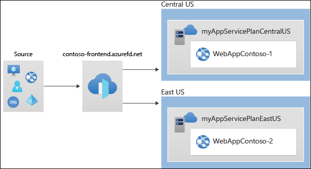
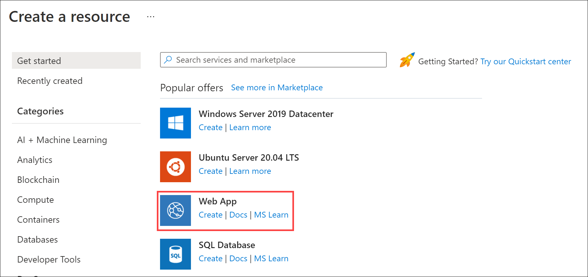
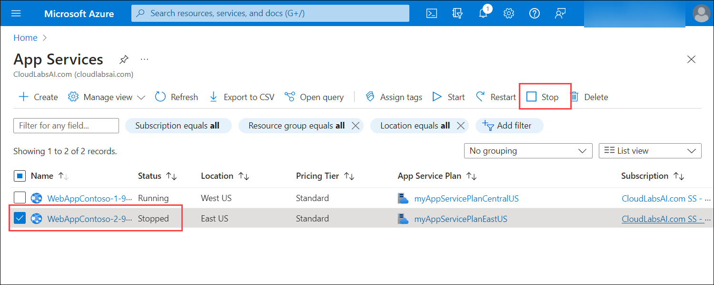
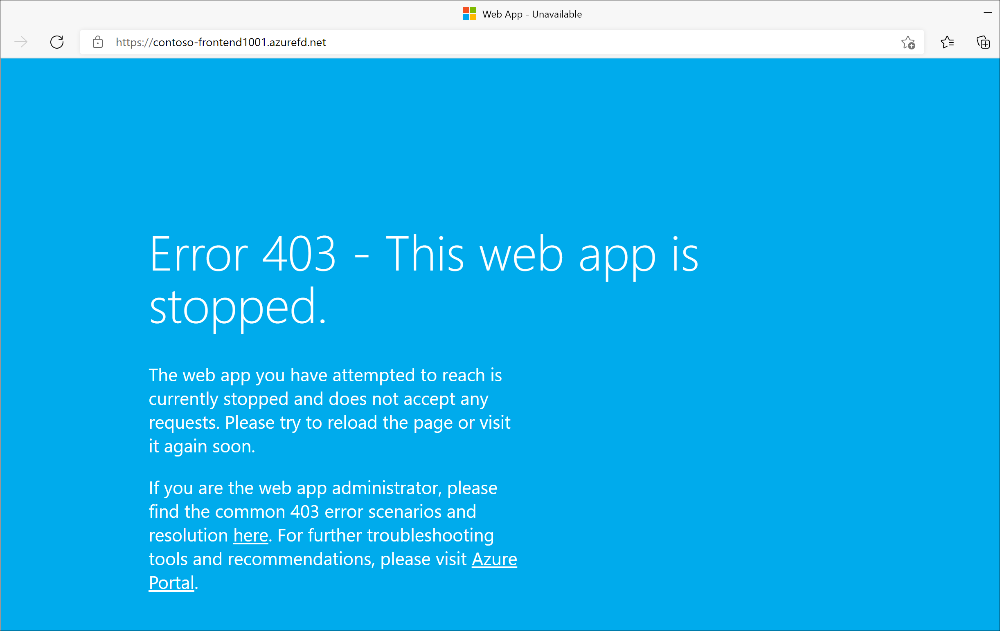

# M05-Unit 6 Create a Front Door for a highly available web application using the Azure portal

 

In this exercise, you will set up an Azure Front Door configuration that pools two instances of a web application that runs in different Azure regions. This configuration directs traffic to the nearest site that runs the application. Azure Front Door continuously monitors the web application. You will demonstrate automatic failover to the next available site when the nearest site is unavailable. The network configuration is shown in the following diagram:

In this exercise, you will:

+ Task 1: Create two instances of a web app
+ Task 2: Create a Front Door for your application
+ Task 3: View Azure Front Door in action

## Task 1: Create two instances of a web app

This exercise requires two instances of a web application that run in different Azure regions. Both the web application instances run in Active/Active mode, so either one can take traffic. This configuration differs from an Active/Stand-By configuration, where one acts as a failover.

1. Sign in to the Azure portal at [https://portal.azure.com](https://portal.azure.com/).

2. On the Azure Portal home page, select + **Create a resource**.

3. On the Create a resource page, select **WebApp**.
   

4. On the Create Web App page, on the **Basics** tab, enter or select the following information.

   | **Setting**      | **Value**                                                    |
   | ---------------- | ------------------------------------------------------------ |
   | Resource group   | Select the existing resource group **az700-m05-<inject key="DeploymentID" enableCopy="false"/>* |
   | Name             | WebAppContoso-1-{DeploymentID} |
   | Publish          | Select **Code**.                                             |
   | Runtime stack    | Select **.NET 6 (LTS)**.                              |
   | Operating System | Select **Windows**.                                          |
   | Region           | Select **West US**.                                       |
   | Windows Plan     | Select **Create new** and enter **myAppServicePlanWestUS** in the text box. |
   | SKU and size     | Select **Standard S1 100 total ACU, 1.75 GB memory**.        |

   **Note**: Replace Deployment ID with the value from environment details tab

5. Select **Review + create**, review the Summary, and then select **Create**.   
   ‎It might take several minutes for the deployment to complete.

6. Create a second web app. On the Azure Portal home page, select + **Create a resource**.

7. On the Create a resource page, select **WebApp**.

8. On the Create Web App page, on the **Basics** tab, enter or select the following information.

   | **Setting**      | **Value**                                                    |
   | ---------------- | ------------------------------------------------------------ |
   | Resource group   | Select the existing resource group **az700-m05-<inject key="DeploymentID" enableCopy="false"/>** |
   | Name             | WebAppContoso-2-{DeploymentID} |
   | Publish          | Select **Code**.                                             |
   | Runtime stack    | Select **.NET 6 (LTS)**.                                     |
   | Operating System | Select **Windows**.                                          |
   | Region           | Select **East US**.                                          |
   | Windows Plan     | Select **Create new** and enter **myAppServicePlanEastUS** in the text box. |
   | SKU and size     | Select **Standard S1 100 total ACU, 1.75 GB memory**.        |

   **Note**: Replace Deployment ID with the value from environment details tab

9. Select **Review + create**, review the Summary, and then select **Create**.   
   ‎It might take several minutes for the deployment to complete.

## Task 2: Create a Front Door for your application

Configure Azure Front Door to direct user traffic based on lowest latency between the two web apps servers. To begin, add a frontend host for Azure Front Door.

1. On any Azure Portal page, in **Search resources, services and docs (G+/)**, Search for Front Door and CDN profiles, and then select **Front Door and CDN profiles**.

   

1. Select **Create front door and CDN profiles**. On the Compare offerings page, select **Quick create**. Then select **Continue to create a Front Door**.

1. On the Basics tab, enter or select the following information.

   | **Setting**             | **Value**                                    |
   | ----------------------- | -------------------------------------------- |
   | Subscription            | Select your subscription.                    |
   | Resource group          | Select ContosoResourceGroup                  |
   | Resource group location | Accept default setting                       |
   | Name                    | Enter FrontDoor-<inject key="DeploymentID" enableCopy="false"/> |
   | Tier                    | Standard   |
   | Endpoint Name           | FDendpoint-<inject key="DeploymentID" enableCopy="false"/> |
   | Origin Type             | App Service| 
   | Origin host name        | The name of the web app you previously deployed |
   
1. Select **Review and Create**, and then select **Create**.

1. Wait for the resource to deploy, and then select **Go to resource**.
1. On the Front Door resource in the Overview blade, locate the **Origin Groups**, select the origin group created
1. To update the origin group select the name **default-origin-group** from the list. Select **Add an origin** and add the second Web App. Select Add and then select Update. 
   
## Task 3: View Azure Front Door in action

Once you create a Front Door, it takes a few minutes for the configuration to be deployed globally. Once complete, access the frontend host you created. 

1. On the Front Door resource in the Overview blade, locate the endpoint hostname that is created for your endpoint. This should be fdendpoint followed by a hyphen and a random string. For example, **fdendpoint-fxa8c8hddhhgcrb9.z01.azurefd.net**. **Copy** this FQDN.

1. In a new browser tab, navigate to the Front Door endpoint FQDN. The default App Service page will be displayed.
   

1. To test instant global failover in action, try the following steps:

1. Switch to the Azure portal, search for and select **App services**. 

1. Select one of your web apps, then select **Stop**, and then select **Yes** to verify.

   

1. Switch back to your browser and select Refresh. You should see the same information page.

**There may be a delay while the web app stops. If you get an error page in your browser, refresh the page**.

1. Switch back to the Azure Portal, locate the other web app, and stop it.

1. Switch back to your browser and select Refresh. This time, you should see an error message.

   

Congratulations! You have configured and tested an Azure Front Door.
