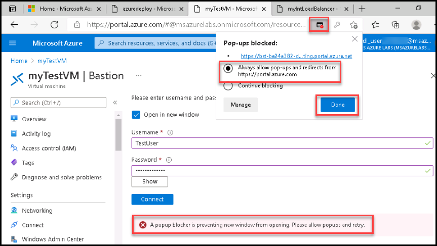
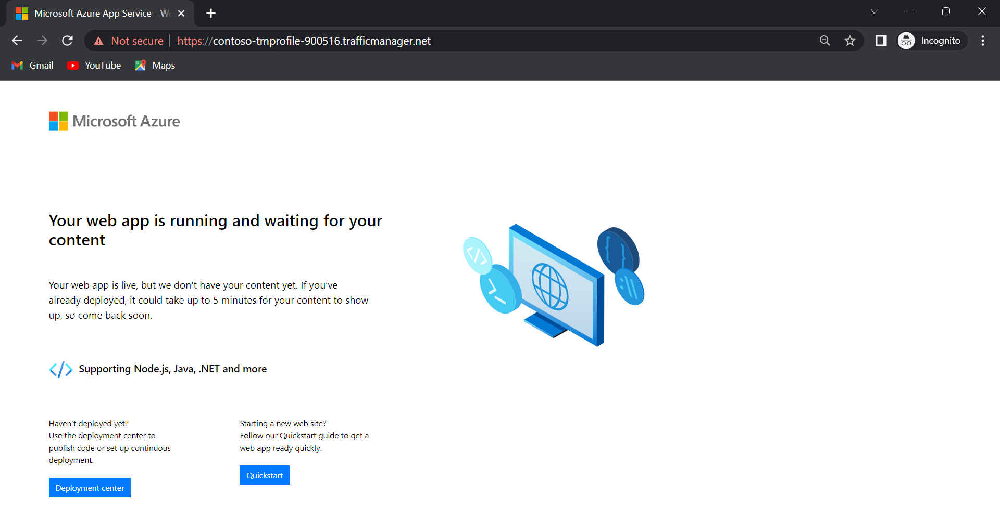

# M07-Unit 3 Create an Azure private endpoint using Azure PowerShell

Get started with Azure Private Link by using a Private Endpoint to connect securely to an Azure web app. There are many ways to create Endpoints including Portal, CLI, PowerShell etc. 

You'll create a Private Endpoint for an Azure web app and deploy a virtual machine to test the private connection.

Private Endpoints can be created for different kinds of Azure services, such as Azure SQL and Azure Storage.

**Prerequisites**

- An Azure Web App with a PremiumV2-tier or higher app service plan deployed in your Azure subscription.

1. Click on the Azure Portal icon on the VM desktop and login with the Azure credentials from the Lab Environment details page.

2. From the Azure portal, open the **Azure Cloud Shell** by clicking on the icon in the top right of the Azure Portal.
   
   
3. When prompted to select either **Bash** or **PowerShell**, select **PowerShell**.
   
4. When prompted, select **Show advanced settings** and then select **Use existing** and choose existing resource group, i.e. **CreatePrivateEndpointQS-rg**. Then select **Create new** against Storage account as well as File Share and provide a unique value in both of the fields and then click on **Create storage**, and wait for the Azure Cloud Shell to initialize. 

5. In your lab VM navigate to the location that is specified. **C:\AllFiles\AZ-700-Designing-and-Implementing-Microsoft-Azure-Networking-Solutions-prod\Allfiles\Exercises\M07**

6. In the toolbar of the Cloud Shell pane, click the Upload/Download files icon, in the drop-down menu, click Upload and upload the files template.json and parameters.json into the Cloud Shell home directory.
   


7. Deploy the following ARM templates to create the PremiumV2-tier Azure Web App needed for this exercise: (Replace Deployment ID value from the environment details tab.)

   ```powershell
   $RGName = "CreatePrivateEndpointQS-rg"
   
   New-AzResourceGroupDeployment -ResourceGroupName $RGName -TemplateFile template.json -TemplateParameterFile parameters.json
   ```

In this exercise, you will:

+ Task 1: Create a virtual network and bastion host
+ Task 2: Create a test virtual machine
+ Task 3: Create a Private Endpoint
+ Task 4: Configure the private DNS zone
+ Task 5: Test connectivity to the Private Endpoint


## Task 1: Create a virtual network and bastion host

You will create a virtual network, subnet, and bastion host.

The bastion host will be used to connect securely to the virtual machine for testing the Private Endpoint.

Create a virtual network and bastion host with: 

- New-AzVirtualNetwork

- New-AzPublicIpAddress

- New-AzBastion

   Run the below commands in power shell (Replace Deployment ID value from the environment details tab.)
 

  ``` Azure PowerShell
      
      ## Create backend subnet config. ##

      $subnetConfig = New-AzVirtualNetworkSubnetConfig -Name myBackendSubnet -AddressPrefix 10.0.0.0/24

      ## Create Azure Bastion subnet. ##

      $bastsubnetConfig = New-AzVirtualNetworkSubnetConfig -Name AzureBastionSubnet -AddressPrefix 10.0.1.0/24

      ## Create the virtual network. ##

      $parameters1 = @{

      Name = 'MyVNet'

      ResourceGroupName = 'CreatePrivateEndpointQS-rg'

      Location = 'eastus'

      AddressPrefix = '10.0.0.0/16'

      Subnet = $subnetConfig, $bastsubnetConfig

      }

      $vnet = New-AzVirtualNetwork @parameters1

      ## Create public IP address for bastion host. ##

      $parameters2 = @{

      Name = 'myBastionIP'

      ResourceGroupName = 'CreatePrivateEndpointQS-rg'

      Location = 'eastus'

      Sku = 'Standard'

      AllocationMethod = 'Static'

      }

      $publicip = New-AzPublicIpAddress @parameters2

      ## Create bastion host ##

      $parameters3 = @{

      ResourceGroupName = 'CreatePrivateEndpointQS'

      Name = 'myBastion'

      PublicIpAddress = $publicip

      VirtualNetwork = $vnet

      }

      New-AzBastion @parameters3

   ```


## Task 2: Create a test virtual machine

In this section, you'll create a virtual machine that will be used to test the Private Endpoint.

- Create the virtual machine with:

- Get-Credential

- New-AzNetworkInterface

- New-AzVM

- New-AzVMConfig

- Set-AzVMOperatingSystem

- Set-AzVMSourceImage

- Add-AzVMNetworkInterface

   Run the below commands in power shell (Replace Deployment ID value from the environment details tab.)

``` Azure PowerShell
## Set credentials for server admin and password and make a note of them you will use them in later task##

$cred = Get-Credential

## Command to get virtual network configuration. ##

$vnet = Get-AzVirtualNetwork -Name myVNet -ResourceGroupName CreatePrivateEndpointQS-rg

## Command to create network interface for VM ##

$parameters1 = @{

 Name = 'myNicVM'

 ResourceGroupName = 'CreatePrivateEndpointQS-rg'

 Location = 'eastus'

 Subnet = $vnet.Subnets[0]

}

$nicVM = New-AzNetworkInterface @parameters1

## Create a virtual machine configuration.##

$parameters2 = @{

 VMName = 'myVM'

 VMSize = 'Standard_DS1_v2'

}

$parameters3 = @{

 ComputerName = 'myVM'

 Credential = $cred

}

$parameters4 = @{

 PublisherName = 'MicrosoftWindowsServer'

 Offer = 'WindowsServer'

 Skus = '2019-Datacenter'

 Version = 'latest'

}

$vmConfig = New-AzVMConfig @parameters2 | Set-AzVMOperatingSystem -Windows @parameters3 | Set-AzVMSourceImage @parameters4 | Add-AzVMNetworkInterface -Id $nicVM.Id

## Create the virtual machine ##

New-AzVM -ResourceGroupName 'CreatePrivateEndpointQS-rg' -Location 'eastus' -VM $vmConfig 


```


Azure provides an ephemeral IP for Azure Virtual Machines which aren't assigned a public IP address, or are in the backend pool of an internal Basic Azure Load Balancer. The ephemeral IP mechanism provides an outbound IP address that isn't configurable.

The ephemeral IP is disabled when a public IP address is assigned to the virtual machine or the virtual machine is placed in the backend pool of a Standard Load Balancer with or without outbound rules. If a Azure Virtual Network NAT gateway resource is assigned to the subnet of the virtual machine, the ephemeral IP is disabled.

For more information on outbound connections in Azure, see Using Source Network Address Translation (SNAT) for outbound connections.

## Task 3: Create a Private Endpoint

In this section, you'll create the Private Endpoint and connection using:

- New-AzPrivateLinkServiceConnection

- New-AzPrivateEndpoint

   Run the below commands in power shell (Replace Deployment ID value from the environment details tab.) 

```Azure PowerShell

## Replace <your-webapp-name> with your webapp name. Go to azure portal in new tab and click on all resources then click on web app you created in previous task and copy the name##

$webapp = Get-AzWebApp -ResourceGroupName CreatePrivateEndpointQS-rg -Name <your-webapp-name>

## Create Private Endpoint connection. ##

$parameters1 = @{

 Name = 'myConnection'

 PrivateLinkServiceId = $webapp.ID

 GroupID = 'sites'

}

$privateEndpointConnection = New-AzPrivateLinkServiceConnection @parameters1

## Place virtual network into variable. ##

$vnet = Get-AzVirtualNetwork -ResourceGroupName 'CreatePrivateEndpointQS-rg' -Name 'myVNet'

## Disable private endpoint network policy ##

$vnet.Subnets[0].PrivateEndpointNetworkPolicies = "Disabled"

$vnet | Set-AzVirtualNetwork

## Create private endpoint

$parameters2 = @{

 ResourceGroupName = 'CreatePrivateEndpointQS-rg'

 Name = 'myPrivateEndpoint'

 Location = 'eastus'

 Subnet = $vnet.Subnets[0]

 PrivateLinkServiceConnection = $privateEndpointConnection

}

New-AzPrivateEndpoint @parameters2 
```


## Task 4: Configure the private DNS zone

In this section you'll create and configure the private DNS zone using:

- New-AzPrivateDnsZone

- New-AzPrivateDnsVirtualNetworkLink

- New-AzPrivateDnsZoneConfig

- New-AzPrivateDnsZoneGroup

   Run the below commands in power shell  

```Azure PowerShell
## Place virtual network into variable. ##

$vnet = Get-AzVirtualNetwork -ResourceGroupName 'CreatePrivateEndpointQS-rg' -Name 'myVNet'

## Create private dns zone. ##

$parameters1 = @{

 ResourceGroupName = 'CreatePrivateEndpointQS-rg'

 Name = 'privatelink.azurewebsites.net'

}

$zone = New-AzPrivateDnsZone @parameters1

## Create dns network link. ##

$parameters2 = @{

 ResourceGroupName = 'CreatePrivateEndpointQS-rg'

 ZoneName = 'privatelink.azurewebsites.net'

 Name = 'myLink'

 VirtualNetworkId = $vnet.Id

}

$link = New-AzPrivateDnsVirtualNetworkLink @parameters2

## Create DNS configuration ##

$parameters3 = @{

 Name = 'privatelink.azurewebsites.net'

 PrivateDnsZoneId = $zone.ResourceId

}

$config = New-AzPrivateDnsZoneConfig @parameters3

## Create DNS zone group. ##

$parameters4 = @{

 ResourceGroupName = 'CreatePrivateEndpointQS-rg'

 PrivateEndpointName = 'myPrivateEndpoint'

 Name = 'myZoneGroup'

 PrivateDnsZoneConfig = $config

}

New-AzPrivateDnsZoneGroup @parameters4 
```


## Task 5: Test connectivity to the Private Endpoint

In this section, you'll use the virtual machine you created in the previous step to connect to the SQL server across the Private Endpoint.

- Sign in to the [Azure portal](https://portal.azure.com/)

- Select **Resource groups** in the left-hand navigation pane.

- Select **CreatePrivateEndpointQS-rg**.

- Select **myVM**.

- On the overview page for **myVM**, select **Connect** then **Bastion**.

- Select the blue **Use Bastion** button.

- Enter the username and password that you entered during the virtual machine creation.

**Note**: if you get error **A popup blocker is preventing new window from opening. Please allow popups and retry.** then click on popup icon in the address bar and select always allow popup then select done as shown in below image.



- Open Windows PowerShell on the server after you connect.

- Enter nslookup &lt;your- webapp-name&gt;.azurewebsites.net. Replace &lt;your-webapp-name&gt; with the name of the web app you created in the previous steps. You'll receive a message similar to what is displayed below:

  ```
  Server: UnKnown
  
  Address: 168.63.129.16
  
  Non-authoritative answer:
  
  Name: mywebapp8675.privatelink.azurewebsites.net
  
  Address: 10.0.0.5
  
  Aliases: mywebapp8675.azurewebsites.net 
  ```  


A private IP address of **10.0.0.5** is returned for the web app name. This address is in the subnet of the virtual network you created previously.

- In the bastion connection to **myVM**, open Internet Explorer.
- Enter the url of your web app, **https://&lt;your-webapp-name&gt;.azurewebsites.net**.
- You'll receive the default web app page if your application hasn't been deployed:
  
- Close the connection to **myVM**.


