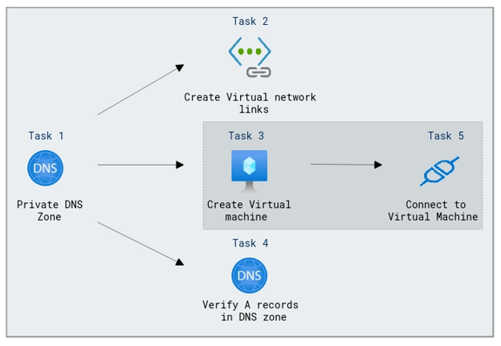

# Lab Scenario Preview: Introduction to Azure Virtual Networks

## Module 01 - Unit 6 Configure DNS settings in Azure

### Lab overview

In this lab, you will configure DNS name resolution and you will create a private DNS zone named contoso.com, link the VNets for registration and resolution, and then create two virtual machines and test the configuration.

### Lab objectives
  
In this lab, you will complete the following tasks:

+ Task 1: Create a private DNS Zone
+ Task 2: Link subnet for auto registration
+ Task 3: Create Virtual Machines to test the configuration
+ Task 4: Verify records are present in the DNS zone

### Architecture Diagram

 

Once you understand the lab's content, you can start the Hands-on Lab by clicking the **Launch** button located in the top right corner. This will lead you to the lab environment and guide. You can also preview the full lab guide [here](https://experience.cloudlabs.ai/#/labguidepreview/a97e28a0-1c77-4579-82b7-4d5543dbcda7) if you want to go through detailed guide prior to launching lab environment.

