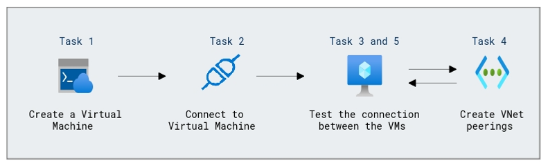

# Lab Scenario Preview: Introduction to Azure Virtual Networks

## Module 01-Unit 8 Connect two Azure Virtual Networks using global virtual network peering

### Lab overview

In this unit, you will configure connectivity between the CoreServicesVnet and the ManufacturingVnet by adding peerings to allow traffic flow.

### Objectives
  
After completing this lab, you will be able to:

- Create a Virtual Machine to test the configuration
- Connect to the Test VMs using RDP
- Test the connection between the VMs
- Create VNet peerings between CoreServicesVnet and ManufacturingVnet
- Test the connection between the VMs

### Architecture Diagram

 

Once you understand the lab's content, you can start the Hands-on Lab by clicking the **Launch** button located in the top right corner. This will lead you to the lab environment and guide. You can also preview the full lab guide [here](https://experience.cloudlabs.ai/#/labguidepreview/83749a82-b864-452e-90f5-0c7f5db6d2cc) if you want to go through detailed guide prior to launching lab environment.

