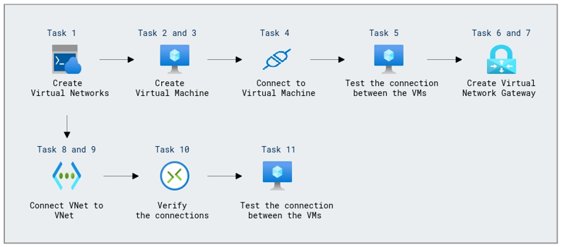

# Lab Scenario Preview: Design and implement hybrid networking

## Module 02-Unit 3 Create and configure a virtual network gateway

### Lab overview

In this exercise you will create Virtual Networks and Virtual Machine and configure a virtual network gateway to connect the Core Services VNet and Manufacturing VNet. 

### Objectives
  
After completing this lab, you will be able to:

- Create CoreServicesVnet and ManufacturingVnet
- Create CoreServicesVM
- Create ManufacturingVM
- Connect to the Test VMs using RDP
- Test the connection between the VMs
- Create CoreServicesVnet Gateway
- Create ManufacturingVnet Gateway
- CoreServicesVnet to ManufacturingVnet 
- Connect ManufacturingVnet to CoreServicesVnet
- Verify that the connections connect 
- Test the connection between the VMs

### Architecture Diagram

 

Once you understand the lab's content, you can start the Hands-on Lab by clicking the **Launch** button located in the top right corner. This will lead you to the lab environment and guide. You can also preview the full lab guide [here](https://experience.cloudlabs.ai/#/labguidepreview/a06e9f7f-76ce-4796-9e70-fc0e2413fdc5) if you want to go through detailed guide prior to launching lab environment.

