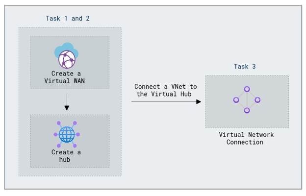

# Lab Scenario Preview: Module 02 - Design and implement hybrid networking

## Module 02-Unit 7 Create a Virtual WAN by using Azure Portal

### Lab overview

In this lab, you will learn how to create a Virtual WAN in Azure Portal to establish a global network infrastructure. Add Azure regions, configure site-to-site VPN connections and configure Virtual Network to the Virtual Hub connection. 

### Lab objectives
  
In this lab, you will complete the following tasks:

+ Task 1: Create a Virtual WAN
+ Task 2: Create a hub by using Azure Portal
+ Task 3: Connect a VNet to the Virtual Hub

### Architecture Diagram

 

Once you understand the lab's content, you can start the Hands-on Lab by clicking the **Launch** button located in the top right corner. This will lead you to the lab environment and guide. You can also preview the full lab guide [here](https://experience.cloudlabs.ai/#/labguidepreview/337240dc-d17d-4f98-9c48-107905091c46) if you want to go through detailed guide prior to launching lab environment.

