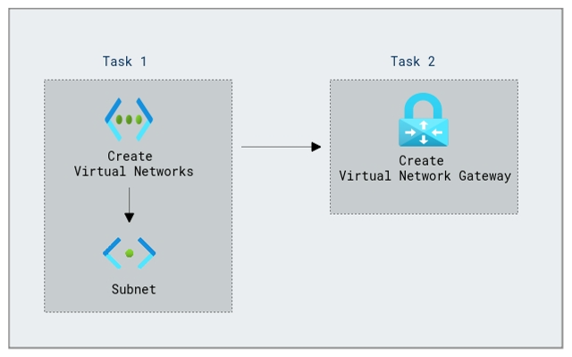

# Lab Scenario Preview: Design and implement Azure ExpressRoute

## Module 03-Unit 4 Configure an ExpressRoute Gateway

### Lab overview

In this lab, you will learn how to Configure an ExpressRoute Gateway in Azure to establish a high-speed, private connection between your on-premises datacenter and Azure. Enable seamless data transfer, increased network reliability, and enhanced security for your organization's critical workloads.

### Lab objectives
  
In this lab, you will complete the following tasks:

+ Task 1: Create the VNet and gateway subnet
+ Task 2: Create the virtual network gateway

### Architecture Diagram

 

Once you understand the lab's content, you can start the Hands-on Lab by clicking the **Launch** button located in the top right corner. This will lead you to the lab environment and guide. You can also preview the full lab guide [here](https://experience.cloudlabs.ai/#/labguidepreview/4071bceb-df18-4162-a023-8f14d6e25918) if you want to go through detailed guide prior to launching lab environment.

