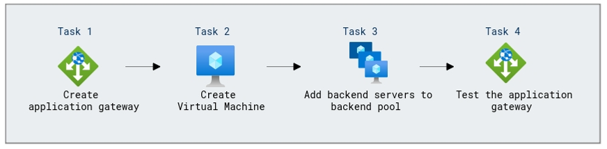

# Lab Scenario Preview: Load balancing HTTP(S) traffic in Azure

## Module 05: Unit 4 - Deploy Azure Application Gateway

### Lab overview

In this lab, you will learn how to deploy Azure Application Gateway for a web application. Configure backend pools, listener rules, and backend tragets, and test load balancing and application delivery for enhanced performance and security.

###  Lab Objectives
In this lab, you will complete the following tasks:

+ Task 1: Create an application gateway
+ Task 2: Create virtual machines
+ Task 3: Add backend servers to backend pool
+ Task 4: Test the application gateway

### Architecture Diagram

 

Once you understand the lab's content, you can start the Hands-on Lab by clicking the **Launch** button located in the top right corner. This will lead you to the lab environment and guide. You can also preview the full lab guide [here](https://experience.cloudlabs.ai/#/labguidepreview/5fa4ae69-5f06-4d10-878b-2696cba5c94c) if you want to go through detailed guide prior to launching lab environment.

