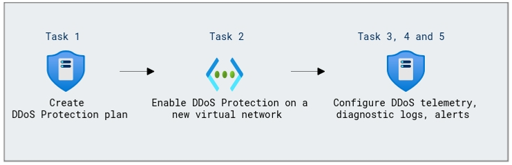

# Lab Scenario Preview: Design and implement network security

## Module 06-Unit 4 Configure DDoS Protection on a virtual network using the Azure portal 

### Lab overview

In this lab, you will learn how to configure Distributed Denial of Service (DDoS) protection for a virtual network in Azure using the Azure portal. You will enable DDoS Standard protection, define alerting thresholds, and verify the protection's effectiveness by monitoring traffic and mitigating potential DDoS attacks, ensuring the security and availability of your network resources.

### Lab objectives
  
In this lab, you will complete the following tasks:

+ Task 1: Create a DDoS Protection plan
+ Task 2: Enable DDoS Protection on a new virtual network
+ Task 3: Configure DDoS telemetry
+ Task 4: Configure DDoS diagnostic logs
+ Task 5: Configure DDoS alerts
+ Task 6: Test with simulation partners
  
### Architecture Diagram

 

Once you understand the lab's content, you can start the Hands-on Lab by clicking the **Launch** button located in the top right corner. This will lead you to the lab environment and guide. You can also preview the full lab guide [here](https://experience.cloudlabs.ai/#/labguidepreview/7416be56-a02b-46be-ace9-302c88e40c7b) if you want to go through detailed guide prior to launching lab environment.

