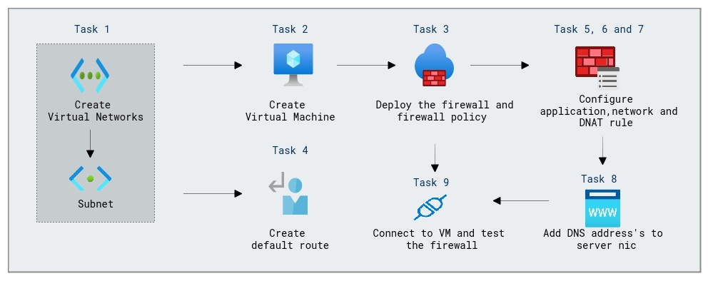

# Lab Scenario Preview: Design and implement network security

## Module 06-Unit 7 Deploy and configure Azure Firewall using the Azure portal

### Lab overview

In this lab, you will learn how to deploy and configure Azure Firewall using the Azure portal to safeguard your Azure network. Set up network rules, application rules, and threat intelligence to protect against unauthorized access and threats.

### Lab objectives
  
In this lab, you will complete the following tasks:

+ Task 1: Create a virtual network and subnets
+ Task 2: Create a virtual machine
+ Task 3: Deploy the firewall and firewall policy
+ Task 4: Create a default route
+ Task 5: Configure an application rule
+ Task 6: Configure a network rule
+ Task 7: Configure a Destination NAT (DNAT) rule
+ Task 8: Change the primary and secondary DNS address for the server's network interface
+ Task 9: Test the firewall
  
### Architecture Diagram

 

Once you understand the lab's content, you can start the Hands-on Lab by clicking the **Launch** button located in the top right corner. This will lead you to the lab environment and guide. You can also preview the full lab guide [here](https://experience.cloudlabs.ai/#/labguidepreview/e2a26d97-3c8e-4f16-9015-e00a13f35baa) if you want to go through detailed guide prior to launching lab environment.

