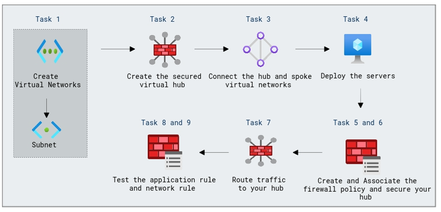

# Lab Scenario Preview: Design and implement network security

## Module 06-Unit 9 Secure your virtual hub using Azure Firewall Manager

### Lab overview

In this lab, you will learn how to Secure your Azure Virtual Hub using Azure Firewall Manager. Configure centralized security policies, threat intelligence, and application rules to protect network traffic effectively, ensuring compliance and security for your organization's virtual network infrastructure.

### Objectives
  
After completing this lab, you will be able to:

- Create two spoke virtual networks and subnets
- Create the secured virtual hub
- Connect the hub and spoke virtual networks
- Deploy the servers
- Create a firewall policy and secure your hub
- Associate the firewall policy
- Route traffic to your hub
- Test the application rule
- Test the network rule

### Architecture Diagram
 

Once you understand the lab's content, you can start the Hands-on Lab by clicking the **Launch** button located in the top right corner. This will lead you to the lab environment and guide. You can also preview the full lab guide [here](https://experience.cloudlabs.ai/#/labguidepreview/09f7f724-0a6b-46d4-aeed-2dde9a7f26cd) if you want to go through detailed guide prior to launching lab environment.

