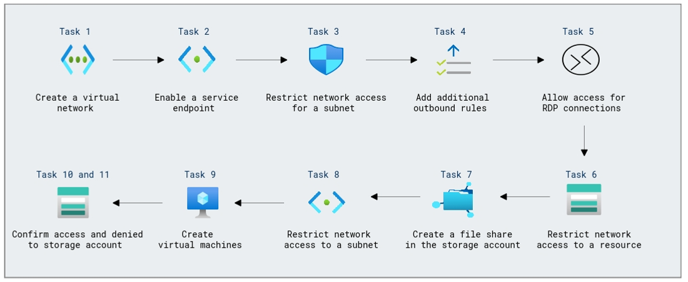

# Lab Scenario Preview: Design and implement private access to Azure Services

## Module 07-Unit 5 Restrict network access to PaaS resources with virtual network service endpoints

### Lab overview

In this lab, you will learn how to secure Your organization is migrating its applications to a Platform-as-a-Service (PaaS) environment in Azure. You need to ensure that access to PaaS resources, such as Azure SQL databases and Azure Storage accounts, is restricted to only the virtual network where your applications are hosted. To achieve this, you plan to implement virtual network service endpoints for the PaaS services, creating a secure and isolated network environment for your applications.

### Objectives
  
After completing this lab, you will be able to:

- Create a virtual network
- Enable a service endpoint
- Restrict network access for a subnet
- Add additional outbound rules
- Allow access for RDP connections
- Restrict network access to a resource
- Create a file share in the storage account
- Restrict network access to a subnet
- Create virtual machines
- Confirm access to storage account
- Confirm access is denied to storage account

### Architecture Diagram
 

Once you understand the lab's content, you can start the Hands-on Lab by clicking the **Launch** button located in the top right corner. This will lead you to the lab environment and guide. You can also preview the full lab guide [here](https://experience.cloudlabs.ai/#/labguidepreview/b17ef699-9704-4a0d-be14-7d2ab94469f1) if you want to go through detailed guide prior to launching lab environment.

