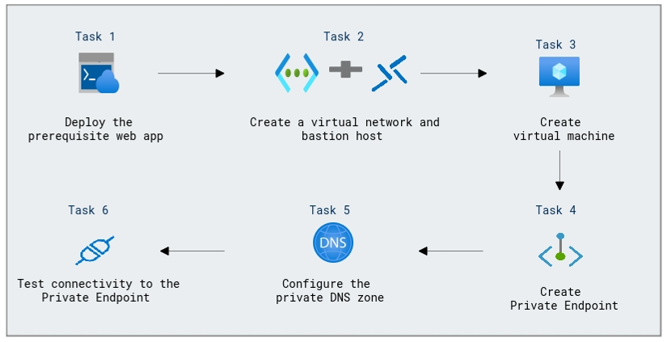

# Lab Scenario Preview: Design and implement private access to Azure Services

## Module 07-Unit 6 Create an Azure private endpoint using Azure PowerShell

### Lab overview

In this lab, you will learn how to deploy a new web application in Azure, and you need to ensure that it is accessible privately within your Azure virtual network to enhance security. To achieve this, you will create an Azure private endpoint for the web application using Azure PowerShell.

### Lab Objectives
  
After completing this lab, you will be able to:

+ Task 1: Deploy the prerequisite web app
+ Task 2: Create a virtual network and bastion host
+ Task 3: Create a test virtual machine
+ Task 4: Create a Private Endpoint
+ Task 5: Configure the private DNS zone
+ Task 6: Test connectivity to the Private Endpoint

### Architecture Diagram
 

Once you understand the lab's content, you can start the Hands-on Lab by clicking the **Launch** button located in the top right corner. This will lead you to the lab environment and guide. You can also preview the full lab guide [here](https://experience.cloudlabs.ai/#/labguidepreview/4362c83e-9e23-448f-a344-535b341b0a90) if you want to go through detailed guide prior to launching lab environment.

