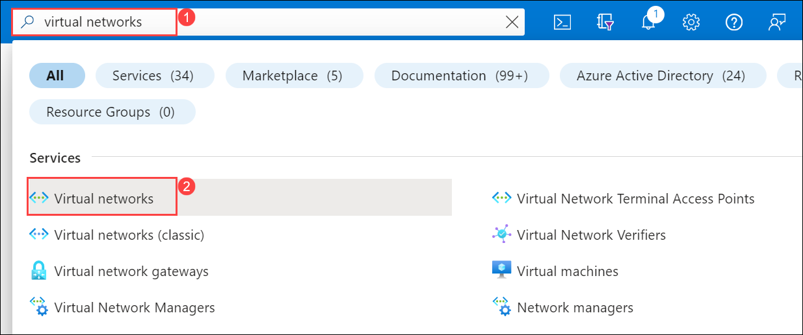
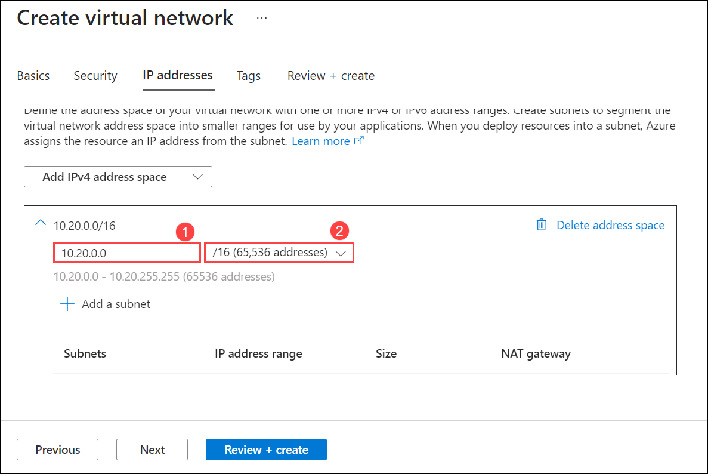
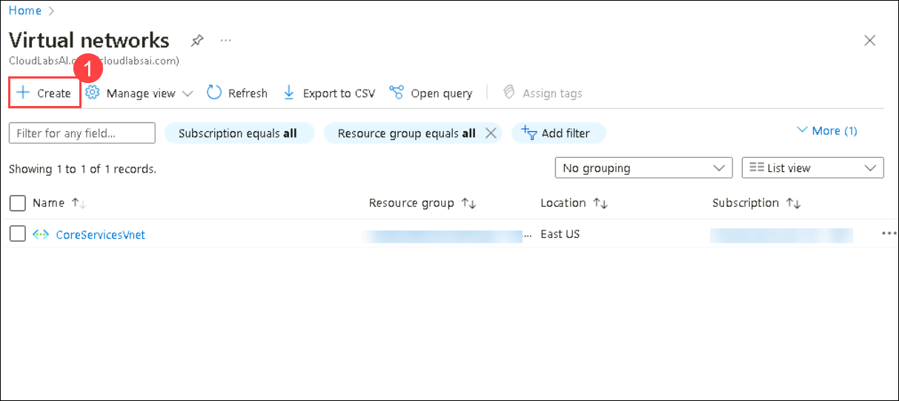
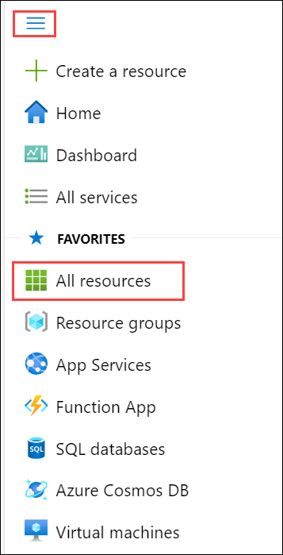
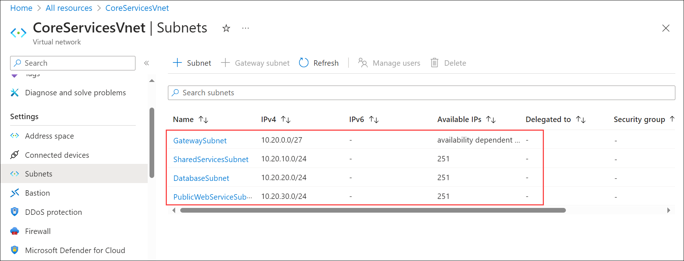

# Module 01-Unit 4 Design and implement a Virtual Network in Azure

## Lab scenario 

Now you're ready to deploy virtual networks in the Azure portal.

Consider the fictional organization Contoso Ltd, which is in the process of migrating infrastructure and applications to Azure. In your role as network engineer, you must plan and implement three virtual networks and subnets to support resources in those virtual networks.

**Note:** An **[interactive lab simulation](https://mslabs.cloudguides.com/guides/AZ-700%20Lab%20Simulation%20-%20Design%20and%20implement%20a%20virtual%20network%20in%20Azure)** is available that allows you to click through this lab at your own pace. You may find slight differences between the interactive simulation and the hosted lab, but the core concepts and ideas being demonstrated are the same.

## Lab Objectives

In this lab, you will complete the following tasks:

+ Task 1: Create the CoreServicesVnet virtual network and subnets
+ Task 2: Create the ManufacturingVnet virtual network and subnets
+ Task 3: Create the ResearchVnet virtual network and subnets
+ Task 4: Verify the creation of VNets and Subnets

## Estimated time: 20 minutes

## Architecture diagram

The **CoreServicesVnet** virtual network is deployed in the **East US** region. This virtual network will have the largest number of resources. It will have connectivity to on-premises networks through a VPN connection. This network will have web services, databases, and other systems that are key to the operations of the business. Shared services, such as domain controllers and DNS also will be located here. A large amount of growth is anticipated, so a large address space is necessary for this virtual network.

The **ManufacturingVnet** virtual network is deployed in the **West Europe** region, near the location of your organization's manufacturing facilities. This virtual network will contain systems for the operations of the manufacturing facilities. The organization is anticipating a large number of internal connected devices for their systems to retrieve data from, such as temperature, and will need an IP address space that it can expand into.

The **ResearchVnet** virtual network is deployed in the **Southeast Asia** region, near the location of the organization's research and development team. The research and development team uses this virtual network. The team has a small, stable set of resources that is not expected to grow. The team needs a small number of IP addresses for a few virtual machines for their work.

You will create the following resources:
 

| **Virtual Network** | **Region**   | **Virtual network address space** | **Subnet**                | **Subnet**    |
| ------------------- | ------------ | --------------------------------- | ------------------------- | ------------- |
| CoreServicesVnet    | East US      | 10.20.0.0/16                      |                           |               |
|                     |              |                                   | GatewaySubnet             | 10.20.0.0/27  |
|                     |              |                                   | SharedServicesSubnet      | 10.20.10.0/24 |
|                     |              |                                   | DatabaseSubnet            | 10.20.20.0/24 |
|                     |              |                                   | PublicWebServiceSubnet    | 10.20.30.0/24 |
| ManufacturingVnet   | West Europe  | 10.30.0.0/16                      |                           |               |
|                     |              |                                   | ManufacturingSystemSubnet | 10.30.10.0/24 |
|                     |              |                                   | SensorSubnet1             | 10.30.20.0/24 |
|                     |              |                                   | SensorSubnet2             | 10.30.21.0/24 |
|                     |              |                                   | SensorSubnet3             | 10.30.22.0/24 |
| ResearchVnet        |Southeast Asia| 10.40.0.0/16                      |                           |               |
|                     |              |                                   | ResearchSystemSubnet      | 10.40.0.0/24  |

These virtual networks and subnets are structured in a way that accommodates existing resources yet allows for projected growth. Let's create these virtual networks and subnets to lay the foundation for our networking infrastructure.

### Task 1: Create the CoreServicesVnet virtual network and subnets

1. On Azure Portal page, in **Search resources, services and docs (G+/)** box at the top of the portal, enter **Virtual Networks**, and then select **Virtual Networks** under services.
   
   

1. Select **+ Create** on the Virtual networks page. 
   
1. On **Basic** tab of **Create virtual network** use the information in the following table to create the **CoreServicesVnet** virtual network and select **IP Address** tab.
 
   | **Tab**      | **Option**         | **Value**            |
   | ------------ | ------------------ | -------------------- |
   | Basics       | Subscription       | Leave default        |
   |              | Resource Group     | ContosoResourceGroup-<inject key="DeploymentID" enableCopy="false"/> |
   |              | Name               | CoreServicesVNet     |
   |              | Region             | (US) East US         |
 

1. On the **IP Address** tab of **Create virtual network** use the information:

   - Remove the default IP Address space by clicking on **Delete the address space**

     

   - After deleting **address space**, select **Add IPV4 Address space** use the information in the following table. 

     

      |    **Tab**      | **Option**         | **Value**            |
      | --------------  | -------------------- | -------------------|
      | IP Addresses    | IPv4 address space | 10.20.0.0            |
      |                 | IPv4 address Size  | /16                  |

      

1. Use the information in the following table to create the CoreServicesVnet subnets, to begin creating each subnet on the **Create virtual network** page, select **+ Add subnet**. To finish creating each subnet, select **Add**.

    | **Subnet**             | **Option**           | **Value**              |
    | ---------------------- | -------------------- | ---------------------- |
    | GatewaySubnet          | Subnet purpose       | Select **Virtual Network Gateway** |
    |                        | Name                 | GatewaySubnet          |
    |                        | Starting address     | 10.20.0.0              |
    |                        | Size                 | /27                    |
    | SharedServicesSubnet   | Subnet name          | SharedServicesSubnet   |
    |                        | Starting address     | 10.20.10.0             |
    |                        | Size                 | /24                    |
    | DatabaseSubnet         | Subnet name          | DatabaseSubnet         |
    |                        | Starting address     | 10.20.20.0             |
    |                        | Size                 | /24                    |
    | PublicWebServiceSubnet | Subnet name          | PublicWebServiceSubnet |
    |                        | Starting address     | 10.20.30.0             |
    |                        | Size                 | /24                    |

 1. To finish creating the CoreServicesVnet and its associated subnets, select **Review + create**.

 1. Verify your configuration passed validation, Go back to virtual network and then again select **+ Create**.

    
 
 1. Repeat steps 1 -8 for each VNet based on the tables below mentioned in **Task 2** and **Task3**.

   > **Congratulations** on completing the task! Now, it's time to validate it. Here are the steps:
   > - Navigate to the Lab Validation Page, from the upper right corner in the lab guide section.
   > - Hit the Validate button for the corresponding task. You can proceed to the next task if you receive a success message.
   > - If not, carefully read the error message and retry the step, following the instructions in the lab guide.
   > - If you need any assistance, please contact us at labs-support@spektrasystems.com. We are available 24/7 to help you out.

### Task 2: Create the ManufacturingVnet virtual network and subnets

1. On **Basic** tab of **Create virtual network** use the information in the following table to create the **ManufacturingVnet** virtual network and select **IP 
   Address** tab.

   | **Tab**      | **Option**         | **Value**             |
   | ------------ | ------------------ | --------------------- |
   | Basics       | Resource Group     | ContosoResourceGroup-<inject key="DeploymentID" enableCopy="false"/>  |
   |              | Name               | ManufacturingVnet     |
   |              | Region             | (Europe) West Europe  |

1. **Go to Ip address tab** Delete the existing ip address in the IP adress Tab and add the below ip adress with the subnets as performed in the previous task.   

    | **IP/Subnet**                | **Option**           | **Value**                 |
    | ------------------------- | -------------------- | ------------------------- |
    | IP Addresses              | IPv4 address space   | 10.30.0.0/16              |
    | ManufacturingSystemSubnet | Subnet name          | ManufacturingSystemSubnet |
    |                           | Subnet address range | 10.30.10.0/24             |
    | SensorSubnet1             | Subnet name          | SensorSubnet1             |
    |                           | Subnet address range | 10.30.20.0/24             |
    | SensorSubnet2             | Subnet name          | SensorSubnet2             |
    |                           | Subnet address range | 10.30.21.0/24             |
    | SensorSubnet3             | Subnet name          | SensorSubnet3             |
    |                           | Subnet address range | 10.30.22.0/24             |

 1. To finish creating the CoreServicesVnet and its associated subnets, select **Review + create**.

 1. Verify your configuration passed validation, Go back to virtual network and then again select **+ Create**.
    
    > **Congratulations** on completing the task! Now, it's time to validate it. Here are the steps:
    > - Navigate to the Lab Validation Page, from the upper right corner in the lab guide section.
    > - Hit the Validate button for the corresponding task. You can proceed to the next task if you receive a success message.
    > - If not, carefully read the error message and retry the step, following the instructions in the lab guide.
    > - If you need any assistance, please contact us at labs-support@spektrasystems.com. We are available 24/7 to help you out.

### Task 3: Create the ResearchVnet virtual network and subnets

1. On **Basic** tab of **Create virtual network** use the information in the following table to create the **ResearchVnet** virtual network and select **IP 
   Address** tab.

   | **Tab**      | **Option**         | **Value**            |
   | ------------ | ------------------ | -------------------- |
   | Basics       | Resource Group     | ContosoResourceGroup-<inject key="DeploymentID" enableCopy="false"/> |
   |              | Name               | ResearchVnet         |
   |              | Region             | Southeast Asia       |

1. **Go to Ip address tab** Delete the existing ip address in the IP adress Tab and add the below ip adress with the subnets as performed in the previous task.    

   | **IP/Subnet**        | **Option**           | **Value**            |
   | -------------------- | -------------------- | -------------------- |
   | IP Addresses         | IPv4 address space   | 10.40.0.0/16         |
   | ResearchSystemSubnet | Subnet name          | ResearchSystemSubnet |
   |                      | Subnet address range | 10.40.0.0/24         |
 
   > **Congratulations** on completing the task! Now, it's time to validate it. Here are the steps:
   > - Navigate to the Lab Validation Page, from the upper right corner in the lab guide section.
   > - Hit the Validate button for the corresponding task. You can proceed to the next task if you receive a success message.
   > - If not, carefully read the error message and retry the step, following the instructions in the lab guide.
   > - If you need any assistance, please contact us at labs-support@spektrasystems.com. We are available 24/7 to help you out.

### Task 4: Verify the creation of VNets and Subnets

1. On the Azure portal home page, from top left corner of page click **Show portal** menu and select **All resources**.

   

1. Verify that the CoreServicesVnet, ManufacturingVnet, and ResearchVnet are listed.

1. Select **CoreServicesVnet**. 

1. In CoreServicesVnet, from the left navigation pane, under **Settings**, select **Subnets**.

1. In CoreServicesVnet | Subnets, verify that the subnets you created are listed, and that the IP address ranges are correct.

   

1. Repeat steps 3 - 5 and select **ManufacturingVnet**, and **ResearchVnet** Virtual Network to verify the subnets.

## Review

In this lab, you have completed:

+ Creating the CoreServicesVnet virtual network and subnets
+ Creating the ManufacturingVnet virtual network and subnets
+ Creating the ResearchVnet virtual network and subnets
+ Verifying the creation of VNets and Subnets

## You have successfully completed the lab.
