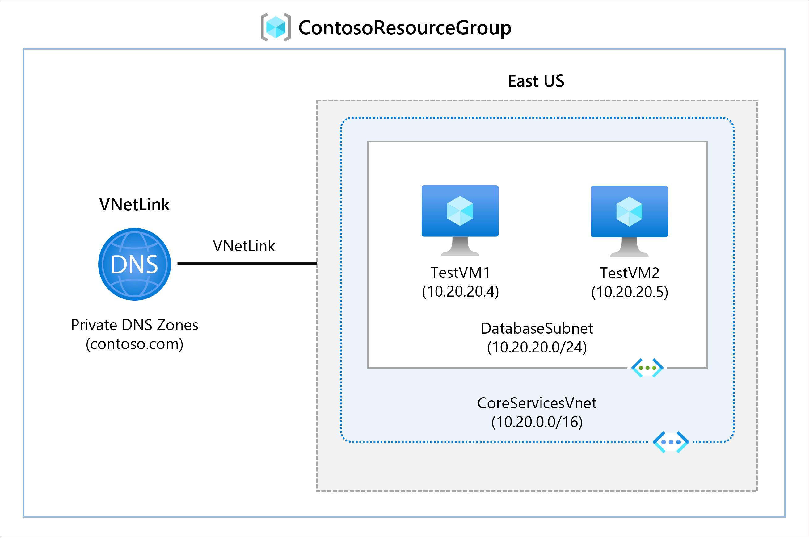
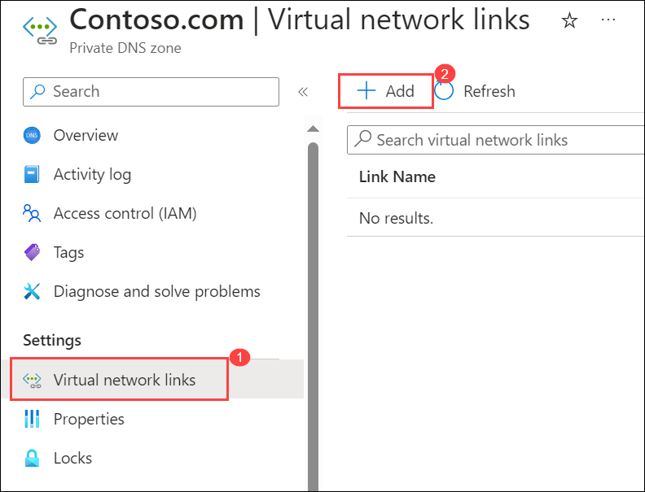
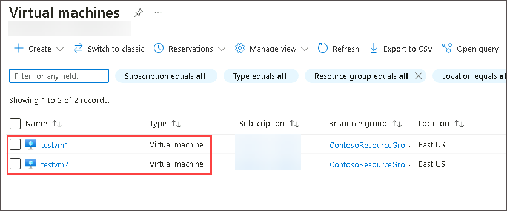
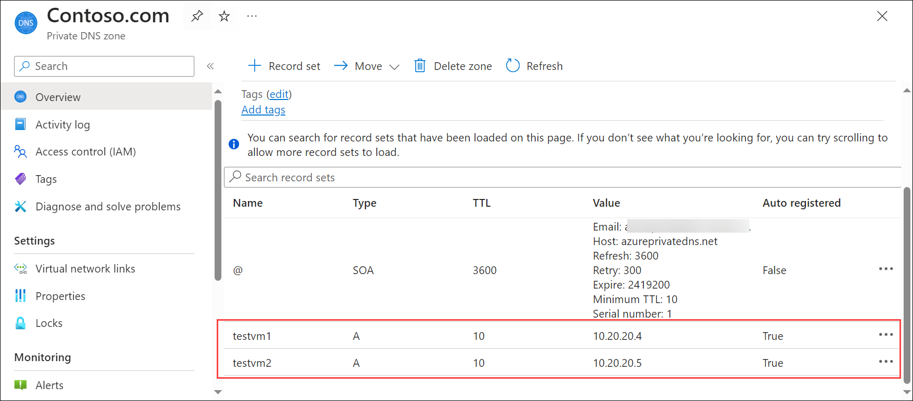
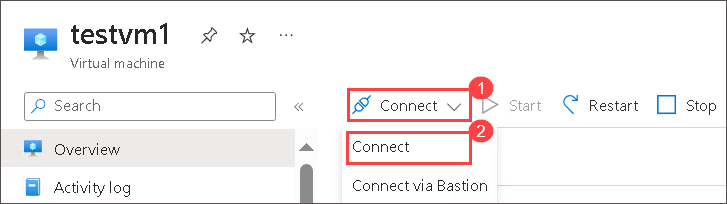
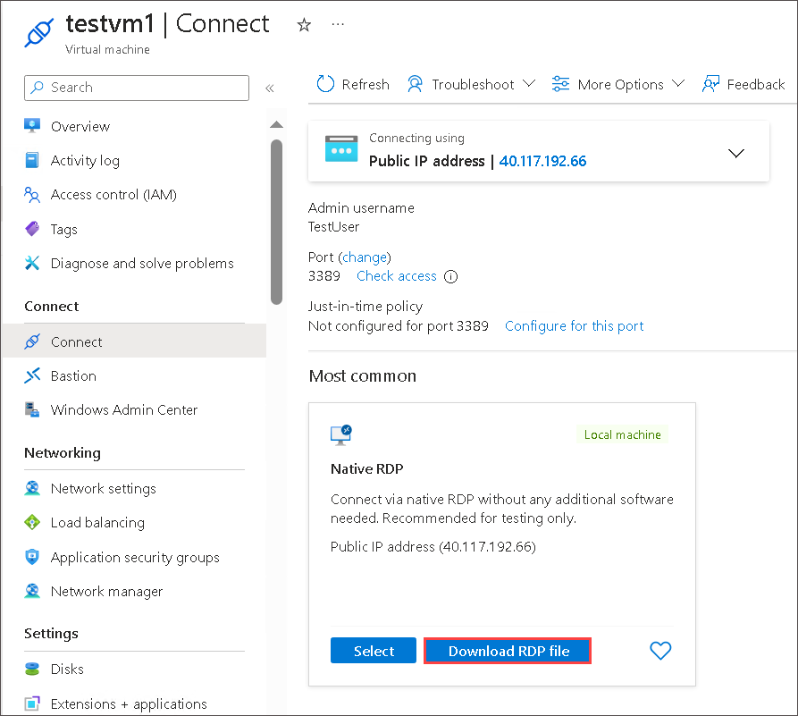

# Module 01 - Unit 6 Configure DNS settings in Azure

## Lab scenario 
In this lab, you will configure DNS name resolution for Contoso Ltd. You will create a private DNS zone named contoso.com, link the VNets for registration and resolution, and then create two virtual machines and test the configuration.

## Lab Objectives

In this lab, you will complete the following tasks:

+ Task 1: Create a private DNS Zone
+ Task 2: Link subnet for auto registration
+ Task 3: Create Virtual Machines to test the configuration
+ Task 4: Verify records are present in the DNS zone

**Note:** An **[interactive lab simulation](https://mslabs.cloudguides.com/guides/AZ-700%20Lab%20Simulation%20-%20Configure%20DNS%20settings%20in%20Azure)** is available that allows you to click through this lab at your own pace. You may find slight differences between the interactive simulation and the hosted lab, but the core concepts and ideas being demonstrated are the same.

## Estimated time: 25 minutes

## Architecture diagram

  ‎

### Task 1: Create a private DNS Zone

1. On Azure Portal page, in **Search resources, services and docs (G+/)** box at the top of the portal, enter **Private DNS zones**, and then select **Private DNS zones** under services.

    ‎.png)

1. In Private DNS zones, select **+ Create**.

1. On **Basics** tab, use the information in the following table to create the private DNS zone.

   | **Tab**         | **Option**                             | **Value**            |
   | --------------- | -------------------------------------- | -------------------- |
   | Basics          | Resource group                         | **ContosoResourceGroup-<inject key="DeploymentID" enableCopy="false"/>** |
   |                 | Name                                   | **Contoso.com**          | 

1. Select **Review create** and **create**

   >**Note**: Please Wait until the deployment is completed, and then select **Go to resource**.

1. Verify that the zone has been created by clicking on the **Go to resource**.

### Task 2: Link subnet for auto registration

1. In Contoso.com, under **Settings** section, select **Virtual network links** and on **Contoso.com | Virtual network links** page, select **+ Add**.

   

1. Use the information in the following table to add the virtual network link.

   | **Option**                          | **Value**                               |
   | ----------------------------------- | --------------------------------------- |
   | Link name                           | **CoreServicesVnetLink**                    |
   | Subscription                        | **No changes required**                     |
   | Virtual Network                     | Select **CoreServicesVnet (ContosoResourceGroup-<inject key="DeploymentID" enableCopy="false"/>)** |
   | Enable auto registration            | **Selected**                                |

1. Review your settings and select **OK**.

   >**Note**: Please Wait for 2 mins to successfully create virtual network link.
   
1. Select **Refresh**.

1. Verify that the CoreServicesVnetLink has been created, and that auto-registration is enabled.

1. Repeat steps 1 - 5 for the ManufacturingVnet, using the information in the following table: 

   | **Option**                          | **Value**                                |
   | ----------------------------------- | ---------------------------------------- |
   | Link name                           | **ManufacturingVnetLink**                |
   | Subscription                        | **No changes required**                  |
   | Virtual Network                     | **select ManufacturingVnet (ContosoResourceGroup-<inject key="DeploymentID" enableCopy="false"/>)** |
   | Enable auto registration            | **Selected**                             |

1. Review your settings and select OK.

   >**Note**: Please Wait for 2 mins to successfully create virtual network link.

1. Select **Refresh**.

1. Verify that the **ManufacturingVnetLink** has been created, and that auto-registration is enabled.

1. Repeat steps 1 - 5 for the ResearchVnet, using the information in the following table: 

   | **Option**                          | **Value**                           |
   | ----------------------------------- | ----------------------------------- |
   | Link name                           | **ResearchVnetLink**                |
   | Subscription                        | **No changes required**             |
   | Virtual Network                     | **select ResearchVnet (ContosoResourceGroup-<inject key="DeploymentID" enableCopy="false"/>)** |
   | Enable auto registration            | **Selected**                        |

1. Review your settings and select OK.
  
   >**Note**: Please Wait for 2 mins to successfully create virtual network link.

1. Select **Refresh**.

1. Verify that the **ResearchVnetLink** has been created, and that auto-registration is enabled.

   > **Congratulations** on completing the task! Now, it's time to validate it. Here are the steps:
   > - Navigate to the Lab Validation Page, from the upper right corner in the lab guide section.
   > - Hit the Validate button for the corresponding task. You can proceed to the next task if you receive a success message.
   > - If not, carefully read the error message and retry the step, following the instructions in the lab guide.
   > - If you need any assistance, please contact us at labs-support@spektrasystems.com. We are available 24/7 to help you out.
 
###  Task 3: Create Virtual Machines to test the configuration

In this section, you will create two test VMs to test the Private DNS zone configuration.

1. On the Azure portal, select the **Cloud shell** (**[>_]**)  button at the top of the page to the right of the search box. This opens a cloud shell pane at the bottom of the portal.

   

1. The first time you open the Cloud Shell, you may be prompted to choose the type of shell you want to use (*Bash* or *PowerShell*). If so, select **PowerShell**.

     

1. On **Getting started** window choose **Mount storage account** then under **Storage account subscription** select your available subscription from the dropdown and click on **Apply**.
   
     
   
1. Within the Mount storage account pane, select **I want to create a storage account** and click **Next**.

     
   
1. Please make sure you have selected your resource group **ContosoResourceGroup-<inject key="DeploymentID" enableCopy="false"/>**.

1. Enter **blob<inject key="DeploymentID" enableCopy="false"/>** For the **Storage account name**.

1. Enter **blobfileshare<inject key="DeploymentID" enableCopy="false"/>** For the  **File share** , then click on **Create**.

   

1. On the toolbar of the Cloud Shell pane, select the Select **Manage files** icon, in the drop-down menu, select **Upload**.

   

1. Upload the following files **azuredeploy.json** and **azuredeploy.parameters.json** into the Cloud Shell home directory one by one from the source folder **C:\AllFiles\AZ-700-Designing-and-Implementing-Microsoft-Azure-Networking-Solutions-prod\Allfiles\Exercises\M01**.

1. Deploy the following ARM templates to create the VMs needed for this exercise:

   ```powershell
   $RGName = "ContosoResourceGroup-<inject key="DeploymentID" enableCopy="false"/>"
   
   New-AzResourceGroupDeployment -ResourceGroupName $RGName -TemplateFile azuredeploy.json -TemplateParameterFile azuredeploy.parameters.json
   ```

    >**Note**: You will be prompted to provide an Admin password enter **Pa55w.rd!!**.
  
1. When the deployment is complete, go to the Azure portal home page, and then select **Virtual Machines**.

1. Verify that both **virtual machines** have been created.

      

   > **Congratulations** on completing the task! Now, it's time to validate it. Here are the steps:
   > - Navigate to the Lab Validation Page, from the upper right corner in the lab guide section.
   > - Hit the Validate button for the corresponding task. You can proceed to the next task if you receive a success message.
   > - If not, carefully read the error message and retry the step, following the instructions in the lab guide.
   > - If you need any assistance, please contact us at labs-support@spektrasystems.com. We are available 24/7 to help you out.

### Task 4: Verify records are present in the DNS zone

1. On the Azure Portal home page, select **Private DNS zones**.

1. On Private DNS zones, select **contoso.com**.

1. Verify that host (A) records are listed for both VMs, as shown:

   

1. Make a note of the names and IP addresses of the VMs.

 ### Task 05: Connect to the Test VMs using RDP

1. On the Azure Portal home page, select **Virtual Machines**.

1. Select **testvm1**.

1. On TestVM1, select **Connect** then select **Connect** from the drop-down. 

   

1. On **testvm1 | Connect** page, under **Native RDP** window select and **Download RDP file**. 

   

1. Save the RDP file to your desktop. If any warning pops up in "edge downloads" select **Keep**.

1. Follow the same steps for **testvm2**

1. Connect to testvm1 using the RDP file, and the username **TestUser** and the password you provided during deployment **Pa55w.rd!!**.

1. Connect to testvm2 using the RDP file, and the username **TestUser** and the password you provided during deployment **Pa55w.rd!!**.

1. On both VMs, in **Choose privacy settings for your device**, select **Accept**.

1. On both VMs, if prompted, in **Networks**, select **Yes**.

1. On TestVM1, open a command prompt and enter the command **ipconfig /all**.

1. Verify that the IP address is the same as the one you noted in the DNS zone.

1. Enter the command **ping testvm2.contoso.com**.

1. Verify that the FQDN resolves to the IP address that you noted in the Private DNS zone. The ping itself will timeout because of the Windows Firewall that is enabled on the VMs.

1. Alternatively, you can enter the command nslookup testvm2.contoso.com and verify that you receive a successful name resolution record for VM2
 
   > **Congratulations** on completing the task! Now, it's time to validate it. Here are the steps:
   > - Navigate to the Lab Validation Page, from the upper right corner in the lab guide section.
   > - Hit the Validate button for the corresponding task. You can proceed to the next task if you receive a success message.
   > - If not, carefully read the error message and retry the step, following the instructions in the lab guide.
   > - If you need any assistance, please contact us at labs-support@spektrasystems.com. We are available 24/7 to help you out.

## Review

In this lab, you have completed:

+ Creating a private DNS Zone
+ Linking subnet for auto registration
+ Creating Virtual Machines to test the configuration
+ Verifying records are present in the DNS zone

## You have successfully completed the lab.
