# Module 02-Unit 3 Create and configure a virtual network gateway

## Lab scenario 
In this lab you will configure a virtual network gateway to connect the Contoso Core Services VNet and Manufacturing VNet. 

## Lab Objectives
In this lab, you will complete the following tasks:

+ Task 1: Create CoreServicesVnet and ManufacturingVnet
+ Task 2: Create CoreServicesVM
+ Task 3: Create ManufacturingVM
+ Task 4: Connect to the Test VMs using RDP
+ Task 5: Test the connection between the VMs
+ Task 6: Create CoreServicesVnet Gateway
+ Task 7: Create ManufacturingVnet Gateway
+ Task 8: CoreServicesVnet to ManufacturingVnet 
+ Task 9: Connect ManufacturingVnet to CoreServicesVnet
+ Task 10: Verify that the connections connect 
+ Task 11: Test the connection between the VMs

**Note:** An **[interactive lab simulation](https://mslabs.cloudguides.com/guides/AZ-700%20Lab%20Simulation%20-%20Create%20and%20configure%20a%20virtual%20network%20gateway)** is available that allows you to click through this lab at your own pace. You may find slight differences between the interactive simulation and the hosted lab, but the core concepts and ideas being demonstrated are the same.

## Estimated time: 70 minutes

## Architecture diagram
 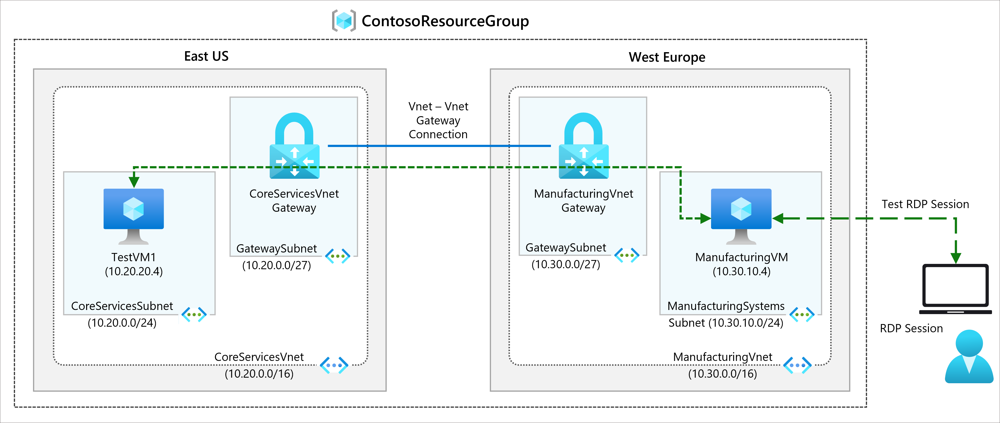

## Task 1: Create CoreServicesVnet and ManufacturingVnet

1. On the Azure portal, select the **Cloud shell** (**[>_]**)  button at the top of the page to the right of the search box. This opens a cloud shell pane at the bottom of the portal.

   

1. The first time you open the Cloud Shell, you may be prompted to choose the type of shell you want to use (*Bash* or *PowerShell*). If so, select **PowerShell**.

     

1. On **Getting started** window choose **Mount storage account** then under **Storage account subscription** select your available subscription from the dropdown and click on **Apply**.
   
     
   
1. Within the Mount storage account pane, select **I want to create a storage account** and click **Next**.

     
   
1. Please make sure you have selected your resource group **ContosoResourceGroup-<inject key="DeploymentID" enableCopy="false"/>** and enter **blob<inject key="DeploymentID" enableCopy="false"/>** for the **Storage account** and enter **blobfileshare<inject key="DeploymentID" enableCopy="false"/>** for the  **File share**, then click on **Create**.

    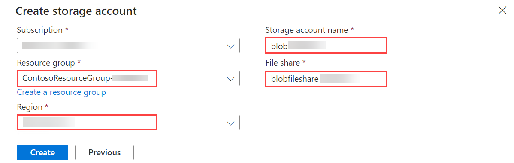
   
1. On the toolbar of the Cloud Shell pane, select the Select **Manage files** icon, in the drop-down menu, select **Upload** and upload the following files **azuredeploy.json** and **azuredeploy.parameters.json** into the Cloud Shell home directory one by one from the source folder **C:\AllFiles\AZ-700-Designing-and-Implementing-Microsoft-Azure-Networking-Solutions-prod\Allfiles\Exercises\M02**.

   

1. Deploy the following ARM templates to create the virtual network and subnets needed for this exercise:

   ```powershell
   $RGName = "ContosoResourceGroup-<inject key="DeploymentID" enableCopy="false"/>"
   New-AzResourceGroupDeployment -ResourceGroupName $RGName -TemplateFile azuredeploy.json -TemplateParameterFile azuredeploy.parameters.json
   ```


   > **Congratulations** on completing the task! Now, it's time to validate it. Here are the steps:
   > - Navigate to the Lab Validation Page, from the upper right corner in the lab guide section.
   > - Hit the Validate button for the corresponding task. You can proceed to the next task if you receive a success message.
   > - If not, carefully read the error message and retry the step, following the instructions in the lab guide.
   > - If you need any assistance, please contact us at labs-support@spektrasystems.com. We are available 24/7 to help you out. 

## Task 2: Create CoreServicesVM

1. On the Azure portal, open the **PowerShell** session within the **Cloud Shell** pane.

1. On the toolbar of the Cloud Shell pane, select the **Upload/Download files** icon, in the drop-down menu, select **Upload** and upload the following files **CoreServicesVMazuredeploy.json** and **CoreServicesVMazuredeploy.parameters.json** into the Cloud Shell home directory one by one from the source folder **C:\AllFiles\AZ-700-Designing-and-Implementing-Microsoft-Azure-Networking-Solutions-prod\Allfiles\Exercises\M02**.

1. Deploy the following ARM templates to create the VMs needed for this exercise:
   
   ```powershell
   $RGName = "ContosoResourceGroup-<inject key="DeploymentID" enableCopy="false"/>"
   
   New-AzResourceGroupDeployment -ResourceGroupName $RGName -TemplateFile CoreServicesVMazuredeploy.json -TemplateParameterFile CoreServicesVMazuredeploy.parameters.json
   ``` 

   >**Note**: You will be prompted to provide an Admin password, enter **Pa55w.rd!!**.
   
1. When the deployment is complete, go to the Azure portal home page, and then select **Virtual Machines**.

1. Verify that the virtual machine has been created.

   > **Congratulations** on completing the task! Now, it's time to validate it. Here are the steps:
   > - Navigate to the Lab Validation Page, from the upper right corner in the lab guide section.
   > - Hit the Validate button for the corresponding task. You can proceed to the next task if you receive a success message.
   > - If not, carefully read the error message and retry the step, following the instructions in the lab guide.
   > - If you need any assistance, please contact us at labs-support@spektrasystems.com. We are available 24/7 to help you out.


## Task 3: Create ManufacturingVM

1. On the Azure portal, open the **PowerShell** session within the **Cloud Shell** pane.

1. On the toolbar of the Cloud Shell pane, select the **Upload/Download files** icon, in the drop-down menu, select **Upload** and upload the following files **ManufacturingVMazuredeploy.json** and **ManufacturingVMazuredeploy.parameters.json** into the Cloud Shell home directory one by one from the source folder **C:\AllFiles\AZ-700-Designing-and-Implementing-Microsoft-Azure-Networking-Solutions-prod\Allfiles\Exercises\M02**

1. Deploy the following ARM templates to create the VMs needed for this exercise:

   ```powershell
   $RGName = "ContosoResourceGroup-<inject key="DeploymentID" enableCopy="false"/>"
   
   New-AzResourceGroupDeployment -ResourceGroupName $RGName -TemplateFile ManufacturingVMazuredeploy.json -TemplateParameterFile ManufacturingVMazuredeploy.parameters.json
   ```

   >**Note**: You will be prompted to provide an Admin password, enter **Pa55w.rd!!**.

1. When the deployment is complete, go to the Azure portal home page, and then select **Virtual Machines**.

1. Verify that the virtual machine has been created.

   > **Congratulations** on completing the task! Now, it's time to validate it. Here are the steps:
   > - Navigate to the Lab Validation Page, from the upper right corner in the lab guide section.
   > - Hit the Validate button for the corresponding task. You can proceed to the next task if you receive a success message.
   > - If not, carefully read the error message and retry the step, following the instructions in the lab guide.
   > - If you need any assistance, please contact us at labs-support@spektrasystems.com. We are available 24/7 to help you out.

## Task 4: Connect to the Test VMs using RDP

1. On the Azure Portal home page, search and select **Virtual Machines**.
1. Select **ManufacturingVM**.
1. On **ManufacturingVM**, click on the **Connect (1)** dropdown and then select **Connect (2)**.

   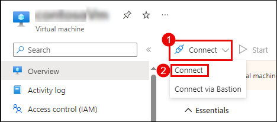

1. On **ManufacturingVM | Connect** page, click on **Download RDP file**. 

   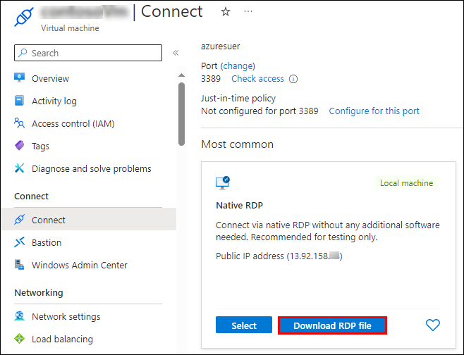

1. Click on the **Keep** button within the warning pop-up that shows up.

   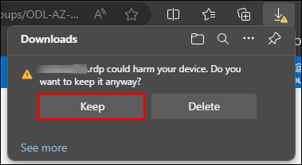

1. Open the **ManufacturingVM.rdp** file that was just downloaded and click on **Connect** when prompted.

   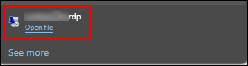

   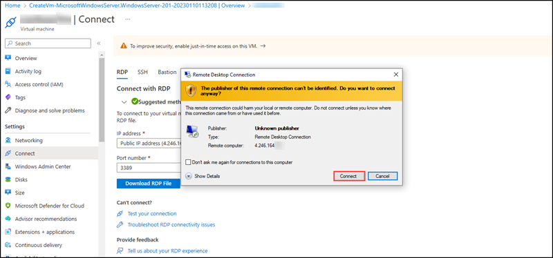

1. Connect to ManufacturingTestVM using the RDP file, and enter the username **TestUser** and Admin password **Pa55w.rd!!** provided during deployment. After connecting, minimize the RDP session.

1. On the Azure Portal home page, select **Virtual Machines**.

1. Select **CoreServicesVM**.

1. On **CoreServicesVM**, click on the **Connect** dropdown and then select **Connect**.

1. On **CoreServicesVM | Connect** page, click on **Download RDP file**. 

1. Click on the **Keep** button within the warning pop-up that shows up.

1. Open the **ManufacturingVM.rdp** file that was just downloaded and click on **Connect** when prompted.

1. Connect to CoreServicesTestVM using the RDP file, and the username **TestUser** and Admin password, enter **Pa55w.rd!!**

1. On both VMs, in **Networks**, select **Yes**.

1. On CoreServicesVM, open PowerShell, and run the following command: **ipconfig**

1. Note the IPv4 address. 

 ## Task 5: Test the connection between the VMs

1. On the **ManufacturingVM**, open PowerShell.

1. Use the following command to verify that there is no connection to CoreServicesVM on CoreServicesVnet. Be sure to use the IPv4 address for CoreServicesVM.

   ```Powershell
   Test-NetConnection 10.20.20.4 -port 3389
   ```

1. The test connection should fail, and you will see a result similar to the following:

   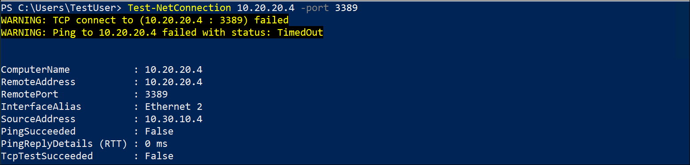
   
##  Task 6: Create CoreServicesVnet Gateway

1. In **Search resources, services, and docs (G+/)** box at the top of the portal, enter **Virtual network gateway**, and then select **Virtual network gateways** from the results.

    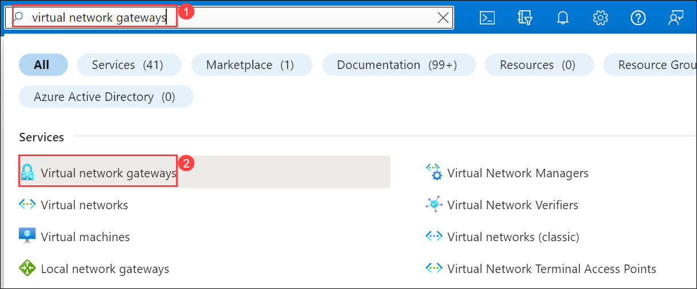

1. In Virtual network gateways, select **+ Create**.

1. Use the information in the following table to create the virtual network gateway:

   | **Tab**         | **Section**       | **Option**                                  | **Value**                    |
   | --------------- | ----------------- | ------------------------------------------- | ---------------------------- |
   | Basics          | Project Details   | Subscription                                | No changes required          |
   |                 |                   | ResourceGroup                               | **ContosoResourceGroup-<inject key="DeploymentID" enableCopy="false"/>**    |
   |                 | Instance Details  | Name                                        | CoreServicesVnetGateway      |
   |                 |                   | Region                                      | East US                      |
   |                 |                   | Gateway type                                | VPN                          |
   |                 |                   | SKU                                         | VpnGw1                       |
   |                 |                   | Generation                                  | Generation1                  |
   |                 |                   | Virtual network                             | CoreServicesVnet             |
   |                 |                   | Subnet                                      | GatewaySubnet (10.20.0.0/27) |
   |                 | Public IP address | Public IP address                           | Create new                   |
   |                 |                   | Public IP address name                      | CoreServicesVnetGateway-ip   |
   |                 |                   | Public IP address type                      | Standard                     |
   |                 |                   | Enable active-active mode                   | Disabled                     |
   |                 |                   | Configure BGP                               | Disabled                     |

1.  Select **Review + create** and **Create**.

    >**Note**: It can take up to 45 minutes to create a virtual network gateway, don't wait for deployment instead perform next task. 

    > **Congratulations** on completing the task! Now, it's time to validate it. Here are the steps:
    > - Navigate to the Lab Validation Page, from the upper right corner in the lab guide section.
    > - Hit the Validate button for the corresponding task. You can proceed to the next task if you receive a success message.
    > - If not, carefully read the error message and retry the step, following the instructions in the lab guide.
    > - If you need any assistance, please contact us at labs-support@spektrasystems.com. We are available 24/7 to help you out.

## Task 7: Create ManufacturingVnet Gateway

1. In **Search resources, services, and docs (G+/)**, enter **Virtual network gateways**, and then select **Virtual network gateways** from the results.

1. In Virtual network gateways, select **+ Create**.

1. Use the information in the following table to create the virtual network gateway:

   >**Important**: First select **Region** on the basics tab and specify the following.

   | **Tab**         | **Section**       | **Option**                                  | **Value**                    |
   | --------------- | ----------------- | ------------------------------------------- | ---------------------------- |
   | Basics          | Project Details   | Subscription                                | No changes required          |
   |                 |                   | ResourceGroup                               | **ContosoResourceGroup-<inject key="DeploymentID" enableCopy="false"/>**    |
   |                 | Instance Details  | Name                                        | ManufacturingVnetGateway     |
   |                 |                   | Region                                      | North Europe                 |
   |                 |                   | Gateway type                                | VPN                          |
   |                 |                   | SKU                                         | VpnGw1                       |
   |                 |                   | Generation                                  | Generation1                  |
   |                 |                   | Virtual network                             | ManufacturingVnet            |
   |                 |                   | Subnet                                      | 10.30.0.0/27                 |
   |                 | Public IP address | Public IP address                           | Create new                   |
   |                 |                   | Public IP address name                      | ManufacturingVnetGateway-ip  |
   |                 |                   | Public IP Address Type                      | Standard                     |
   |                 |                   | Enable active-active mode                   | Disabled                     |
   |                 |                   | Configure BGP                               | Disabled                     |
  

1.  Select **Review + create** and **Create**.

    >**Note**: Please wait until deployment gets success it can take up to 45 minutes to create a virtual network gateway. 

    > **Congratulations** on completing the task! Now, it's time to validate it. Here are the steps:
    > - Navigate to the Lab Validation Page, from the upper right corner in the lab guide section.
    > - Hit the Validate button for the corresponding task. You can proceed to the next task if you receive a success message.
    > - If not, carefully read the error message and retry the step, following the instructions in the lab guide.
    > - If you need any assistance, please contact us at labs-support@spektrasystems.com. We are available 24/7 to help you out.

## Task 8: Connect CoreServicesVnet to ManufacturingVnet 

1. In **Search resources, services, and docs (G+/)**, enter **Virtual network gateway**, and then select **Virtual network gateways** from the results.

1. In Virtual network gateways, select **CoreServicesVnetGateway**.

1. On CoreServicesVnetGateway, from the left navigation menu, under **Settings** section select **Connections**, and then select **+ Add**.

   >**Note**: You will not be able to complete this configuration until the virtual network gateways are fully deployed.

1. On **Create connection** page of **Basics** tab, use the information in the following table to create the connection:

      | **Option**                     | **Value**                         |
      | ------------------------------ | --------------------------------- |
      | Subscription                   | Leave default                     |
      | Resource Group                 | **ContosoResourceGroup-<inject key="DeploymentID" enableCopy="false"/>** |
      | Connection type                | VNet-to-VNet                      |
      | Name                           | CoreServicesGW-to-ManufacturingGW |
      | Location                       | East US                           |

1. Select **Next: Settings >**
   
1. On **Create connection** page of **Settings** tab, use the information in the following table to create the connection:

      | **Option**                     | **Value**                         |
      | ------------------------------ | --------------------------------- |
      | First virtual network gateway  | CoreServicesVnetGateway           |
      | Second virtual network gateway | ManufacturingVnetGateway          |          
      | IKE Protocol                   | IKEv2                             |
      | Use Azure Private IP Address   | Not selected                      |
      | Enable BGP                     | Not selected                      |
      
1. To create the connection, select **Review + create** and **Create**.
   
## Task 9: Connect ManufacturingVnet to CoreServicesVnet

1. In **Search resources, services, and docs (G+/)**, enter **Virtual network gateway**, and then select **Virtual network gateways** from the results.

1. In Virtual network gateways, select **ManufacturingVnetGateway**.

1. on ManufacturingVnetGateway, from the left navigation menu, under **Settings** section select **Connections**, and then select **+ Add**.

1. Use the information in the following table to create the connection:

      | **Option**                     | **Value**                         |
      | ------------------------------ | --------------------------------- |
      | Subscription                   | Leave default                     |
      | Resource Group                 | **ContosoResourceGroup-<inject key="DeploymentID" enableCopy="false"/>** |
      | Connection type                | VNet-to-VNet                      |
      | Name                           | ManufacturingGW-to-CoreServicesGW |
      | Location                       | North Europe                      |

1. Select **Next: Settings >**
   
1. On **Create connection** page of **Settings** tab, use the information in the following table to create the connection:

      | **Option**                     | **Value**                         |
      | ------------------------------ | --------------------------------- |
      | First virtual network gateway  | ManufacturingVnetGateway          |
      | Second virtual network gateway | CoreServicesVnetGateway           |
      | IKE Protocol                   | IKEv2                             |
      | Use Azure Private IP Address   | Not selected                      |
      | Enable BGP                     | Not selected                      |
  
1. To create the connection, select **Review + create** and **Create**.

1. Navigate to **Connections** page, select **CoreServicesGW-to-ManufacturingGW**, from the left navigation menu, under **Settings** select **Authentication**, replace the **Shared key (PSK)** valuw with **abc123**, and click on **Save**.

1. Navigate to **Connections** page, select **ManufacturingGW-to-CoreServicesGW**, from the left navigation menu, under **Settings** select **Authentication**, replace the **Shared key (PSK)** valuw with **abc123**, and click on **Save**.

## Task 10: Verify that the connections connect 

1. In **Search resources, services, and docs (G+/)**, enter **connections**, and then select **connections** from the results.

1. Select each connection and check the status. 

1. Wait until the status of both connections is **Connected**. You may need to refresh your screen. 

    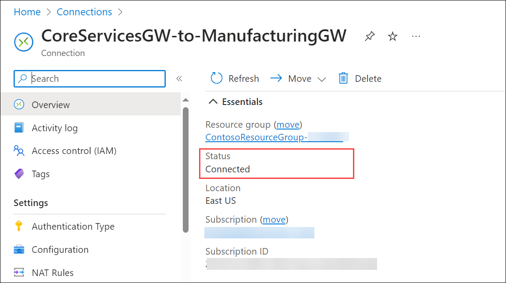
   
    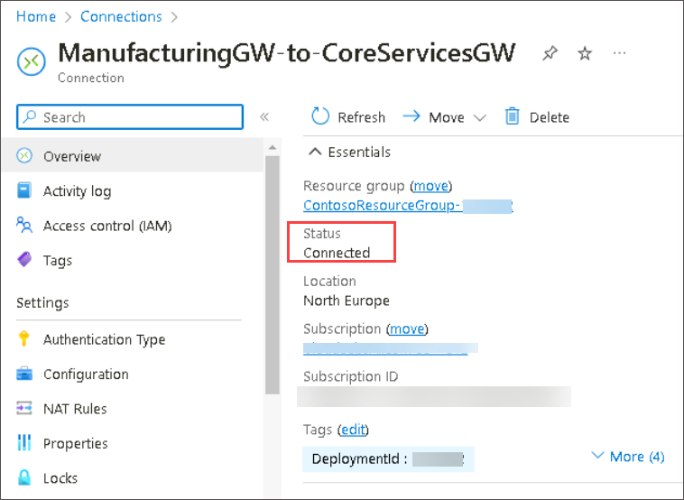

   >**Note:** It may take upto 30 minutes for the status of the two connections that was just established/created.

   > **Congratulations** on completing the task! Now, it's time to validate it. Here are the steps:
   > - Navigate to the Lab Validation Page, from the upper right corner in the lab guide section.
   > - Hit the Validate button for the corresponding task. You can proceed to the next task if you receive a success message.
   > - If not, carefully read the error message and retry the step, following the instructions in the lab guide.
   > - If you need any assistance, please contact us at labs-support@spektrasystems.com. We are available 24/7 to help you out.

## Task 11: Test the connection between the VMs

1. On the **ManufacturingVM**, open PowerShell.

1. Use the following command to verify that there is now a connection to CoreServicesVM on CoreServicesVnet. Be sure to use the IPv4 address for CoreServicesVM.

   ```Powershell
   Test-NetConnection 10.20.20.4 -port 3389
   ```

1. The test connection should succeed, and you will see a result similar to the following:

    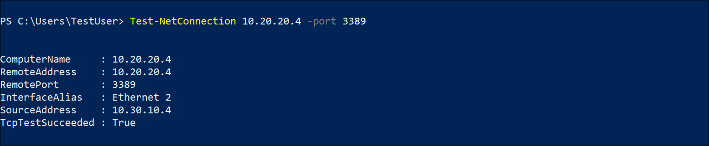

1. Close the Remote Desktop connection windows.

   Congratulations! You have configured a VNet-to-VNet connection by using a virtual network gateway.

## Review
In this lab, you have completed:

- Create Virtual Networks and Virtual machine
- Connect to VM's using RDP and Test the connection
- Create Application gateway
- CoreServicesVnet to ManufacturingVnet 
- Test the connection between the VMs

## You have successfully completed the lab.
