# Module 02-Unit 3 Create and configure a virtual network gateway

## Lab Overview
In this lab, you will configure a Virtual Network Gateway to establish connectivity between Contoso Core Services VNet and Manufacturing VNet. This is essential for enabling cross-network communication through a secure and reliable connection.

## Lab Objectives
In this lab, you will complete the following tasks:

+ Task 1: Create CoreServicesVnet and ManufacturingVnet
+ Task 2: Create CoreServicesVM
+ Task 3: Create ManufacturingVM
+ Task 4: Connect to the Test VMs using RDP
+ Task 5: Test the connection between the VMs
+ Task 6: Create CoreServicesVnet Gateway
+ Task 7: Create ManufacturingVnet Gateway
+ Task 8: CoreServicesVnet to ManufacturingVnet 
+ Task 9: Connect ManufacturingVnet to CoreServicesVnet
+ Task 10: Verify that the connections connect 
+ Task 11: Test the connection between the VMs

## Estimated time: 70 minutes

## Architecture diagram
 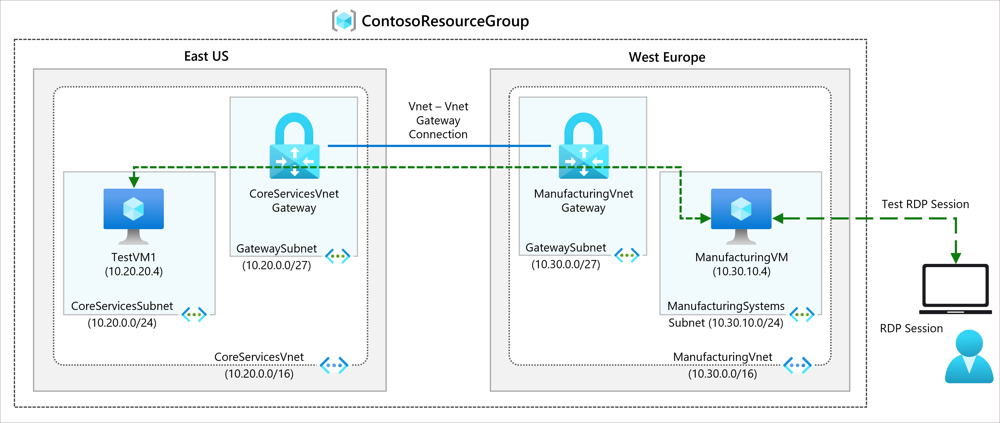

## Task 1: Create CoreServicesVnet and ManufacturingVnet

In this task, you'll create CoreServicesVnet and ManufacturingVnet, you set up the basic Azure resources to create two virtual networks: CoreServicesVnet and ManufacturingVnet. The task involves using Azure Cloud Shell to deploy ARM templates and configure the necessary infrastructure for the upcoming tasks.

1. On the Azure portal, select the **Cloud shell** (**[>_]**)  button at the top of the page to the right of the search box. This opens a cloud shell pane at the bottom of the portal.

   

1. The first time you open the Cloud Shell, you may be prompted to choose the type of shell you want to use (*Bash* or *PowerShell*). If so, select **PowerShell**.

     

1. On **Getting started** window choose **Mount storage account (1)** then under **Storage account subscription (2)** select your available subscription from the dropdown and click on **Apply (3)**.
   
     
   
1. Within the Mount storage account pane, select **I want to create a storage account (1)** and click **Next (2)**.

     
   
1. Please make sure you have selected your resource group **ContosoResourceGroup-<inject key="DeploymentID" enableCopy="false"/>** and then select **Region** **<inject key="Region" enableCopy="false"/>** and enter **blob<inject key="DeploymentID" enableCopy="false"/>** for the **Storage account** and enter **blobfileshare<inject key="DeploymentID" enableCopy="false"/>** for the  **File share**, then click on **Create**.

    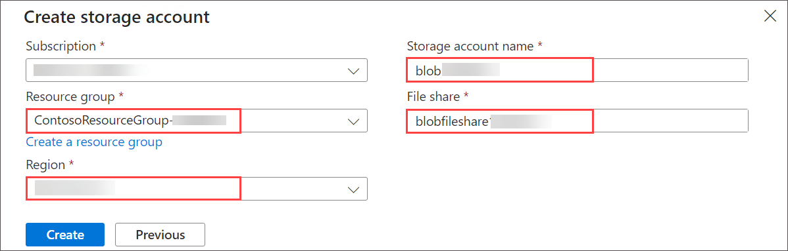
   
1. On the toolbar of the Cloud Shell pane, select the Select **Manage files (1)** icon, in the drop-down menu, select **Upload (2)** and upload the following files **azuredeploy.json** and **azuredeploy.parameters.json** into the Cloud Shell home directory one by one from the source folder **C:\AllFiles\AZ-700-Designing-and-Implementing-Microsoft-Azure-Networking-Solutions-prod\Allfiles\Exercises\M02**.

    

1. Deploy the following ARM templates to create the virtual network and subnets needed for this exercise:

   ```powershell
   $RGName = "ContosoResourceGroup-<inject key="DeploymentID" enableCopy="false"/>"
   New-AzResourceGroupDeployment -ResourceGroupName $RGName -TemplateFile azuredeploy.json -TemplateParameterFile azuredeploy.parameters.json
   ```

   > **Congratulations** on completing the task! Now, it's time to validate it. Here are the steps:
   > - Hit the Validate button for the corresponding task. If you receive a success message, you can proceed to the next task. 
   > - If not, carefully read the error message and retry the step, following the instructions in the lab guide.
   > - If you need any assistance, please contact us at labs-support@spektrasystems.com. We are available 24/7 to help.

   <validation step="847c0c62-8090-4d24-a8f1-cb650792ef71" /> 

## Task 2: Create CoreServicesVM

In this task, you'll create CoreServicesVM, you will create the CoreServicesVM virtual machine by deploying ARM templates.

1. On the Azure portal, open the **PowerShell** session within the **Cloud Shell** pane.

1. On the toolbar of the Cloud Shell pane, select the Select **Manage files** icon, in the drop-down menu, select **Upload** and upload the following files **CoreServicesVMazuredeploy.json** and **CoreServicesVMazuredeploy.parameters.json** into the Cloud Shell home directory one by one from the source folder **C:\AllFiles\AZ-700-Designing-and-Implementing-Microsoft-Azure-Networking-Solutions-prod\Allfiles\Exercises\M02**.

1. Deploy the following ARM templates to create the VMs needed for this exercise:
   
      ```powershell
      $RGName = "ContosoResourceGroup-<inject key="DeploymentID" enableCopy="false"/>"
      
      New-AzResourceGroupDeployment -ResourceGroupName $RGName -TemplateFile CoreServicesVMazuredeploy.json -TemplateParameterFile CoreServicesVMazuredeploy.parameters.json
      ``` 

      >**Note**: You will be prompted to provide an Admin password, enter **Pa55w.rd!!**.
   
1. When the deployment is complete, go to the Azure portal home page, and then select **Virtual Machines**.

1. Verify that the virtual machine has been created.

   > **Congratulations** on completing the task! Now, it's time to validate it. Here are the steps:
   > - Hit the Validate button for the corresponding task. If you receive a success message, you can proceed to the next task. 
   > - If not, carefully read the error message and retry the step, following the instructions in the lab guide.
   > - If you need any assistance, please contact us at labs-support@spektrasystems.com. We are available 24/7 to help.

     <validation step="43d0668a-f35c-4b21-85ae-b7a6666b7b64" />

## Task 3: Create ManufacturingVM

In this task, you'll create ManufacturingVM, you will create the ManufacturingVM virtual machine by deploying ARM templates. 

1. On the Azure portal, open the **PowerShell** session within the **Cloud Shell** pane.

1. On the toolbar of the Cloud Shell pane, select the Select **Manage files** icon, in the drop-down menu, select **Upload** and upload the following files **ManufacturingVMazuredeploy.json** and **ManufacturingVMazuredeploy.parameters.json** into the Cloud Shell home directory one by one from the source folder **C:\AllFiles\AZ-700-Designing-and-Implementing-Microsoft-Azure-Networking-Solutions-prod\Allfiles\Exercises\M02**

1. Deploy the following ARM templates to create the VMs needed for this exercise:

   ```powershell
   $RGName = "ContosoResourceGroup-<inject key="DeploymentID" enableCopy="false"/>"
   
   New-AzResourceGroupDeployment -ResourceGroupName $RGName -TemplateFile ManufacturingVMazuredeploy.json -TemplateParameterFile ManufacturingVMazuredeploy.parameters.json
   ```

   >**Note**: You will be prompted to provide an Admin password, enter **Pa55w.rd!!**.

1. When the deployment is complete, go to the Azure portal home page, and then select **Virtual Machines**.

1. Verify that the virtual machine has been created.

   > **Congratulations** on completing the task! Now, it's time to validate it. Here are the steps:
   > - Hit the Validate button for the corresponding task. If you receive a success message, you can proceed to the next task. 
   > - If not, carefully read the error message and retry the step, following the instructions in the lab guide.
   > - If you need any assistance, please contact us at labs-support@spektrasystems.com. We are available 24/7 to help.

     <validation step="8cbd870c-21af-498b-a7e2-3cbded97cf32" />

## Task 4: Connect to the Test VMs using RDP

In this task, you'll connect to the Test VMs using RDP, you'll connect to both ManufacturingVM and CoreServicesVM using Remote Desktop Protocol (RDP). 

1. On the Azure Portal home page, search and select **Virtual Machines**.

1. Select **ManufacturingVM**.

1. On **ManufacturingVM**, click on the **Connect (1)** dropdown and then select **Connect (2)**.

   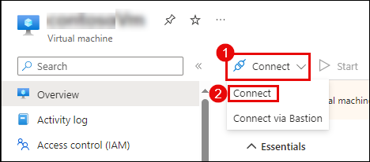

1. On **ManufacturingVM | Connect** page, click on **Download RDP file**. 

   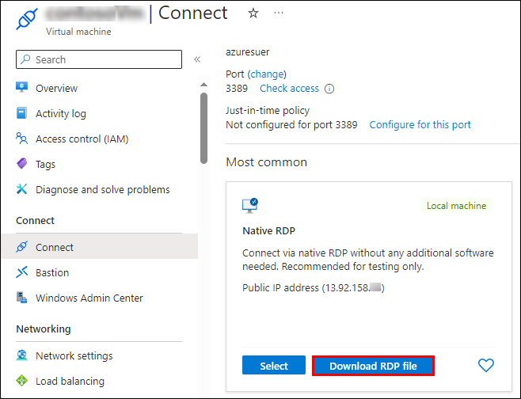

1. Click on the **Keep** button within the warning pop-up that shows up.

   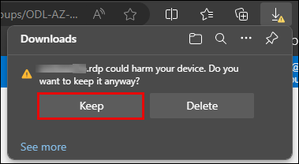

     

1. Open the **ManufacturingVM.rdp** file that was just downloaded and click on **Connect** when prompted.

   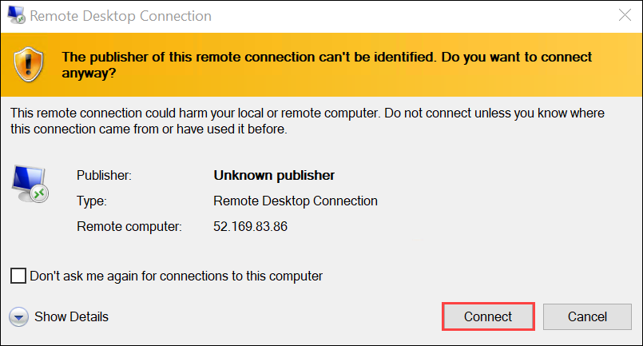

1. Connect to ManufacturingTestVM using the RDP file, and enter the username **TestUser** and Admin password **Pa55w.rd!!** provided during deployment. After connecting, minimize the RDP session.

1. On the Azure Portal home page, select **Virtual Machines**.

1. Select **CoreServicesVM**.

1. On **CoreServicesVM**, click on the **Connect** dropdown and then select **Connect**.

1. On **CoreServicesVM | Connect** page, click on **Download RDP file**. 

1. Click on the **Keep** button within the warning pop-up that shows up.

1. Open the **ManufacturingVM.rdp** file that was just downloaded and click on **Connect** when prompted.

1. Connect to CoreServicesTestVM using the RDP file, and the username **TestUser** and Admin password, enter **Pa55w.rd!!**

1. On both VMs, in **Networks**, select **Yes**.

1. On CoreServicesVM, open PowerShell, and run the following command: **ipconfig**

1. Note the IPv4 address. 

 ## Task 5: Test the connection between the VMs

1. On the **ManufacturingVM**, open PowerShell.

1. Use the following command to verify that there is no connection to CoreServicesVM on CoreServicesVnet. Be sure to use the IPv4 address for CoreServicesVM.

   ```Powershell
   Test-NetConnection 10.20.20.4 -port 3389
   ```

1. The test connection should fail, and you will see a result similar to the following:

   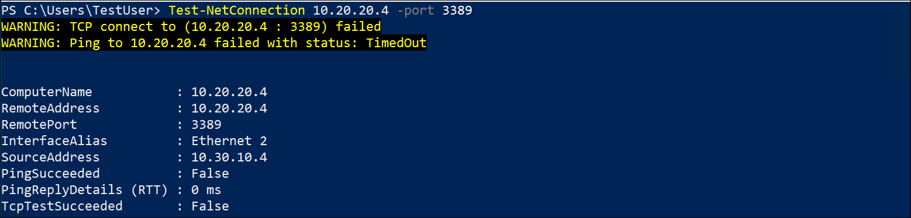
   
##  Task 6: Create CoreServicesVnet Gateway

In this task you'll create CoreServicesVnet Gateway, you will create the CoreServicesVnet Gateway to enable secure connections between the virtual networks. 

1. In **Search resources, services, and docs (G+/)** box at the top of the portal, enter **Virtual network gateway (1)**, and then select **Virtual network gateways (2)** from the results.

   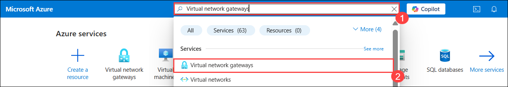

1. In Virtual network gateways, select **+ Create**.

    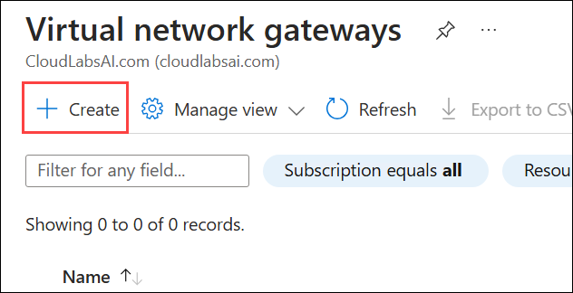

1. Use the information in the following table to create the virtual network gateway:

   | **Tab**         | **Section**       | **Option**                                  | **Value**                    |
   | --------------- | ----------------- | ------------------------------------------- | ---------------------------- |
   | Basics          | Project Details   | Subscription                                |**No changes required (1)**        |
   |                 |                   | ResourceGroup                               | **ContosoResourceGroup-<inject key="DeploymentID" enableCopy="false"/> (2)**    |
   |                 | Instance Details  | Name                                        | **CoreServicesVnetGateway (3)**     |
   |                 |                   | Region                                      | **East US (4)**                      |
   |                 |                   | Gateway type                                | **VPN (5)**                          |
   |                 |                   | SKU                                         | **VpnGw1 (6)**                       |
   |                 |                   | Generation                                  | **Generation1 (7)**                 |
   |                 |                   | Virtual network                             | **CoreServicesVnet (8)**            |
   |                 |                   | Subnet                                      | **GatewaySubnet (10.20.0.0/27) (9)** |
   |                 | Public IP address | Public IP address                           | **Create new (10)**                  |
   |                 |                   | Public IP address name                      | **CoreServicesVnetGateway-ip (11)**   |
   |                 |                   | Public IP address type                      | **Standard (12)**                    |
   |                 |                   | Enable active-active mode                   | **Disabled (13)**                     |
   |                 |                   | Configure BGP                               | **Disabled (14)**                    |                   |
   |                 |                   | Enable Key Vault Access                        | **Disabled (15)**                    |

   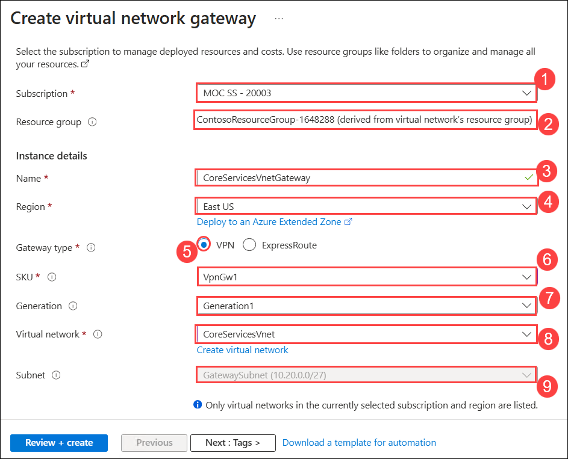
   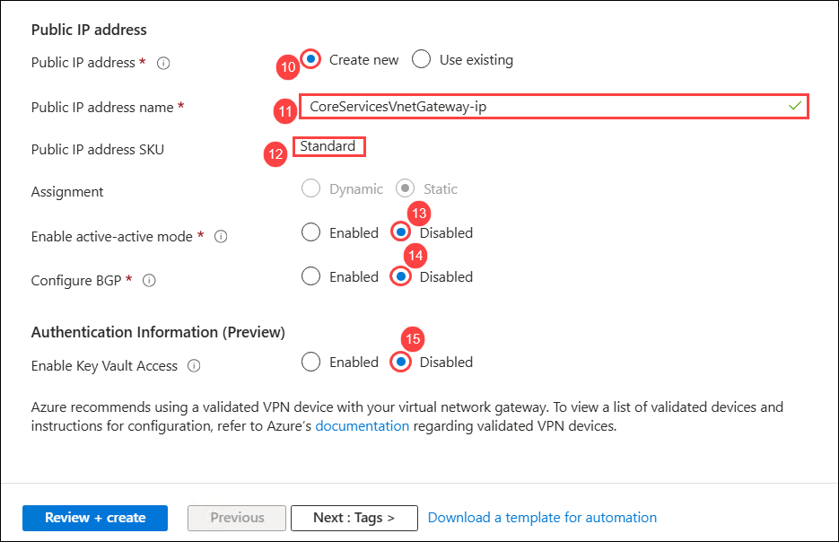

1. Select **Review + create** and **Create**.

1. It can take up to 45 minutes to create a virtual network gateway, don't wait for deployment instead perform next task. 

   > **Congratulations** on completing the task! Now, it's time to validate it. Here are the steps:
   > - Hit the Validate button for the corresponding task. If you receive a success message, you can proceed to the next task. 
   > - If not, carefully read the error message and retry the step, following the instructions in the lab guide.
   > - If you need any assistance, please contact us at labs-support@spektrasystems.com. We are available 24/7 to help.

   <validation step="07197cc4-bdd3-415f-871c-4f6e1b00dea7" />

## Task 7: Create ManufacturingVnet Gateway

In this task, you'll create ManufacturingVnet Gateway, you will create a ManufacturingVnet Gateway.

1. In order to create a virtual network gateway, we will need a Gateway Subnet. The template created the GatewaySubnet for the CoreServicesVnet. Here you create the subnet manually. 

1. Go the Virtual networks and open the **ManufacturingVnet**.

1. In the **Settings** blade, select **Subnets (1)**, and then **+ Subnet (2)**.

    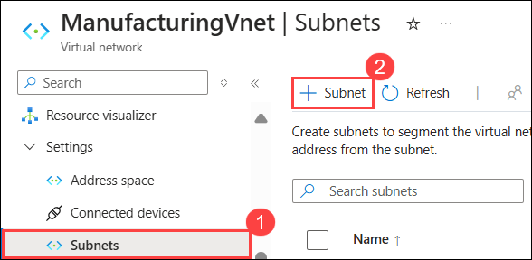

1. Select the following configurations in the Add a Subnet page. Then select **Add (3)**. 

    | Parameter | Value |
    | --------------- | ----------------- | 
    | Subnet purpose | **Virtual Network Gateway (1)** |
    | Size | **/27 (32 addresses) (2)** |

    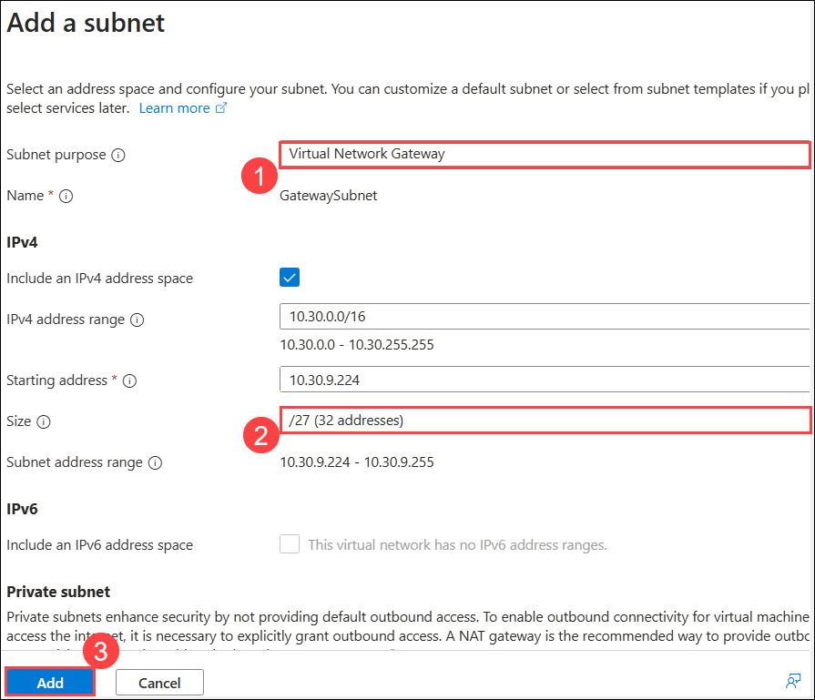

1. In **Search resources, services, and docs (G+/)**, enter **Virtual network gateways**, and then select **Virtual network gateways** from the results.

1. In Virtual network gateways, select **+ Create**.

1. Use the information in the following table to create the virtual network gateway:

   >**Important**: First select **Region** on the basics tab and specify the following.

   | **Tab**         | **Section**       | **Option**                                  | **Value**                    |
   | --------------- | ----------------- | ------------------------------------------- | ---------------------------- |
   | Basics          | Project Details   | Subscription                                | No changes required          |
   |                 |                   | ResourceGroup                               | **ContosoResourceGroup-<inject key="DeploymentID" enableCopy="false"/>**    |
   |                 | Instance Details  | Name                                        | ManufacturingVnetGateway     |
   |                 |                   | Region                                      | North Europe                 |
   |                 |                   | Gateway type                                | VPN                          |
   |                 |                   | SKU                                         | VpnGw1                       |
   |                 |                   | Generation                                  | Generation1                  |
   |                 |                   | Virtual network                             | ManufacturingVnet            |
   |                 |                   | Subnet                                      | 10.30.0.0/27                 |
   |                 | Public IP address | Public IP address                           | Create new                   |
   |                 |                   | Public IP address name                      | ManufacturingVnetGateway-ip  |
   |                 |                   | Public IP Address Type                      | Standard                     |
   |                 |                   | Enable active-active mode                   | Disabled                     |
   |                 |                   | Configure BGP                               | Disabled                     |
  

1.  Select **Review + create** and **Create**.

    >**Note**: Please wait until deployment gets success it can take up to 45 minutes to create a virtual network gateway. 

   > **Congratulations** on completing the task! Now, it's time to validate it. Here are the steps:
   > - Hit the Validate button for the corresponding task. If you receive a success message, you can proceed to the next task. 
   > - If not, carefully read the error message and retry the step, following the instructions in the lab guide.
   > - If you need any assistance, please contact us at labs-support@spektrasystems.com. We are available 24/7 to help.

   <validation step="c5a08b41-af13-48c5-8abc-8a4e540ae643" />

## Task 8: Connect CoreServicesVnet to ManufacturingVnet 

In this task, you'll connect CoreServicesVnet to ManufacturingVnet, you will set up a VNet-to-VNet connection between CoreServicesVnet and ManufacturingVnet.

1. In **Search resources, services, and docs (G+/)**, enter **Virtual network gateway**, and then select **Virtual network gateways** from the results.

1. In Virtual network gateways, select **CoreServicesVnetGateway**.

1. On CoreServicesVnetGateway, from the left navigation menu, under **Settings** section select **Connections**, and then select **+ Add**.

     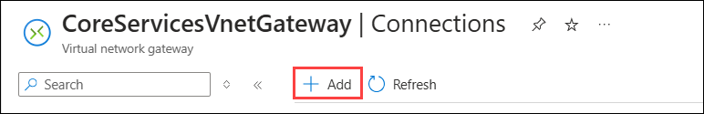

   >**Note**: You will not be able to complete this configuration until the virtual network gateways are fully deployed.

1. On **Create connection** page of **Basics** tab, use the information in the following table to create the connection:

      | **Option**                     | **Value**                         |
      | ------------------------------ | --------------------------------- |
      | Subscription                   | **Leave default (1)**                    |
      | Resource Group                 | **ContosoResourceGroup-<inject key="DeploymentID" enableCopy="false"/> (2)** |
      | Connection type                | **VNet-to-VNet (3)**                     |
      | Name                           | **CoreServicesGW-to-ManufacturingGW (4)** |
      | Location                       | **East US (5)**                           |

1. Select **Next: Settings >**

     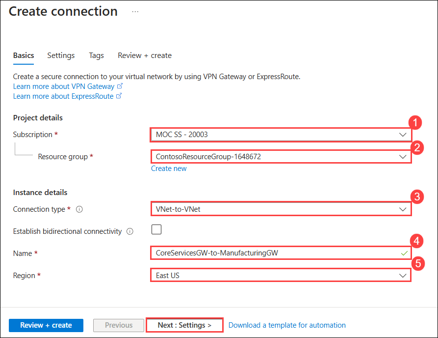
   
1. On **Create connection** page of **Settings** tab, use the information in the following table to create the connection:

      | **Option**                     | **Value**                         |
      | ------------------------------ | --------------------------------- |
      | First virtual network gateway  | **CoreServicesVnetGateway (1)**         |
      | Second virtual network gateway | **ManufacturingVnetGateway (2)**         |
      | Shared key (PSK)               | **abc123 (3)**                        |         
      | IKE Protocol                   | **IKEv2 (4)**                            |
      | Use Azure Private IP Address   | **Not selected (5)**                      |
      | Enable BGP                     | **Not selected (6)**                      |

      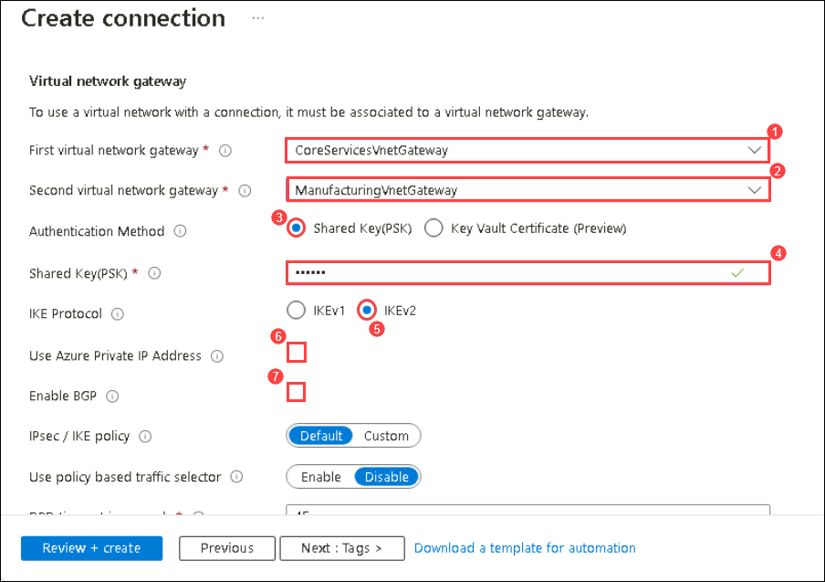
      
1. To create the connection, select **Review + create** and **Create**.
   
## Task 9: Connect ManufacturingVnet to CoreServicesVnet

In this task, you'll connect ManufacturingVnet to CoreServicesVnet, you'll establish the reverse VNet-to-VNet connection between ManufacturingVnet and CoreServicesVnet.  

1. In **Search resources, services, and docs (G+/)**, enter **Virtual network gateway**, and then select **Virtual network gateways** from the results.

1. In Virtual network gateways, select **ManufacturingVnetGateway**.

1. on ManufacturingVnetGateway, from the left navigation menu, under **Settings** section select **Connections**, and then select **+ Add**.

    

1. Use the information in the following table to create the connection:

      | **Option**                     | **Value**                         |
      | ------------------------------ | --------------------------------- |
      | Subscription                   | **Leave default (1)**                    |
      | Resource Group                 | **ContosoResourceGroup-<inject key="DeploymentID" enableCopy="false"/> (2)** |
      | Connection type                | **VNet-to-VNet (3)**                    |
      | Name                           | **ManufacturingGW-to-CoreServicesGW (4)** |
      | Location                       | **North Europe (5)**                      |

1. Select **Next: Settings > (6)**

   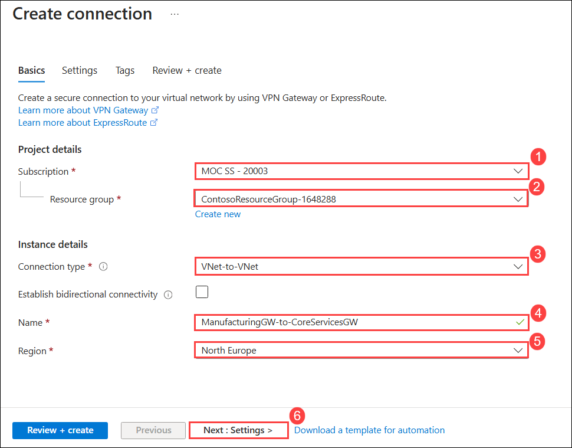
   
1. On **Create connection** page of **Settings** tab, use the information in the following table to create the connection:

      | **Option**                     | **Value**                         |
      | ------------------------------ | --------------------------------- |
      | First virtual network gateway  | **ManufacturingVnetGateway (1)**         |
      | Second virtual network gateway | **CoreServicesVnetGateway (2)**          |
      | Shared key (PSK)               | **abc123 (3)**                           |
      | IKE Protocol                   | **IKEv2 (4)**                             |
      | Use Azure Private IP Address   | **Not selected (5)**                    |
      | Enable BGP                     | **Not selected (6)**                     |

      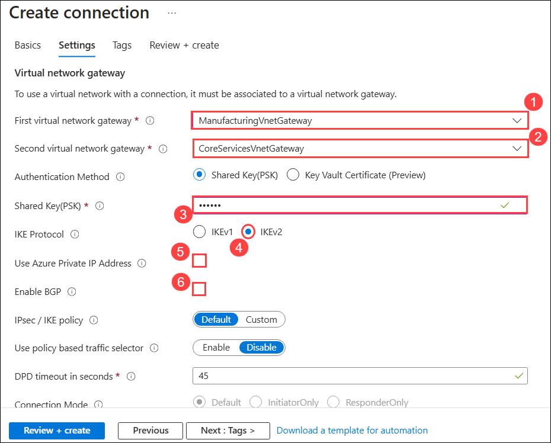
      
1. To create the connection, select **Review + create** and **Create**.

    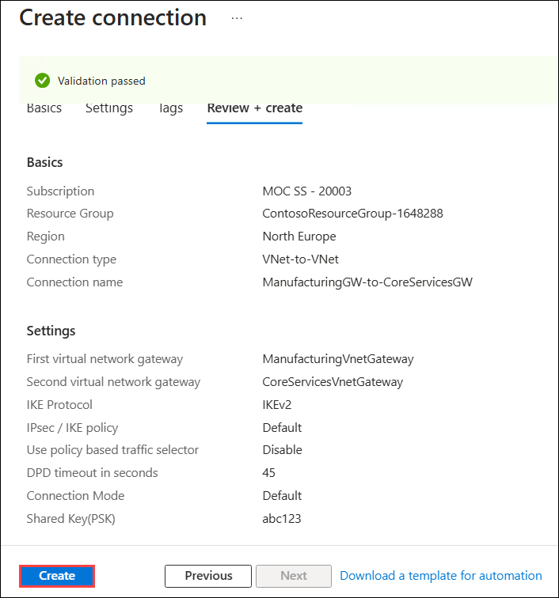

## Task 10: Verify that the connections connect 

In this task, you'll verify that the connections connect and you'll confirm the status of the connections between CoreServicesVnet and ManufacturingVnet. 

1. In **Search resources, services, and docs (G+/)**, enter **connections**, and then select **connections** from the results.

1. Select each connection and check the status. 

1. Wait until the status of both connections is **Connected**. You may need to refresh your screen. 

    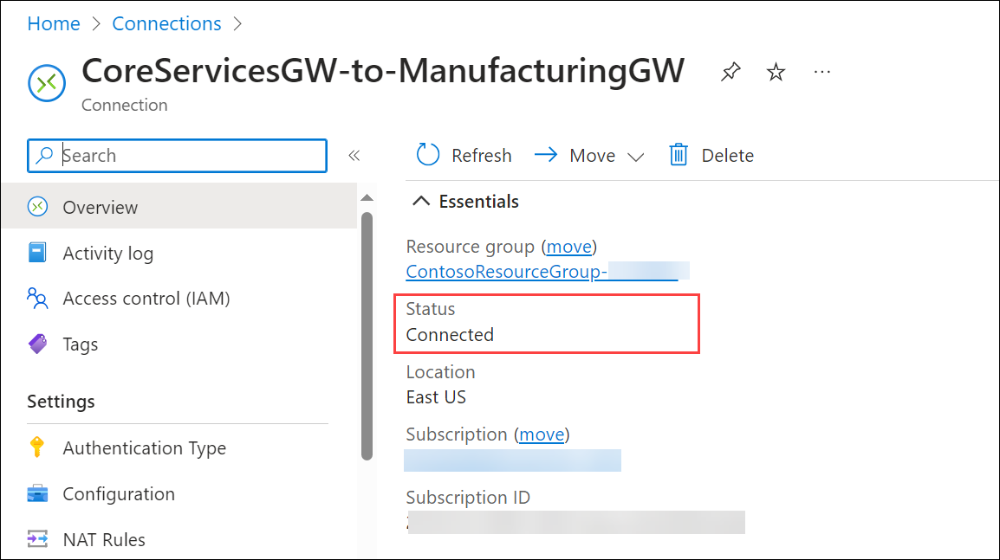
   
    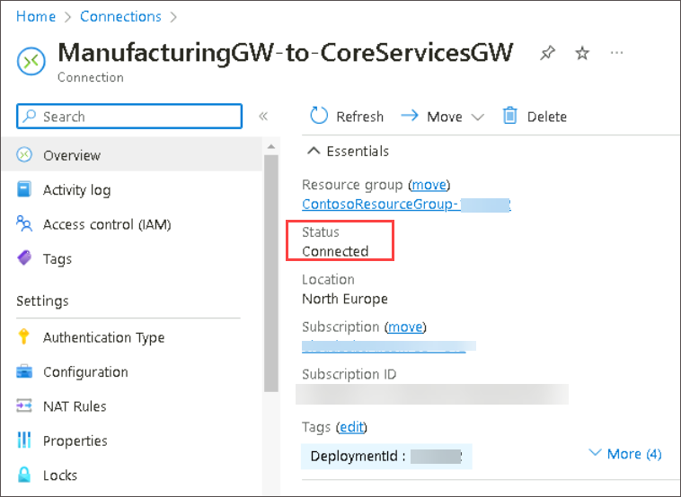

   >**Note:** It may take upto 30 minutes for the status of the two connections that was just established/created.

   > **Congratulations** on completing the task! Now, it's time to validate it. Here are the steps:
   > - Hit the Validate button for the corresponding task. If you receive a success message, you can proceed to the next task. 
   > - If not, carefully read the error message and retry the step, following the instructions in the lab guide.
   > - If you need any assistance, please contact us at labs-support@spektrasystems.com. We are available 24/7 to help.

   <validation step="638b26e2-d9a3-4d7a-ba0c-cf391847ec0b" />

## Task 11: Test the connection between the VMs

In this task, you'll test the connection between the VMs, you will verify the VNet-to-VNet connection between ManufacturingVM and CoreServicesVM. 

1. On the **ManufacturingVM**, open PowerShell.

1. Use the following command to verify that there is now a connection to CoreServicesVM on CoreServicesVnet. Be sure to use the IPv4 address for CoreServicesVM.

   ```Powershell
   Test-NetConnection 10.20.20.4 -port 3389
   ```

1. The test connection should succeed, and you will see a result similar to the following:

    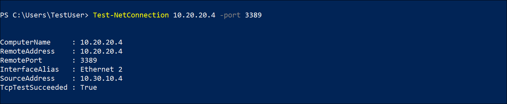

1. Close the Remote Desktop connection windows.

   Congratulations! You have configured a VNet-to-VNet connection by using a virtual network gateway.

## Key takeaways

Congratulations on completing the lab. Here are the main takeaways for this lab. 

+ Azure VPN Gateway is a service that provides secure connectivity between your on-premises networks and Azure virtual networks.
+ Site-to-Site (S2S) connections connect your on-premises network to an Azure virtual network using IPsec/IKE VPN tunnels. Ideal for hybrid cloud scenarios.
+ Point-to-Site (P2S) connections connnect individual clients to an Azure virtual network from remote locations. VPN protocols inlcude OpenVPN, IKEv2, or SSTP. Useful for remote workers.
+ VNet-to-VNet connections connect two or more Azure virtual networks using IPsec/IKE VPN tunnels. Suitable for multi-region or multi-VNet deployments.
+ Different VPN Gateway SKUs offer varying levels of performance, throughput, and features. 


## Review
In this lab, you have completed:

- Create Virtual Networks and Virtual machine
- Connect to VM's using RDP and Test the connection
- Create Application gateway
- CoreServicesVnet to ManufacturingVnet 
- Test the connection between the VMs

## You have successfully completed the lab.
