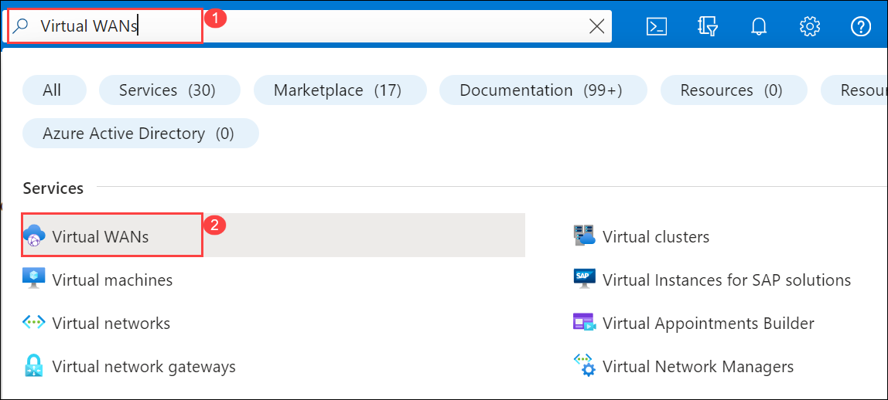
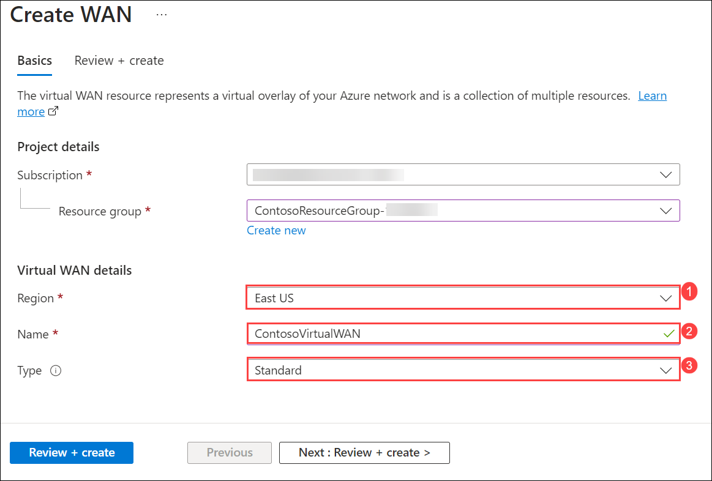
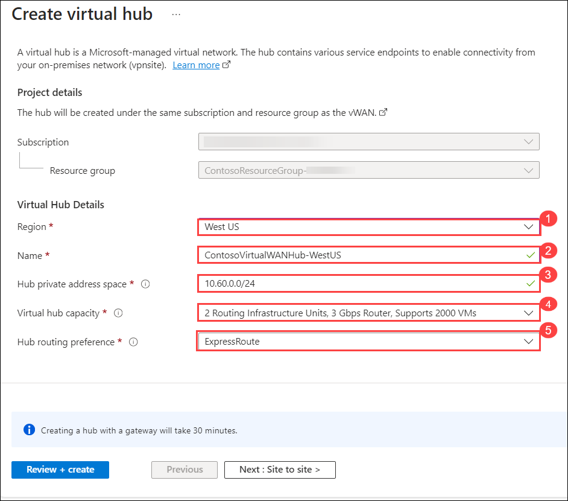
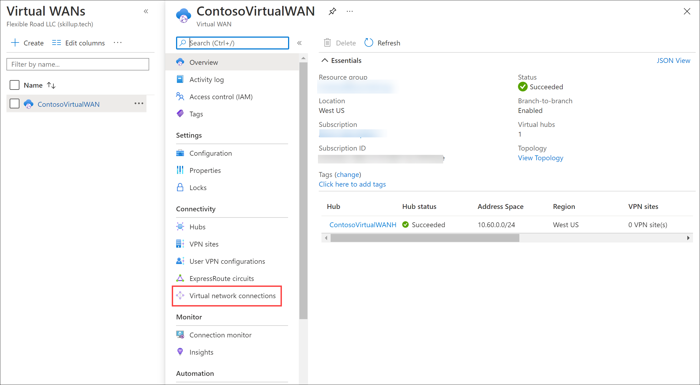

# Module 02-Unit 7 Create a Virtual WAN by using Azure Portal

## Lab Scenario

In this exercise, you will create a Virtual WAN for Contoso.

## Lab Objectives

In this Lab, you will Perform:

+ Task 1: Create a Virtual WAN
+ Task 2: Create a hub by using Azure Portal
+ Task 3: Connect a VNet to the Virtual Hub
+ Task 4: Clean up resources

**Note:** An **[interactive lab simulation](https://mslabs.cloudguides.com/guides/AZ-700%20Lab%20Simulation%20-%20Create%20a%20virtual%20WAN%20using%20the%20Azure%20portal)** is available that allows you to click through this lab at your own pace. You may find slight differences between the interactive simulation and the hosted lab, but the core concepts and ideas being demonstrated are the same.

### Estimated time: 65 minutes (including ~45 minutes deployment waiting time)

### Task 1: Create a Virtual WAN

1. From a browser, navigate to the Azure portal and sign in with your Azure account.

1. In the portal, enter Virtual WAN into the search box and select **Virtual WANs** from the results list.

   

1. On the Virtual WAN page, select + **Create**. 

1. On the Create WAN page, on the **Basics** tab, fill in the following fields:

   - **Subscription:** Use the existing subscription.

   - **Resource group:** **ContosoResourceGroup-<inject key="DeploymentID" enableCopy="false"/>**.

   - **Resource group location:** Choose a resource location from the dropdown. A WAN is a global resource and does not live in a particular region. However, you must select a region to manage and locate the WAN resource that you create.

   - **Name:** ContosoVirtualWAN

   - **Type:** Standard

1. When you have finished filling out the fields, select **Review +Create**.

1. Once validation passes, select **Create** to create the Virtual WAN.

   

   > **Congratulations** on completing the task! Now, it's time to validate it. Here are the steps:
   > - Navigate to the Lab Validation Page, from the upper right corner in the lab guide section.
   > - Hit the Validate button for the corresponding task. You can proceed to the next task if you receive a success message.
   > - If not, carefully read the error message and retry the step, following the instructions in the lab guide.
   > - If you need any assistance, please contact us at labs-support@spektrasystems.com. We are available 24/7 to help you out.

### Task 2: Create a hub by using Azure Portal

A hub contains gateways for site-to-site, ExpressRoute, or point-to-site functionality. It takes 30 minutes to create the site-to-site VPN gateway in the virtual hub. You must create a Virtual WAN before you can create a hub.

1. Locate the Virtual WAN that you created. 
1. On the Virtual WAN page, under **Connectivity**, select **Hubs**.
1. On the Hubs page, select **+New Hub** to open the Create virtual hub page.
  
1. On the Create virtual hub page **Basics** tab, complete the following fields:
   - **Region:** West US
   - **Name:** ContosoVirtualWANHub-WestUS
   - **Hub private address space:** 10.60.0.0/24
   - **Virtual hub capacity:** 2 Routing infrastructure units
   - **Hub routing preference:** ExpressRoute

   

1. Select **Next: Site-to-site**.
1. On the **Site-to-site** tab, complete the following fields:
   - **Do you want to create a Site to site (VPN gateway)?:** Yes
   - The **AS Number** field cannot be edited.
   - **Gateway scale units:** 1 scale unit - 500 Mbps x 2
   - **Routing preference:** leave the default 
   - **Review + Create** to validate.

   .png)

1. Select **Create** to create the hub. 
1. After 30 minutes, **Refresh** to view the hub on the Hubs page. 

   > **Congratulations** on completing the task! Now, it's time to validate it. Here are the steps:
   > - Navigate to the Lab Validation Page, from the upper right corner in the lab guide section.
   > - Hit the Validate button for the corresponding task. You can proceed to the next task if you receive a success message.
   > - If not, carefully read the error message and retry the step, following the instructions in the lab guide.
   > - If you need any assistance, please contact us at labs-support@spektrasystems.com. We are available 24/7 to help you out.

### Task 3: Connect a VNet to the Virtual Hub

1. Locate the Virtual WAN that you created. 

1. In ContosoVirtualWAN, under **Connectivity**, select **Virtual network connections**.

   

1. On ContosoVirtualWAN | Virtual network connections, select **+ Add connection**.

1. In Add connection, use the following information to create the connection.

   - **Connection name:** ContosoVirtualWAN-to-ResearchVNet

   - **Hubs:** ContosoVirtualWANHub-WestUS

   - **Subscription:** no changes

   - **Resource Group:** ContosoResourceGroup-<inject key="DeploymentID" enableCopy="false"/>

   - **Virtual network:** ResearchVNet

   - **Propagate to none:** Yes

   - **Associate Route Table:** Default

1. Select **Create**.

## Review

In this Lab, you have Performed:

+ Creating a Virtual WAN
+ Creating a hub by using Azure Portal
+ Connecting a VNet to the Virtual Hub
+ Cleaning up resources

## You have successfully completed the lab.
