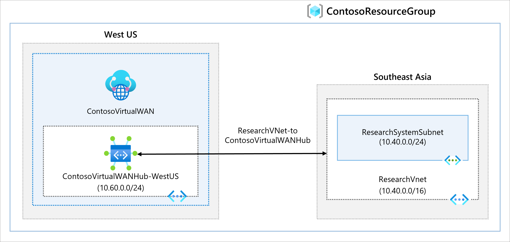
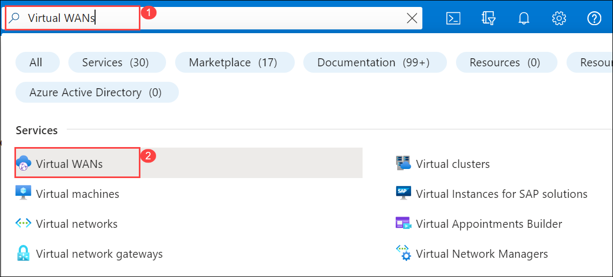
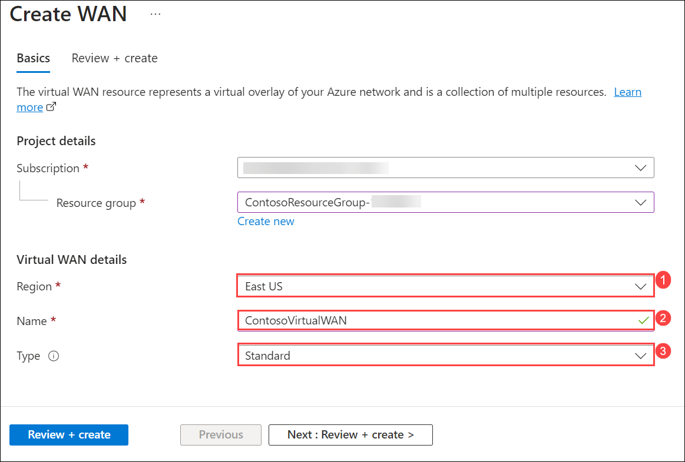
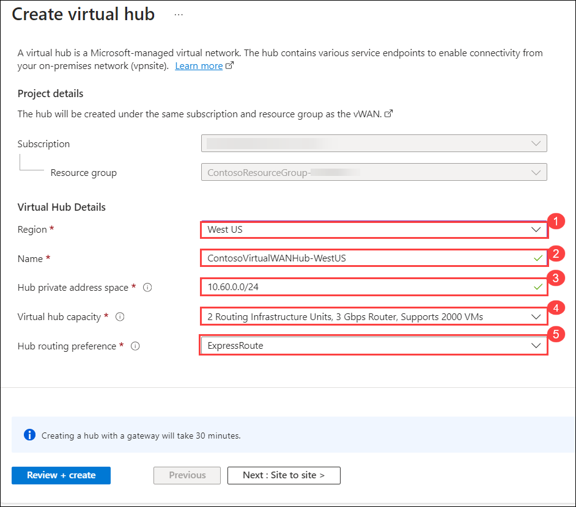
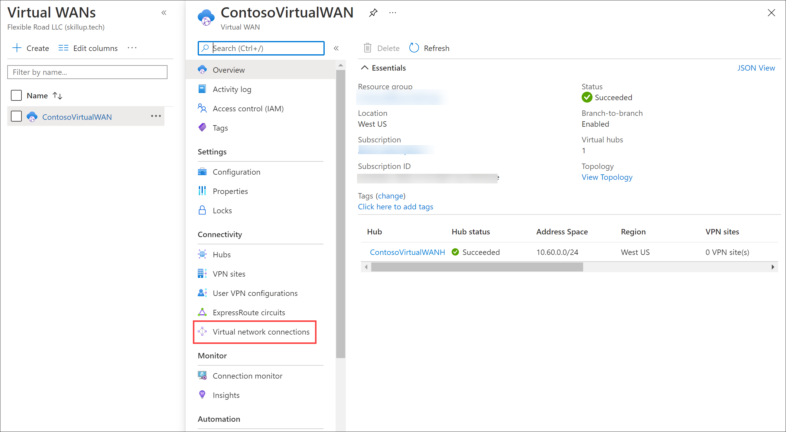
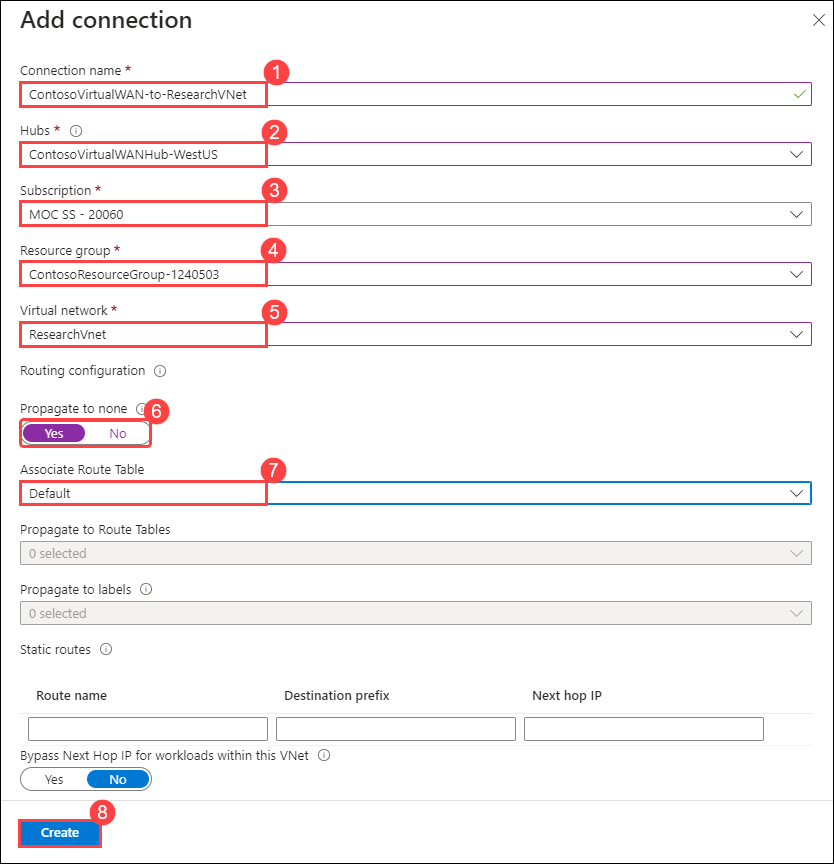

# Module 02-Unit 7 Create a Virtual WAN by using Azure Portal

## Lab Overview

In this hands-on lab, you will set up a Virtual WAN in Azure, create a hub using the Azure Portal, and connect a VNet to the Virtual Hub. Azure Virtual WAN simplifies large-scale branch connectivity and offers centralized network management. You will configure the Virtual WAN resource, create a hub as a central connection point, and connect a VNet to the hub, ensuring seamless communication and optimized routing. This lab will provide you with the skills to efficiently manage complex network environments using Azure Virtual WAN.

>**Note:** An **[interactive lab simulation](https://mslabs.cloudguides.com/guides/AZ-700%20Lab%20Simulation%20-%20Create%20a%20virtual%20WAN%20using%20the%20Azure%20portal)** is available that allows you to click through this lab at your own pace. You may find slight differences between the interactive simulation and the hosted lab, but the core concepts and ideas being demonstrated are the same.

## Lab Objectives

In this lab, you will complete the following tasks:

+ Task 1 : Create a Virtual WAN.
+ Task 2:  Create a Hub by Using Azure Portal.
+ Task 3: Connect a VNet to the Virtual Hub.

## Estimated Duration: 65 minutes

## Architecture diagram

   ‎

### Task 1: Create a Virtual WAN

1. On Azure Portal page, in **Search resources, services and docs (G+/)**, enter **Virtual WANs**, and then select **Virtual WANs** under services.

   

1. On the Virtual WAN page, select + **Create**. 

1. On the Create WAN page, on the **Basics** tab, fill in the following fields:

   - **Subscription:** Use the existing subscription.

   - **Resource group:** **ContosoResourceGroup-<inject key="DeploymentID" enableCopy="false"/>**.

   - **Region:** Choose a resource location from the dropdown. A WAN is a global resource and does not live in a particular region. However, you must select a region to manage and locate the WAN resource that you create.

   - **Name:** ContosoVirtualWAN

   - **Type:** Standard

1. When you have finished filling out the fields, select **Review + create**.

     

1. Once validation passes, select **Create** to create the Virtual WAN. Wait for the deployment to get completed.

   > **Congratulations** on completing the task! Now, it's time to validate it. Here are the steps:
   > - Hit the Validate button for the corresponding task. If you receive a success message, you can proceed to the next task. 
   > - If not, carefully read the error message and retry the step, following the instructions in the lab guide.
   > - If you need any assistance, please contact us at labs-support@spektrasystems.com. We are available 24/7 to help.

   <validation step="c7427a0d-37bd-4ddd-9888-2b7c903f071a" />

### Task 2: Create a hub by using Azure Portal

A hub contains gateways for site-to-site, ExpressRoute, or point-to-site functionality. It takes 30 minutes to create the site-to-site VPN gateway in the virtual hub. You must create a Virtual WAN before you can create a hub.

1. Locate the Virtual WAN that you created. 
1. On the Virtual WAN page, from the left navigation menu, under **Connectivity**, select **Hubs**.

1. On the Hubs page, select **+ New Hub** to open the Create virtual hub page.
  
1. On the Create virtual hub page **Basics** tab, complete the following fields:
   - **Region:** West US
   
   - **Name:** ContosoVirtualWANHub-WestUS
   
   - **Hub private address space:** 10.60.0.0/24
   - **Virtual hub capacity:** 2 Routing 
   Infrastructure Units
   
   - **Hub routing preference:** ExpressRoute

      

1. Select **Next: Site-to-site**.

1. On the **Site-to-site** tab, complete the following fields:
   - **Do you want to create a Site to site (VPN gateway)?:** Yes
   
   - The **AS Number** field cannot be edited.
   
   - **Gateway scale units:** 1 scale unit - 500 Mbps x 2
   
   - **Routing preference:** leave the default 
   
   - **Review + create** to validate.

      .png)

1. Select **Create** to create the hub. 

1. After 30 minutes, **Refresh** to view the hub on the Hubs page. Wait for the deployment to finish before proceeding to the next task.

   > **Congratulations** on completing the task! Now, it's time to validate it. Here are the steps:
   > - Hit the Validate button for the corresponding task. If you receive a success message, you can proceed to the next task. 
   > - If not, carefully read the error message and retry the step, following the instructions in the lab guide.
   > - If you need any assistance, please contact us at labs-support@spektrasystems.com. We are available 24/7 to help.

   <validation step="57e2db2a-f095-49a3-9a12-0f902763015b" />

### Task 3: Connect a VNet to the Virtual Hub

1. Locate the Virtual WAN that you created. 

1. In ContosoVirtualWAN, follow the below step:

   - From the left navigation menu under **Connectivity**, select **Virtual network connections**.

     

1. On ContosoVirtualWAN | Virtual network connections, select **+ Add connection**.

1. In Add connection, use the following information to create the connection.

   - **Connection name (1):** ContosoVirtualWAN-to-ResearchVNet

   - **Hubs (2):** ContosoVirtualWANHub-WestUS

   - **Subscription (3):** Leave it as default

   - **Resource Group (4):** ContosoResourceGroup-<inject key="DeploymentID" enableCopy="false"/>

   - **Virtual network (5):** ResearchVNet

   - **Propagate to none (6):** Yes

   - **Associate Route Table (7):** Default

   - Select **Create (8)**.

     

## Extend your learning with Copilot

Copilot can assist you in learning how to use the Azure scripting tools. Copilot can also assist in areas not covered in the lab or where you need more information. Open an Edge browser and choose Copilot (top right) or navigate to *copilot.microsoft.com*. Take a few minutes to try these prompts.
+ What type of network architecture does Azure VWAN use?
+ What are the differences between Azure VWAN basic and standard? Provide examples.
+ Can an Azure VWAN be created with scripting tools?

## Learn more with self-paced training

+ [Introduction to Azure Virtual WAN](https://learn.microsoft.com/training/modules/introduction-azure-virtual-wan/). In this module, you learn about Azure Virtual WAN functionality and features. 
+ [Design and implement hybrid networking](https://learn.microsoft.com/training/modules/design-implement-hybrid-networking/). In this module, you learn how to design and implement Azure Virtual WAN.

## Key takeaways

Congratulations on completing the lab. Here are the main takeaways for this lab. 

+ Azure Virtual WAN is a networking service that brings many networking, security, and routing functionalities together to provide a single operational interface
+ The Virtual WAN architecture is a hub and spoke architecture with scale and performance built in for branches, users, ExpressRoute circuits, and virtual networks.
+ There are three main usage cases for virtual WAN: Site to site, Point to site, and ExpressRoute. 
+ There are two types of virtual WANs: Basic (Site-to-site VPN only) and Standard.

## Review

In this lab, you have completed:

+ Creating a Virtual WAN
+ Creating a hub by using Azure Portal
+ Connecting a VNet to the Virtual Hub

## You have successfully completed the lab.
