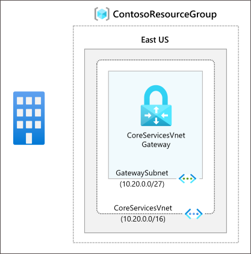
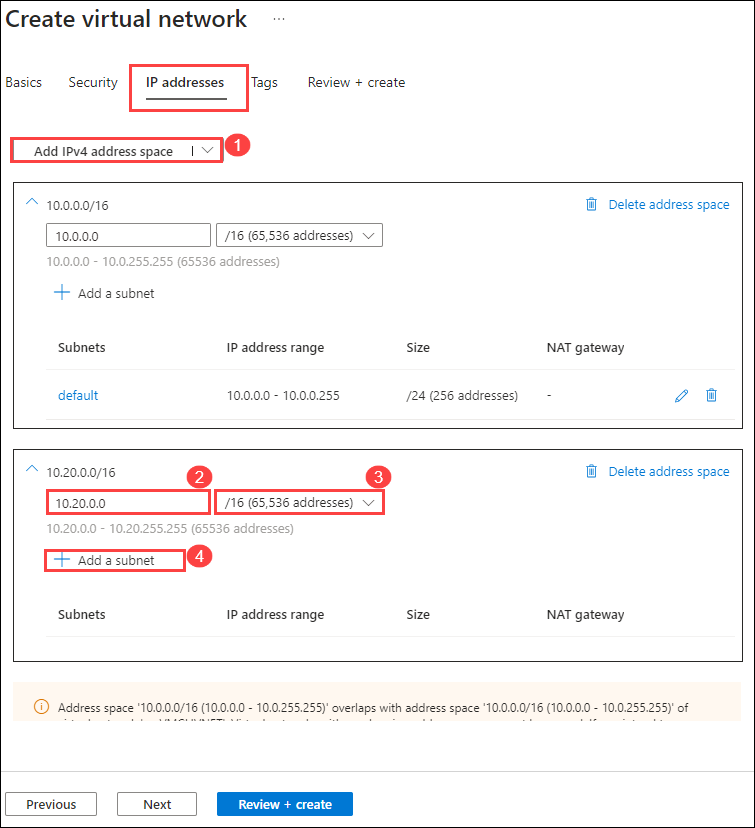
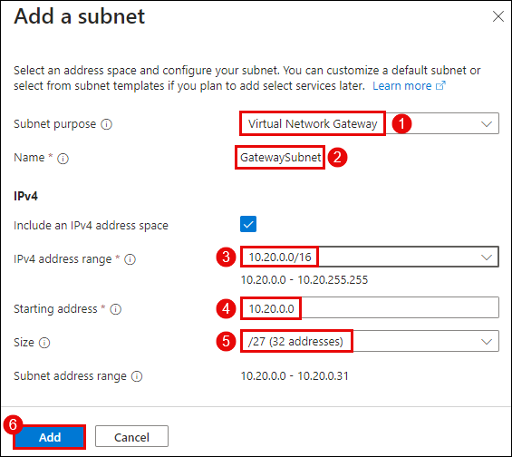

# Module 03-Unit 4 Configure an ExpressRoute Gateway

## Deploy ExpressRoute gateways

## Lab scenario 

To connect your Azure virtual network and your on-premises network via ExpressRoute, you must create a virtual network gateway first. A virtual network gateway serves two purposes: to exchange IP routes between the networks and to route network traffic. 

**Note:** An **[interactive lab simulation](https://mslabs.cloudguides.com/guides/AZ-700%20Lab%20Simulation%20-%20Configure%20an%20ExpressRoute%20gateway)** is available that allows you to click through this lab at your own pace. You may find slight differences between the interactive simulation and the hosted lab, but the core concepts and ideas being demonstrated are the same.

**Gateway types**

When you create a virtual network gateway, you need to specify several settings. One of the required settings, '-GatewayType', specifies whether the gateway is used for ExpressRoute, or VPN traffic. The two gateway types are:

- **VPN** - To send encrypted traffic across the public Internet, you use the gateway type 'VPN'. This is also referred to as a VPN gateway. Site-to-Site, Point-to-Site, and VNet-to-VNet connections all use a VPN gateway.
- **ExpressRoute** - To send network traffic on a private connection, you use the gateway type 'ExpressRoute'. This is also referred to as an ExpressRoute gateway and is the type of gateway used when configuring ExpressRoute.

Each virtual network can have only one virtual network gateway per gateway type. For example, you can have one virtual network gateway that uses -GatewayType VPN, and one that uses -GatewayType ExpressRoute.

## Lab Objectives
In this lab, you will complete the following tasks:

+ Task 1: Create the VNet and gateway subnet
+ Task 2: Create the virtual network gateway

## Estimated time: 60 minutes

## Architecture diagram

   ‎

## Task 1: Create the VNet and gateway subnet

1. On Azure Portal page, in **Search resources, services and docs (G+/)** box at the top of the portal, enter **Virtual networks (1)**, and then select **Virtual 
   networks (2)** under services.

    
   
1. On the Virtual networks page, select **+ Create**.

1. On the **Create virtual networks** blade, on the **Basics** tab, use the information in the following table to create the VNet:

   | **Setting**          | **Value**                        |
   | -------------------- | -------------------------------- |
   | Subscription         | Leave default                    |
   | Resource Group       | **ContosoResourceGroup-<inject key="DeploymentID" enableCopy="false"/>**|
   | Virtual network name | CoreServicesVNet                 |
   | Region               | East US                          |

1. To add IPv4 address space, on the **IP Addresses** tab, perform the following sub-steps:
      - Click on **Add IPv4 address space (1)** in new address space box.
      - Enter **10.20.0.0 (2)** in address space field.
      - Enter **/16 (3)** in size filed.
      - Then click on the **+ Add a subnet (4)** button.

         

1. In the **Add a subnet** pane, use the information in the following table to create the subnet and then click on **Add (6)**.

   | **Setting**                  | **Value**     |
   | ---------------------------- | ------------- |
   | Subnet purpose               | Select **Virtual Network Gateway (1)** |
   | Name                         | **GatewaySubnet (2)**  |
   | IPv4 address range           | Select **10.20.0.0/16 (3)**  |
   | Starting address             | **10.20.0.0 (4)**     |
   | Size                         | **/27 (5)**           |

    

1. On the Create virtual network page, select **Review + create**.

1. Confirm that the VNet passes the validation and then select **Create**.

   >**Note**: If you are using a dual stack virtual network and plan to use IPv6-based private peering over ExpressRoute, select Add IP6 address space and input IPv6 address range values.

> **Congratulations** on completing the task! Now, it's time to validate it. Here are the steps:
 > - Navigate to the Lab Validation Page, from the upper right corner in the lab guide section.
 > - Hit the Validate button for the corresponding task. You can proceed to the next task if you receive a success message.
 > - If not, carefully read the error message and retry the step, following the instructions in the lab guide.
 > - If you need any assistance, please contact us at labs-support@spektrasystems.com. We are available 24/7 to help you out.
   <validation step="4b8c0911-f548-4fa0-ad62-298ff78aa0e5" />

## Task 2: Create the virtual network gateway

1. On any Azure Portal page, in **Search resources, services and docs (G+/)**, enter **Virtual network gateways**, and then select **Virtual network gateways** from the results.

1. On the Virtual network gateways page, select **+ Create**.

1. On the **Create virtual network gateway** page, use the information in the following table to create the gateway:

   **Note**: First try to select **Region** to get virtual network option to choose. It might take upto 15 minutes for the newly created virtual network option to show up. 

   | **Setting**               | **Value**                  |
   | ------------------------- | -------------------------- |
   | **Project details**       |                            |
   | Resource Group            | **ContosoResourceGroup-<inject key="DeploymentID" enableCopy="false"/>** (Auto-selected)     |
   | **Instance details**      |                            |
   | Name                      | CoreServicesVnetGateway    |
   | Region                    | East US                    |
   | Gateway type              | ExpressRoute               |
   | SKU                       | Standard                   |
   | Virtual network           | CoreServicesVNet           |
   | **Public IP address**     |                            |
   | Public IP address         | Create new                 |
   | Public IP address name    | CoreServicesVnetGateway-IP |
   | Public IP address SKU     | Standard                   |
   | Assignment                | Not configurable           |

1. Select **Review + create**.

1. Confirm that the Gateway configuration passes validation and then select **Create**.

1. When the deployment is complete, select **Go to Resource**.

   >**Note**: it can take up to 45 minutes to deploy a Gateway.

> **Congratulations** on completing the task! Now, it's time to validate it. Here are the steps:
 > - Navigate to the Lab Validation Page, from the upper right corner in the lab guide section.
 > - Hit the Validate button for the corresponding task. You can proceed to the next task if you receive a success message.
 > - If not, carefully read the error message and retry the step, following the instructions in the lab guide.
 > - If you need any assistance, please contact us at labs-support@spektrasystems.com. We are available 24/7 to help you out.
   <validation step="15a76eb7-8705-4ab0-8c7d-c006a7ba304f" />

### Review
In this lab, you have completed:

- Create the VNet and gateway subnet
- Create the virtual network gateway
  
## You have successfully completed the lab.
