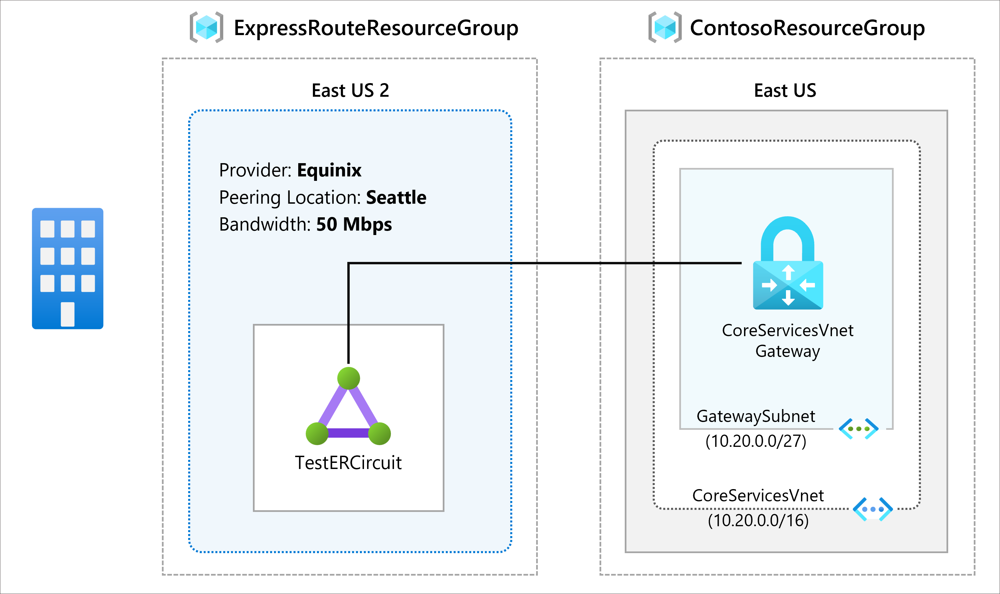
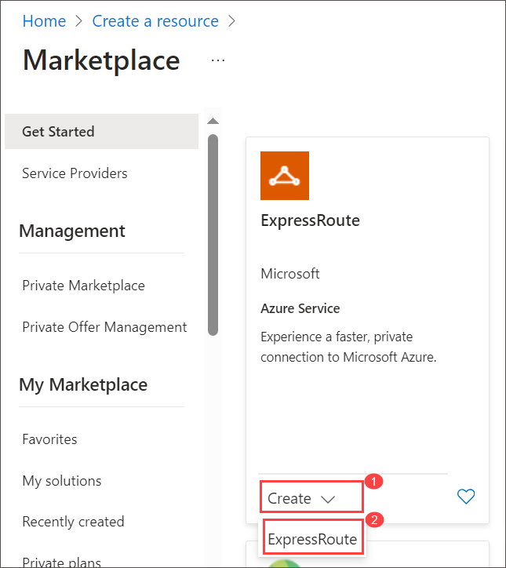
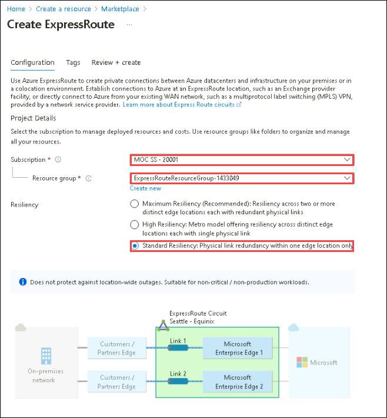
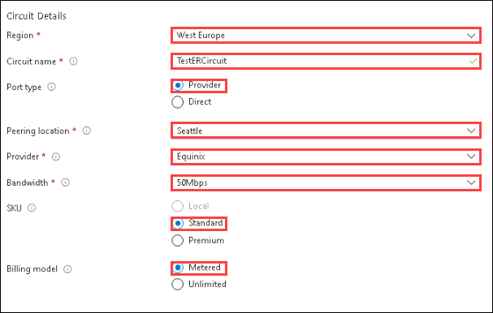
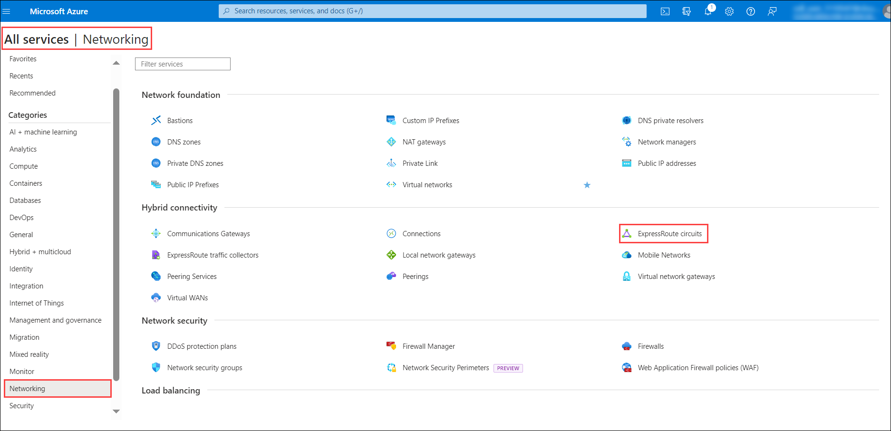
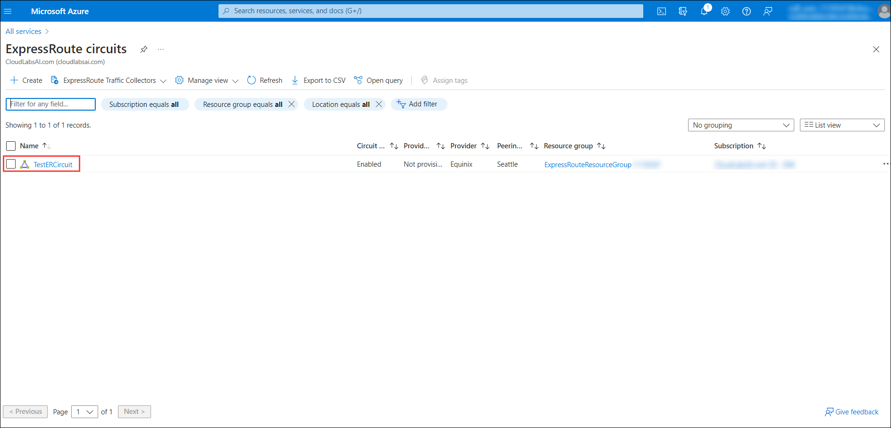
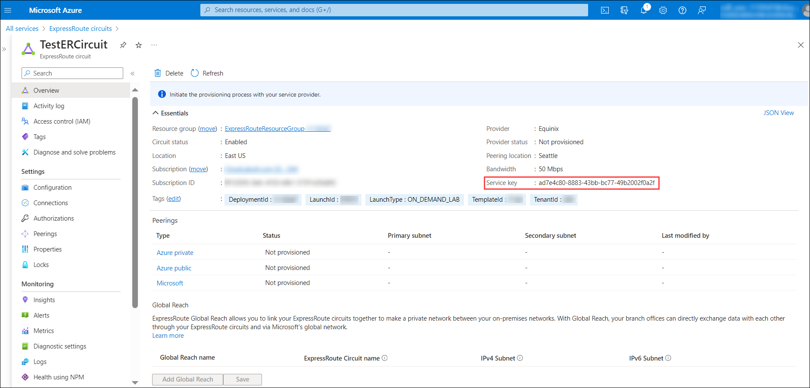

# Module 03: Unit 5 Provision an ExpressRoute circuit

## Lab Overview

In this lab, you will create and provision an ExpressRoute circuit to establish a private connection between your on-premises network and Microsoft cloud services. You'll configure the circuit, select a service provider, and establish the connection. Next, you'll retrieve your Service key, a unique identifier for managing your circuit, by accessing the Azure portal. Finally, you'll deprovision the ExpressRoute circuit when it's no longer needed, ensuring all dependencies are properly handled. 

## Lab Objectives

In this lab, you will complete the following tasks:

+ Task 1: Create and provision an ExpressRoute circuit
+ Task 2: Retrieve your Service key
+ Task 3: Deprovisioning an ExpressRoute circuit

## Estimated time: 15 minutes

## Architecture diagram

  ‎

## Task 1: Create and provision an ExpressRoute circuit

In this task, you will create and provision an ExpressRoute circuit, you're setting up an ExpressRoute connection in Azure. ExpressRoute is a service that provides a private, dedicated, and high-speed connection between your on-premises network and Azure, bypassing the public internet. 

1. On the Azure portal, select **+ Create a resource**, from left navigation pane select **Networking**, search for **ExpressRoute** and on the **Marketplace** page in **ExpressRoute** pane select **Create** and **ExpressRoute**, as shown in the following image. If ExpressRoute does not appear in the list, use **Search the marketplace** to search for it:

   

1. On the **Create ExpressRoute** blade, specify the following settings and  on **Configuration** tab then click **Review + create**:

   |Setting|Value|
   |---|---|
   |Resource group|**ExpressRouteResourceGroup-<inject key="DeploymentID" enableCopy="false"/>**|
   |Resiliency | 	Standard Resiliency: Physical link redundancy within one edge location only |
   |Region|**<inject key="Region" enableCopy="false"/>**|
   |Name|**TestERCircuit**|
   |Port Type|**Provider**|
   |Peering location|**Seattle**|
   |Provider|**Equinix**|
   |Bandwidth|**50Mbps**|
   |SKU|**Standard**|
   |Billing model|**Metered**|

   

1. Confirm that the ExpressRoute configuration passes validation and then select **Create**.

   

   - Port type determines if you are connecting to a service provider or directly into Microsoft's global network at a peering location.
   - Create new or import from classic determines if a new circuit is being created or if you are migrating a classic circuit to Azure Resource Manager.
   - Provider is the internet service provider who you will be requesting your service from.
   - Peering Location is the physical location where you are peering with Microsoft.

> **Note:** The Peering Location indicates the [physical location](https://docs.microsoft.com/en-us/azure/expressroute/expressroute-locations) where you are peering with Microsoft. This is not linked to "Location" property, which refers to the geography where the Azure Network Resource Provider is located. While they are not related, it is a good practice to choose a Network Resource Provider geographically close to the Peering Location of the circuit.

   - **SKU** determines whether an ExpressRoute local, ExpressRoute standard, or an ExpressRoute premium add-on is enabled. You can specify **Local** to get the local SKU, **Standard** to get the standard SKU or **Premium** for the premium add-on. You can change the SKU to enable the premium add-on.

> **Note:** You cannot change the SKU from Standard/Premium to Local.

   - **Billing model** determines the billing type. You can specify **Metered** for a metered data plan and **Unlimited** for an unlimited data plan. You can change the billing type from **Metered** to **Unlimited**.

> **Important** You cannot change the type from Unlimited to Metered.

   - **Allow classic operation** will allow classic virtual networks to be link to the circuit.

## Task 2: Retrieve your Service key

In this task, you will retrieve your Service Key, the main objective is to retrieve the unique Service Key associated with your ExpressRoute circuit. This key is an essential piece of information that your service provider will require in order to complete the provisioning process and finalize the connection between your on-premises network and Azure. 

1. You can view all the circuits that you created by selecting **More services &gt; Networking &gt; ExpressRoute circuits**.

   

1. All ExpressRoute circuits created in the subscription will appear here. 

   

1. The circuit page displays the properties of the circuit. The service key appears in the service key field. Your service provider will need the Service Key to complete the provisioning process. The service key is specific to your circuit. **You must send the service key to your connectivity provider for provisioning.**

   

1. On this page, **Provider status** gives you the current state of provisioning on the service-provider side. **Circuit status** provides you the state on the Microsoft side. 

1. When you create a new ExpressRoute circuit, make sure the circuit is in the following state:

   - Provider status: Not provisioned
   - Circuit status: Enabled
   - The circuit changes to the following state when the connectivity provider is currently enabling it for you:
     - Provider status: Provisioning
     - Circuit status: Enabled
   - To use the ExpressRoute circuit, it must be in the following state:
     - Provider status: Provisioned
     - Circuit status: Enabled
   - You should periodically check the provisioning status and the state of the circuit status.

## Task 3: Deprovisioning an ExpressRoute circuit

In this task, you will deprovisioning an ExpressRoute circuit, the goal is to deprovision an existing ExpressRoute circuit that is no longer needed or that you want to remove from your Azure environment

If the ExpressRoute circuit service provider provisioning state is **Provisioning** or **Provisioned,** you must work with your service provider to deprovision the circuit on their side. Microsoft can continue to reserve resources and bill you until the service provider completes deprovisioning the circuit and notifies us.

> **Note**: You must unlink all virtual networks from the ExpressRoute circuit before deprovisioning. If this operation fails, check whether any virtual networks are linked to the circuit.
> **Note**: If the service provider has deprovisioned the circuit (the service provider provisioning state is set to Not provisioned), you can delete the circuit. This stops billing for the circuit.

   > **Congratulations** on completing the task! Now, it's time to validate it. Here are the steps:
   > - Hit the Validate button for the corresponding task. If you receive a success message, you can proceed to the next task. 
   > - If not, carefully read the error message and retry the step, following the instructions in the lab guide.
   > - If you need any assistance, please contact us at labs-support@spektrasystems.com. We are available 24/7 to help.

   <validation step="d6ba71c7-11b3-4d31-97c6-fa7f26cea24e" />

## Key takeaways

Congratulations on completing the lab. Here are the main takeaways for this lab. 
+ Azure ExpressRoute allows an organization to connect their on-premises networks directly into the Microsoft Azure and Microsoft 365 clouds. Azure ExpressRoute uses a dedicated high-bandwidth connection provided by a Microsoft partner.
+ Microsoft guarantees a minimum of 99.95% availability for ExpressRoute dedicated connections. The connection is private and travels over a dedicated line, third parties can't intercept the traffic.
+ You can create a connection between your on-premises network and the Microsoft cloud in four different ways, CloudExchange Co-location, Point-to-point Ethernet Connection, Any-to-any (IPVPN) Connection, and ExpressRoute Direct.
+ ExpressRoute features is determined by the SKU: Local, Standard, and Premuium. 

## Review

In this lab, you have completed:

+ Creating and provision an ExpressRoute circuit
+ Retrieving your Service key
+ Deprovisioning an ExpressRoute circuit

## You have successfully completed the lab.
