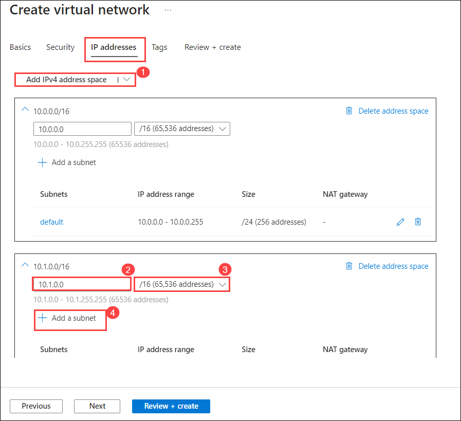
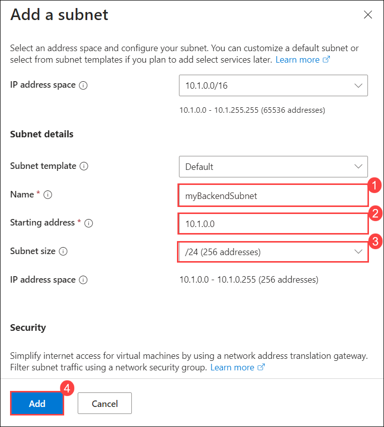
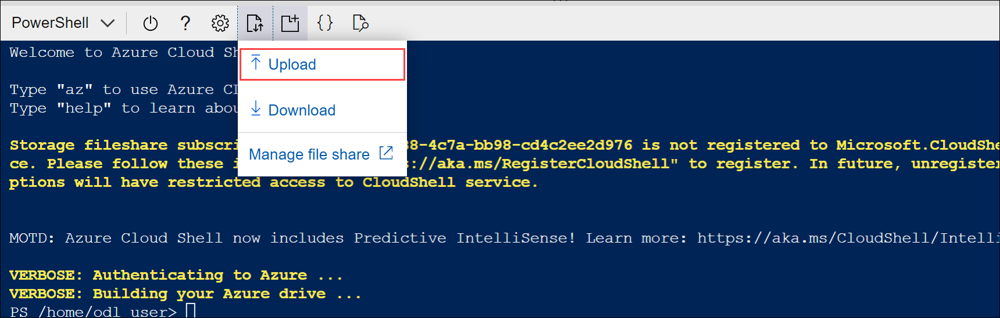
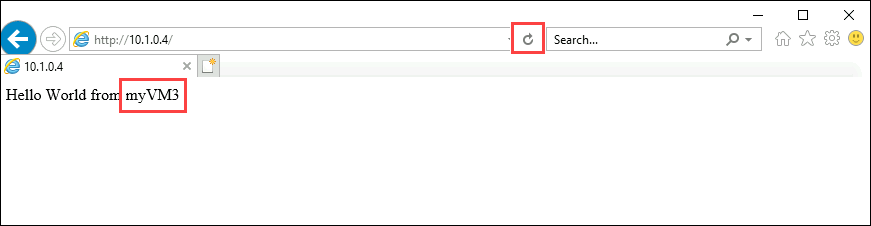

# Module 04-Unit 4 Create and configure an Azure load balancer

## Lab scenario 
In this lab, you will create an internal load balancer for the fictional Contoso Ltd organization.

**Note:** An **[interactive lab simulation](https://mslabs.cloudguides.com/guides/AZ-700%20Lab%20Simulation%20-%20Create%20and%20configure%20an%20Azure%20load%20balancer)** is available that allows you to click through this lab at your own pace. You may find slight differences between the interactive simulation and the hosted lab, but the core concepts and ideas being demonstrated are the same.

The steps to create an internal load balancer, are very similar to those you have already learned about in this module, to create a public load balancer. The key difference is that with a public load balancer the front end is accessed via a public IP address, and you test connectivity from a host which is located outside your virtual network; whereas, with an internal load balancer, the front end is a private IP address inside your virtual network, and you test connectivity from a host inside the same network.

## Estimated time: 60 minutes

## Architecture diagram


 
## Lab Objectives

In this lab, you will complete the following tasks:

+ Task 1: Create the virtual network
+ Task 2: Create backend servers
+ Task 3: Create the load balancer
+ Task 4: Create load balancer resources
+ Task 5: Test the load balancer

## Task 1: Create the virtual network

In this section, you will create a virtual network and a subnet.

1. On the Azure portal locate the search bar at the top of the page. Search for **Virtual Networks** and select virtual networks under services that appears in the 
    results under **Services**.

    

1. Select **Create** on the Virtual networks page.  
1. On the **Basics** tab, use the information in the table below to create the virtual network.

   | **Setting**    | **Value**                                  |
   | -------------- | ------------------------------------------ |
   | Subscription   | Select your subscription                   |
   | Resource group | Select **IntLB-RG-<inject key="DeploymentID" enableCopy="false"/>** |
   | Name           | **IntLB-VNet**                                                      |
   | Region         | **<inject key="Region" enableCopy="false"/>**                   |


1. Select **Next** on the **Security** tab, under **BastionHost** select **Enable Azure Bastion**, then enter the information from the table below.

    | **Setting**                       | **Value**                                     |
    | --------------------------------- | --------------------------------------------- |
    | Bastion name                      | **myBastionHost**                             |
    | Public IP address                 | Select **Create a public IP address**  Name: **myBastionIP** |

1. Select **ok**.

1. Select **Next : IP Addresses**.
   
1. On the **IP Addresses** tab, in the **IPv4 address space** box, don't remove the default, click on **Add IPV4 address space**, in new **IPV4 address space**, enter **10.1.0.0** in address space and **/16** in size field and select **+ Add subnet**.

   

1. On **Add a subnet** blade, specify the following and select **Add**.

   | **Setting**                  | **Value**     |
   | ---------------------------- | ------------- |
   | Name                         | **myBackendSubnet** |
   | Starting address             | **10.1.0.0**        |
   | Subnet size                  | **/24**             |
   |||

    
   
1. On the Create virtual network of **IP address** tab select **Add subnet**, specify the following and select **Add**.

   | **Setting**                  | **Value**     |
   | ---------------------------- | ------------- |
   | Name                         | **myFrontEndSubnet** |
   | Starting address             | **10.1.2.0**        |
   | Subnet size                  | **/24**             |
   |||

   .png)
   
1. Select **Review + create**.

1. Select **Create**.

   > **Congratulations** on completing the task! Now, it's time to validate it. Here are the steps:
   > - Navigate to the Lab Validation Page, from the upper right corner in the lab guide section.
   > - Hit the Validate button for the corresponding task. You can proceed to the next task if you receive a success message.
   > - If not, carefully read the error message and retry the step, following the instructions in the lab guide.
   > - If you need any assistance, please contact us at labs-support@spektrasystems.com. We are available 24/7 to help you out.

## Task 2: Create backend servers

In this section, you will create three VMs, that will be in the same availability set, for the backend pool of the load balancer, add the VMs to the backend pool, and then install IIS on the three VMs to test the load balancer.

1. On the Azure portal select the **Cloud shell** (**[>_]**)  button at the top of the page to the right of the search box. This opens a cloud shell pane at the bottom of the portal.

   

1. The first time you open the Cloud Shell, you may be prompted to choose the type of shell you want to use (*Bash* or *PowerShell*). If so, select **PowerShell**.

   
   
1. If you are prompted to create storage for your Cloud Shell, ensure your subscription is selected and click on **Show advanced settings**. Please make sure you have selected your resource group **IntLB-RG-<inject key="DeploymentID" enableCopy="false"/>** and enter **blob<inject key="DeploymentID" enableCopy="false"/>** for the **Storage account** and enter **blobfileshare<inject key="DeploymentID" enableCopy="false"/>** for the  **File share** , then click on **Create Storage**.


1. On the toolbar of the Cloud Shell pane, select the **Upload/Download files** icon, in the drop-down menu, select **Upload** and upload the following files **azuredeploy.json**, **azuredeploy.parameters.vm1.json**, **azuredeploy.parameters.vm2.json** and **azuredeploy.parameters.vm3.json** from **C:\AllFiles\AZ-700-Designing-and-Implementing-Microsoft-Azure-Networking-Solutions-prod\Allfiles\Exercises\M04** folder into the Cloud Shell home directory one by one.

     

1. Deploy the following ARM templates to create the VMs needed for this exercise:

   >**Important**: Please replace IntLB-RG-DID with **IntLB-RG-<inject key="DeploymentID" enableCopy="false"/>**

   ```powershell
   $RGName = "IntLB-RG-DID"
   
   New-AzResourceGroupDeployment -ResourceGroupName $RGName -TemplateFile azuredeploy.json -TemplateParameterFile azuredeploy.parameters.vm1.json
   New-AzResourceGroupDeployment -ResourceGroupName $RGName -TemplateFile azuredeploy.json -TemplateParameterFile azuredeploy.parameters.vm2.json
   New-AzResourceGroupDeployment -ResourceGroupName $RGName -TemplateFile azuredeploy.json -TemplateParameterFile azuredeploy.parameters.vm3.json
   ```

 1.  You will be prompted to provide an admin password, provide adminPassword: Pa55w.rd!!

   **Note**: It may take 15-20 min to create these three VMs. Please wait until this job completes, and you will be prompted to provide password for three times for 
    each VM deployment.
    
   > **Congratulations** on completing the task! Now, it's time to validate it. Here are the steps:
   > - Navigate to the Lab Validation Page, from the upper right corner in the lab guide section.
   > - Hit the Validate button for the corresponding task. You can proceed to the next task if you receive a success message.
   > - If not, carefully read the error message and retry the step, following the instructions in the lab guide.
   > - If you need any assistance, please contact us at labs-support@spektrasystems.com. We are available 24/7 to help you out.

## Task 3: Create the load balancer

In this section, you will create an internal Standard SKU load balancer. The reason we are creating a Standard SKU load balancer here in the exercise, instead of a Basic SKU load balance, is for later exercises that require a Standard SKU version of the load balancer.

1. On the Azure portal locate the search bar at the top of the page. Search for **Load Balancer** and select **Load Balancer** under services that appears in the results under **Services**.

1. Select **+ Create** on **Load balancing | Load Balancer** page.

1. On the **Basics** tab, use the information in the table below to create the load balancer.

   | **Setting**           | **Value**                |
   | --------------------- | ------------------------ |
   | Subscription          | Select your subscription |
   | Resource group        | **IntLB-RG-<inject key="DeploymentID" enableCopy="false"/>**             |
   | Name                  | **myIntLoadBalancer**    |
   | Region                | **<inject key="Region" enableCopy="false"/>**         |
   | SKU                   | **Standard**             |
   | Type                  | **Internal**             |

1. Select **Next: Frontend IP configurations>** and click on  **+ Add frontend IP configuration**.
1. On the **Add frontend IP address** blade, enter the information from the table below and select **Add**.
 
   | **Setting**     | **Value**                |
   | --------------- | ------------------------ |
   | Name            | **LoadBalancerFrontEnd** |
   | Virtual network | **IntLB-VNet**           |
   | Subnet          | **myFrontEndSubnet**     |
   | Assignment      | **Dynamic**              |

1. Select **Review + create** and  **Create**.

   > **Congratulations** on completing the task! Now, it's time to validate it. Here are the steps:
   > - Navigate to the Lab Validation Page, from the upper right corner in the lab guide section.
   > - Hit the Validate button for the corresponding task. You can proceed to the next task if you receive a success message.
   > - If not, carefully read the error message and retry the step, following the instructions in the lab guide.
   > - If you need any assistance, please contact us at labs-support@spektrasystems.com. We are available 24/7 to help you out.

## Task 4: Create load balancer resources

In this section, you will configure load balancer settings for a backend address pool, then create a health probe and a load balancer rule.

### Task 4.1: Create a backend pool and add VMs to the backend pool

The backend address pool contains the IP addresses of the virtual NICs connected to the load balancer.

1. On the Azure portal home page, select **All resources**, then select on **myIntLoadBalancer** from the resources list.

1. Under **Settings**, select **Backend pools**, and then select **Add**.

1. On the **Add backend pool** page, enter the information from the table below.

   | **Setting**     | **Value**            |
   | --------------- | -------------------- |
   | Name            | **myBackendPool**    |
   | Virtual network | **IntLB-VNet**       |


1. Under **IP configuration**, select **Add**.

1. Select the checkboxes for all 3 VMs (**myVM1**, **myVM2**, and **myVM3**), then select **Add**.

1. Select **Save**.

   
   
### Task 4.2: Create a health probe

The load balancer monitors the status of your app with a health probe. The health probe adds or removes VMs from the load balancer based on their response to health checks. Here you will create a health probe to monitor the health of the VMs.

1. Under **Settings**, select **Health probes**, then select **Add**.

1. On the **Add health probe** page, enter the information from the table below.

   | **Setting**         | **Value**         |
   | ------------------- | ----------------- |
   | Name                | **myHealthProbe** |
   | Protocol            | **HTTP**          |
   | Port                | **80**            |
   | Path                | **/**             |
   | Interval            | **15**            |
   

1. Select **Save**.
 
### Task 4.3: Create a load balancer rule

A load balancer rule is used to define how traffic is distributed to the VMs. You define the frontend IP configuration for the incoming traffic and the backend IP pool to receive the traffic. The source and destination port are defined in the rule. Here you will create a load balancer rule.

1. From the **myIntLoadBalancer | Health probes** page of your load balancer, under **Settings**, select **Load balancing rules**, then Click on **+Add**.

1. On the **Add load balancing rule** page, enter the information from the table below.

   | **Setting**            | **Value**                |
   | ---------------------- | ------------------------ |
   | Name                   | **myHTTPRule**           |
   | IP Version             | **IPv4**                 |
   | Frontend IP address    | **LoadBalancerFrontEnd** |
   | Backend pool           | **myBackendPool**       |
   | Protocol               | **TCP**                  |
   | Port                   | **80**                   |
   | Backend port           | **80**                   |
   | Health probe           | **myHealthProbe**        |
   | Session persistence    | **None**                 |
   | Idle timeout (minutes) | **15**                   |
   | Enable Floating IP     | **Disabled**             |


1. Select **Save**.
 
   > **Congratulations** on completing the task! Now, it's time to validate it. Here are the steps:
   > - Navigate to the Lab Validation Page, from the upper right corner in the lab guide section.
   > - Hit the Validate button for the corresponding task. You can proceed to the next task if you receive a success message.
   > - If not, carefully read the error message and retry the step, following the instructions in the lab guide.
   > - If you need any assistance, please contact us at labs-support@spektrasystems.com. We are available 24/7 to help you out.

## Task 5: Test the load balancer

In this section, you will create a test VM, and then test the load balancer.

### Task 5.1: Create test VM

1. On the Azure portal locate the search bar at the top of the page. Search for **Virtual machine** and select **Virtual machine** under services that appears in the results under **Services**.

1. On the **Create a virtual machine** page, on the **Basics** tab, use the information in the table below to create the first VM.

   | **Setting**          | **Value**                                    |
   | -------------------- | -------------------------------------------- |
   | Subscription         | Select your subscription                     |
   | Resource group       | **IntLB-RG-<inject key="DeploymentID" enableCopy="false"/>**        |
   | Virtual machine name | **myTestVM**                                 |
   | Region               |  **<inject key="Region" enableCopy="false"/>**                              |
   | Availability options | **No infrastructure redundancy required**    |
   | Image                | **Windows Server 2019 Datacenter - Gen 2**   |
   | Size                 | **Standard_DS2_v3 - 2 vcpu, 8 GiB memory**   |
   | Username             | **TestUser**                                 |
   | Password             | **Provide a secure password**                |
   | Confirm password     | **Provide a secure password**                |


1. Select **Next : Disks**, then select **Next : Networking**. 

1. On the **Networking** tab, use the information in the table below to configure networking settings.

   | **Setting**                                                  | **Value**                     |
   | ------------------------------------------------------------ | ----------------------------- |
   | Virtual network                                              | **IntLB-VNet**                |
   | Subnet                                                       | **myBackendSubnet**           |
   | Public IP                                                    | Change to **None**            |
   | NIC network security group                                   | **Advanced**                  |
   | Configure network security group                             | Select the existing **myNSG** |
   | Load balancing options                                       | **None**                      |


1. Select **Review + create**.

1. Select **Create**.

1. Wait for this last VM to be deployed before moving forward with the next task.

### Task 5.2: Connect to the test VM to test the load balancer

1. On the Azure portal home page, select **All resources**, then select on **myIntLoadBalancer** from the resources list.

1. On the **Overview** page, make a note of the **Private IP address**, or copy it to the clipboard.

   **Note**: you may need to select **See more** in order to see the **Private IP address** field.

1. Select **Home**, then on the Azure portal home page, select **All resources**, then select on the **myTestVM** virtual machine that you just created.

1. On the **Overview** page, select **Connect**, then **Go to bastion**.

1. In the **Username** box, enter **TestUser** and in the **Password** box, enter the password you created, then select **Connect**. If popup blocker is preventing the new window, select **Always allow pop-ups and redirects from hhtps://portal.azure.com**  and **Connect** again.

1. The **myTestVM** window will open in another browser tab.

1. If a **Networks** pane appears, select **Yes**.

1. Select the **Internet Explorer** icon in the task bar to open the web browser.

1. Select **OK** on the **Set up Internet Explorer 11** dialog box.

1. Enter (or paste) the **Private IP address** (e.g. 10.1.0.4) from the previous step into the address bar of the browser and press Enter.

1. The default web home page of the IIS Web server is displayed in the browser window. One of the three virtual machines in the backend pool will respond.

    .png)
   
1. If you select the refresh button in the browser a few times, you will see that the response comes randomly from the different VMs in the backend pool of the internal load balancer.
   
    

   > **Congratulations** on completing the task! Now, it's time to validate it. Here are the steps:
   > - Navigate to the Lab Validation Page, from the upper right corner in the lab guide section.
   > - Hit the Validate button for the corresponding task. You can proceed to the next task if you receive a success message.
   > - If not, carefully read the error message and retry the step, following the instructions in the lab guide.
   > - If you need any assistance, please contact us at labs-support@spektrasystems.com. We are available 24/7 to help you out.

## Review

In this lab, you have completed:
+ Create the virtual network
+ Create backend servers
+ Create the load balancer
+ Create load balancer resources
+ Test the load balancer

   
## You have successfully completed the lab.
