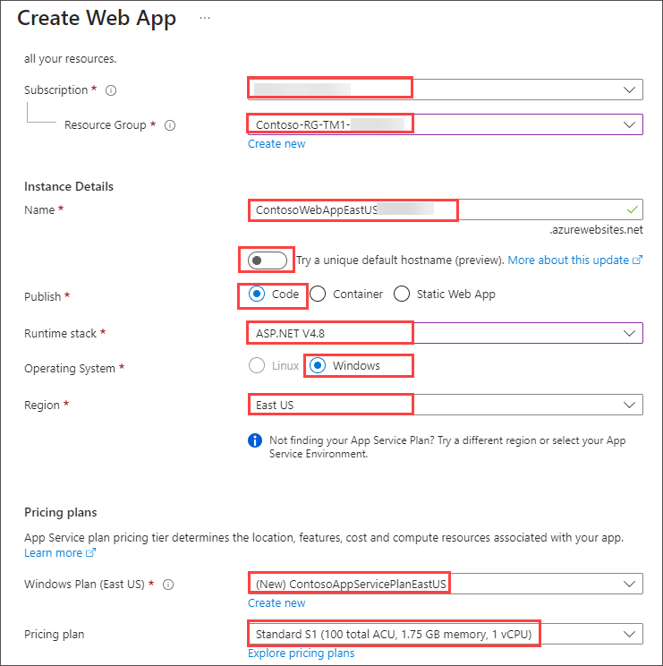
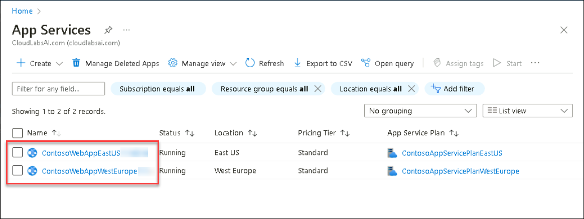
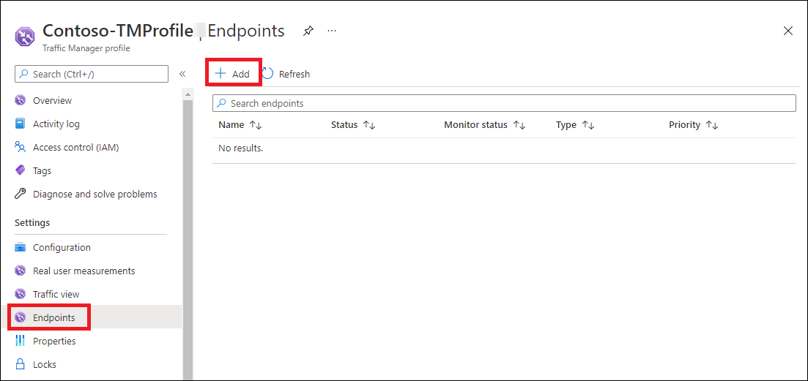
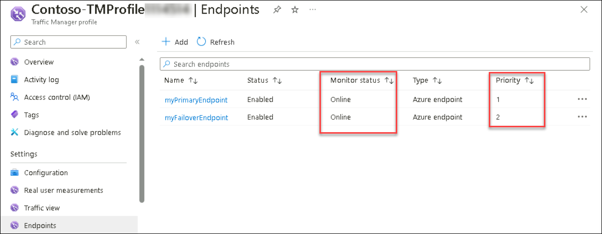
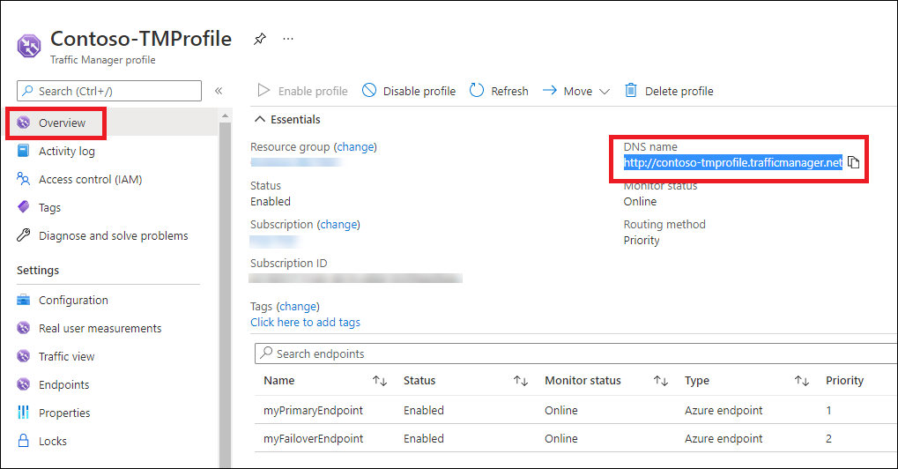
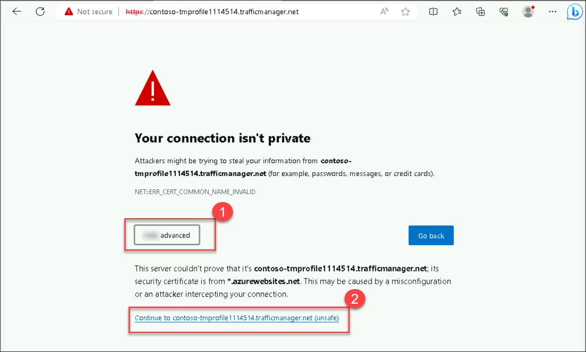
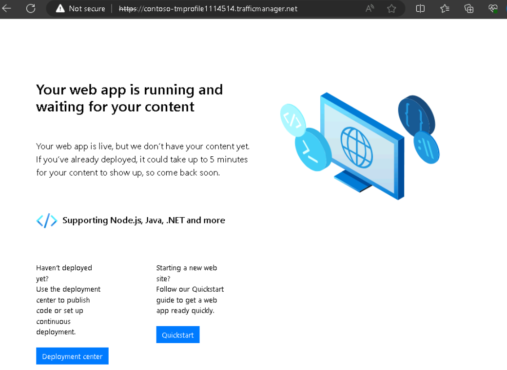
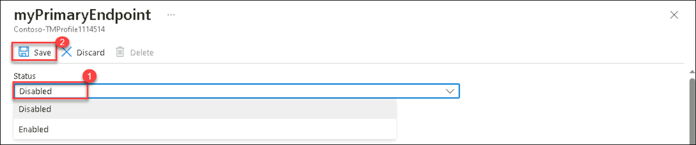

# Module 04-Unit 6 Create a Traffic Manager profile using the Azure portal

In this lab, you will create web apps to host your applications, set up a Traffic Manager profile to distribute traffic across multiple endpoints, and add these endpoints to the Traffic Manager profile. Finally, you will test the Traffic Manager profile to ensure it correctly routes traffic based on your configuration. This setup helps ensure high availability and responsiveness for your applications.

**Note:** An **[interactive lab simulation](https://mslabs.cloudguides.com/guides/AZ-700%20Lab%20Simulation%20-%20Create%20a%20Traffic%20Manager%20profile%20using%20the%20Azure%20portal)** is available that allows you to click through this lab at your own pace. You may find slight differences between the interactive simulation and the hosted lab, but the core concepts and ideas being demonstrated are the same.

## Lab Objectives
In this lab, you will complete the following tasks:

+ Task 1: Create the web apps
+ Task 2: Create a Traffic Manager profile
+ Task 3: Add Traffic Manager endpoints
+ Task 4: Test the Traffic Manager profile

## Task 1: Create the web apps

In this section, you will create two instances of a web application deployed in the two different Azure regions.

1. On any Azure Portal page, in **Search resources, services and docs (G+/)** box at the top of the portal, enter **WebApp (1)**, and then select **App Services (2)** under services.

   

1. Select **+ Create (1)**  and then select **+ Web App (2)** to create a Web App.

     

1. On the **Create Web App** page, on the **Basics** tab, use the information in the table below to create the first web application.

   | **Setting**      | **Value**                                                    |
   | ---------------- | ------------------------------------------------------------ |
   | Subscription     | Select your subscription                                     |
   | Resource group   | Select **Contoso-RG-TM1-<inject key="DeploymentID" enableCopy="false"/>**             |
   | Name             | **ContosoWebAppEastUS<inject key="DeploymentID" enableCopy="false"/>**  |
   | Try a unique default hostname (preview) | Ture off the toggle                   |
   | Publish          | **Code**                                                     |
   | Runtime stack    | **ASP.NET V4.8**                                             |
   | Operating system | **Windows**                                                  |
   | Region           | **East US**                                                  |
   | Windows Plan     | Select **Create  new**  Name: **ContosoAppServicePlanEastUS** |
   | Pricing Plan     | **Standard S1 100 total ACU, 1.75-GB  memory**               |

   
   
1. Select **Monitor + secure** tab.

1. On the **Monitor + secure** tab, select the **No** option for **Enable Application Insights**.

1. Select **Review + create**.

1. Select **Create**. When the Web App successfully deploys, it creates a default web site.

1. Repeat steps 1-6 above to create a second web app. Use the same settings as before except for the information in the table below. 

   | **Setting**    | **Value**                                                    |
   | -------------- | ------------------------------------------------------------ |
   | Resource group | Select **Contoso-RG-TM2-<inject key="DeploymentID" enableCopy="false"/>**             |
   | Name           | **ContosoWebAppWestEurope<inject key="DeploymentID" enableCopy="false"/>**   |
   | Region         | **West Europe**                                              |
   | Windows Plan   | Select **Create  new**  Name: **ContosoAppServicePlanWestEurope** |

1. On Azure Portal page, in **Search resources, services and docs (G+/)** box at the top of the portal, enter **App Services**, and then select **App Services** 
   under services.

1. You should see the two new web apps listed.

   

   > **Congratulations** on completing the task! Now, it's time to validate it. Here are the steps:
   > - Navigate to the Lab Validation Page, from the upper right corner in the lab guide section.
   > - Hit the Validate button for the corresponding task. You can proceed to the next task if you receive a success message.
   > - If not, carefully read the error message and retry the step, following the instructions in the lab guide.
   > - If you need any assistance, please contact us at labs-support@spektrasystems.com. We are available 24/7 to help you out.

   <validation step="4d5ecc40-776d-459c-867f-50db4b49ce0c" />

## Task 2: Create a Traffic Manager profile

Now you will create a Traffic Manager profile that directs user traffic based on endpoint priority.

1. On Azure Portal page, in **Search resources, services and docs (G+/)** box at the top of the portal, enter **Traffic Manager profiles**, and then select **Traffic 
   Manager profiles** under services.

1. On **Load balancing | Traffic Manager** page, select **+ Create**.

1. On the **Create Traffic Manager profile** page, use the information in the table below to create the Traffic Manager profile.

   | **Setting**             | **Value**                |
   | ----------------------- | ------------------------ |
   | Name                    | **Contoso-TMProfile<inject key="DeploymentID" enableCopy="false"/>** |
   | Routing method          | **Priority**             |
   | Subscription            | Select your subscription |
   | Resource group          | **Contoso-RG-TM1-<inject key="DeploymentID" enableCopy="false"/>**   |

1. Select **Create**.

   > **Congratulations** on completing the task! Now, it's time to validate it. Here are the steps:
   > - Navigate to the Lab Validation Page, from the upper right corner in the lab guide section.
   > - Hit the Validate button for the corresponding task. You can proceed to the next task if you receive a success message.
   > - If not, carefully read the error message and retry the step, following the instructions in the lab guide.
   > - If you need any assistance, please contact us at labs-support@spektrasystems.com. We are available 24/7 to help you out.

   <validation step="333aadc8-666f-456e-888e-52ca345debb7" />
   
## Task 3: Add Traffic Manager endpoints

In this section, you will add the website in the East US as the primary endpoint to route all the user traffic. You will then add the website in West Europe as a failover endpoint. If the primary endpoint becomes unavailable, then traffic will automatically be routed to the failover endpoint.

1. On Azure Portal page, in **Search resources, services and docs (G+/)** box at the top of the portal, enter **Traffic Manager profiles**, and then select **Traffic Manager profiles** under services.
   > **Note**: Kindly refresh the page to find and select **Contoso-TMProfile<inject key="DeploymentID" enableCopy="false"/>**.

1. Under **Settings**, select **Endpoints**, and then select **+ Add**.

   

1. On the **Add endpoint** page, enter the information from the table below.

   | **Setting**          | **Value**                         |
   | -------------------- | --------------------------------- |
   | Type                 | **Azure endpoint**                |
   | Name                 | **myPrimaryEndpoint**             |
   | Target resource type | **App Service**                   |
   | Target resource      | **ContosoWebAppEastUS<inject key="DeploymentID" enableCopy="false"/> (East US)** |
   | Priority             | **1**                             |

1. Click on **Add**.

1. Repeat steps 2-4 above to create the failover endpoint. Use the same settings as before except for the information in the table below. 

    | **Setting**     | **Value**                                 |
    | --------------- | ----------------------------------------- |
    | Name            | **myFailoverEndpoint**                    |
    | Target resource | **ContosoWebAppWestEurope<inject key="DeploymentID" enableCopy="false"/> (West Europe)** |
    | Priority        | **2**                                     |

    >**Note:** Setting a priority of 2 means that traffic will route to this failover endpoint if the configured primary endpoint becomes unhealthy.

1. Click on **Add**.

1. Under **Settings**, select **Configuration**, and then update the **Endpoint monitor settings** protocol to **HTTPS** and **Port** to **443** and select **Save**.

1. The two new endpoints are displayed in the Traffic Manager profile. Notice that after a few minutes the **Monitoring status** should change to **Online**.

    

    > **Congratulations** on completing the task! Now, it's time to validate it. Here are the steps:
    > - Navigate to the Lab Validation Page, from the upper right corner in the lab guide section.
    > - Hit the Validate button for the corresponding task. You can proceed to the next task if you receive a success message.
    > - If not, carefully read the error message and retry the step, following the instructions in the lab guide.
    > - If you need any assistance, please contact us at labs-support@spektrasystems.com. We are available 24/7 to help you out.

    <validation step="ecc8a93e-6f61-41d8-99ab-214a855c04d6" />
      
## Task 4: Test the Traffic Manager profile

In this section, you will check the DNS name of your Traffic Manager profile, and then you will configure the primary endpoint so that it is unavailable. You will then verify that the web app is still available, to test that the Traffic Manager profile is successfully sending traffic to the failover endpoint.

1. On the **Contoso-TMProfile<inject key="DeploymentID" enableCopy="false"/>** page, select **Overview**.

1. On the **Overview** screen, copy the **DNS name** entry to the clipboard (or take note of it somewhere).

   

1. Open a web browser tab, and paste (or enter) the **DNS name** entry (contoso-tmprofile.trafficmanager.net) into the address bar, and press Enter.

1. If you encounter **your coneection isn't private**. click on **advanced** and then click on link provide.

   

1. The web app's default web site should be displayed. If you get **404 Web Site not found** message, **Disable profile** from **Contoso-TMProfile<inject key="DeploymentID" enableCopy="false"/>** Traffic Manager 
   profile overview page and **Enable profile**. Then refresh the webpage.

   
   
1. Currently all traffic is being sent to the primary endpoint as you set its **Priority** to **1**.

1. To test the failover endpoint is working properly, you need to disable the primary site.

1. On the **Contoso-TMProfile<inject key="DeploymentID" enableCopy="false"/>** page, on the overview screen, select **myPrimaryEndpoint**.

1. On the **myPrimaryEndpoint** page, under **Status**, select **Disabled**, and then select **Save**.

   

1. Close the **myPrimaryEndpoint** page (select the **X** in the top right corner of the page).

1. On the **Contoso-TMProfile<inject key="DeploymentID" enableCopy="false"/>** page, the **Monitor status** for **myPrimaryEndpoint** should now be **Disabled**.

1. Open a new web browser session, and paste (or enter) the **DNS name** entry (contoso-tmprofile.trafficmanager.net) into the address bar, and press Enter.

1. Verify that the web app is still responding. As the primary endpoint was not available, the traffic was instead routed to the failover endpoint to allow the web site to still function.

   >**Note**: The command executes asynchronously (as determined by the -AsJob parameter), so while you will be able to run another PowerShell command immediately afterwards within the same PowerShell session, it 
   will take a few minutes before the resource groups are actually removed.

   <validation step="20dd3dc3-fd2c-4271-8cb3-6f7fb5223caf" />
   
## Summary

In this hands-on lab, you have created web apps, set up a Traffic Manager profile, added Traffic Manager endpoints, and tested the Traffic Manager profile.
 
## You have successfully completed the lab.
