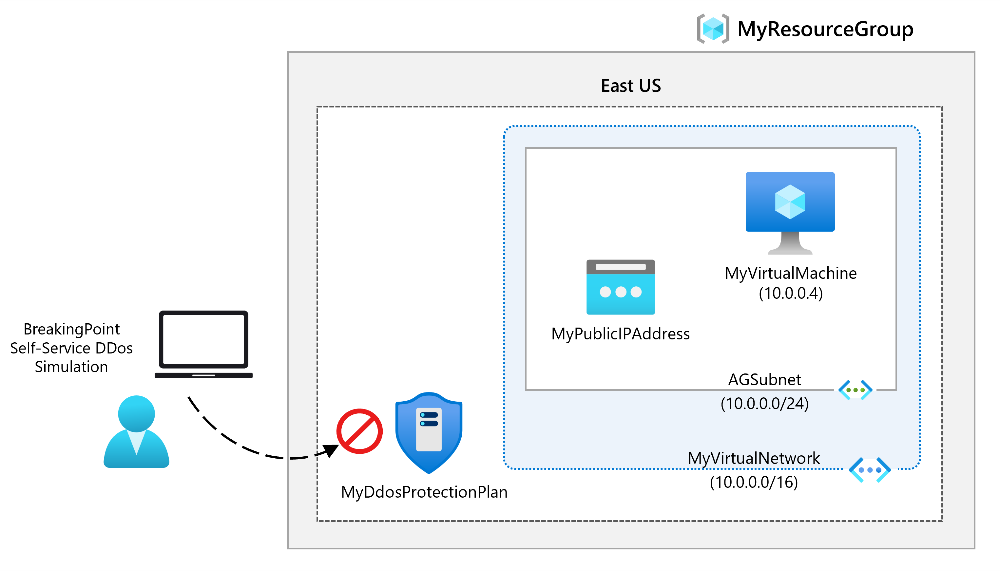

# Module 06-Unit 4 Configure DDoS Protection on a virtual network using the Azure portal(Read only)

  **Note**: This lab we provided as Read only because  **DDoS Protection plan** monthly fix cost is $2,944.
  
## Lab Overview

In this lab, you will simulate a Distributed Denial of Service (DDoS) attack on a virtual network, as part of your responsibilities within the Contoso Network Security team. You will go through the steps of creating a virtual network, configuring DDoS protection, and monitoring the attack using telemetry and metrics.

## Lab Objectives
In this lab, you will complete the following tasks:

+ Task 1: Create a DDoS Protection plan
+ Task 2: Enable DDoS Protection on a new virtual network
+ Task 3: Configure DDoS telemetry
+ Task 4: Configure DDoS diagnostic logs
+ Task 5: Configure DDoS alerts
+ Task 6: Test with simulation partners

## Estimated time: 40 minutes

## Architecture diagram

 ‎

## Task 1: Create a DDoS Protection plan

In this task, you will create a DDoS Protection Plan in Azure to provide protection for your Azure resources from Distributed Denial-of-Service (DDoS) attacks. The DDoS protection plan helps safeguard against large-scale attacks by using the DDoS Protection Standard.

1. On the Azure portal home page, in the search box enter **DDoS** and select **DDoS protection plan** when it appears.

1. Select **+ Create**.

1. On the **Basics** tab, in the **Resource group** list, select  **MyResourceGroup-<inject key="DeploymentID" enableCopy="false"/>**       

1. On the **Instance name** box, enter **MyDdoSProtectionPlan**, then select **Review + create**.

1. Select **Create**.

## Task 2: Enable DDoS Protection on a new virtual network

In this task you will enable DDoS on a new virtual network rather than on an existing one, so first you need to create the new virtual network, then enable DDoS protection on it using the plan you created previously.

1. On the Azure portal home page, select **Create a resource**, then in the search box, enter **Virtual Network**, then select **Virtual Network** when it appears.

1. On the **Virtual Network** page, select **Create**.

1. On the **Basics** tab, select the resource group you created previously.

1. On the **Name** box, enter **MyVirtualNetwork**, then select the **Security** tab. 

1. On the **Security** tab, next to **DDoS Network Protection**, select **Enable**.

1. On the **DDoS protection plan** drop-down list, select **MyDdosProtectionPlan**.

1. Select **Review + create**.

1. Select **Create**.

## Task 3: Configure DDoS telemetry

In this task, you will create a Public IP address and configure telemetry to monitor DDoS metrics for your protected resources. DDoS telemetry helps you track and visualize attack patterns and how your resources are responding to traffic.

1. On the Azure portal home page, select **Create a resource**, then in the search box, enter **public ip**, then select **Public IP address** when it appears.

1. On the **Public IP address** page, select **Create**.

1. On the **Create public IP address** page, under **SKU**, select **Standard**.

1. On the **Name** box, enter **MyPublicIPAddress**.

1. Under **IP address assignment**, select **Static**.

1. On **DNS name label**, enter **mypublicdnsxx** (where xx is your initials to make this unique).

1. Select your resource group from the list.

1. Select **Review + Create**, and click on **Create** again.

1. On the Azure home page, select **All resources**.

1. On the list of your resources, select **MyDdosProtectionPlan**.

1. Under **Monitoring**, select **Metrics**.

1. Select the **Scope** box, then select the checkbox next to **MyPublicIPAddress**.

1. Select **Apply**.

1. On the **Metrics** box, select **Inbound packets dropped DDoS**.

1. On the **Aggregation** box, select **Max**.

## Task 4: Configure DDoS diagnostic logs

In this task, you will configure diagnostic logs for your Public IP address to capture information about DDoS-related events and metrics. These logs help you monitor and analyze the traffic associated with DDoS protection.

1. On the Azure home page, select **All resources**.

1. On the list of your resources, select **MyPublicIPAddress**.

1. Under **Monitoring**, select **Diagnostic settings**.

1. Select **Add diagnostic setting**. 

1. On the **Diagnostic setting** page, in the **Diagnostic setting name** box, enter **MyDiagnosticSetting**. 

1. Under **Category details**, select all 3 **log** checkboxes and the **AllMetrics** checkbox.

1. Under **Destination details**, select the **Send to Log Analytics workspace** checkbox. Here, you could select a pre-existing Log Analytics workspace, but as you haven't set up a destination for the diagnostic logs yet, you will just enter the settings, but then discard them in the next step in this exercise.

1. Normally you would now select **Save** to save your diagnostic settings. Note that this option is still grayed out as we cannot complete the setting configuration yet.

1. Select **Discard**, then select **Yes**.

## Task 5: Configure DDoS alerts

In this task, you will create a virtual machine, assign a public IP address to it, and then configure DDoS alerts.

### Create the VM

In this task, you will create a new Ubuntu Server VM in Azure. You will configure the VM with an SSH public key for secure access and save the private key for use during connection.

1. On the Azure portal home page, select **Create a resource**, then in the search box, enter **virtual machine**, then select **Virtual machine** when it appears.

1. On the **Virtual machine** page, select **Create**.

1. On the **Basics** tab, create a new VM using the information in the table below.

   | **Setting**           | **Value**                                                    |
   | --------------------- | ------------------------------------------------------------ |
   | Subscription          | Select your subscription                                     |
   | Resource group        | **MyResourceGroup-<inject key="DeploymentID" enableCopy="false"/>**     |
   | Virtual machine name  | **MyVirtualMachine**                                         |
   | Region                | Your region                                                  |
   | Availability options  | **No infrastructure  redundancy required**                   |
   | Image                 | **Ubuntu Server 20.04 LTS -  Gen 2** (Select Configure VM Generation link if needed) |                     
   | Size                  | Select **See  all sizes**, then choose **B1ls** in the  list and choose **Select**  **(Standard_B1ls - 1 vcpu,  0.5 GiB memory** |
   | Authentication type   | **SSH public key**                                           |
   | Username              | **azureuser**                                                |
   | SSH public key source | **Generate new key pair**                                    |
   | Key pair name         | **myvirtualmachine-ssh-key**                                 |
   | Public inbound ports  | Select None                                                  |

   >**Note**: While Searching for the image, only search **Ubuntu Server 20.04**, click on **Select** and then click on **Ubuntu Server 20.04 LTS -  Gen 2**.

1. Select **Review + create**.

1. Select **Create**.

1. On the **Generate new key pair** dialog box, select **Download private key and create resource**.

1. Save the private key.

1. When deployment is complete, select **Go to resource**.

### Assign the Public IP address

In this task, you will assign the previously created Public IP Address to the new virtual machine's network interface.

1. On the **Overview** page of the new virtual machine, under **Networking**, select **Network Settings**.

1. Next to **Network Interface**, select **myvirtualmachine-nic**. The name of the nic may differ.

1. Under **Settings**, select **IP configurations**.

1. Select **ipconfig1**.

1. Under the **Public IP address setting** list, select **MyPublicIPAddress** for **Public IP address**.

1. Select **Save**.

### Configure DDoS alerts

In this task, you will configure DDoS alerts to notify you when a potential DDoS attack is detected on your Public IP address.

1. On the Azure home page, select **All resources**.

1. On the list of your resources, select **MyDdosProtectionPlan**.

1. Under **Monitoring**, select **Alerts**.

1. Select **+Create** and then **Alert Rule**.

1. On the **Create alert rule** page, under **Scope**, select **+ Select Resource**.

   >**Note**: If there is any scope pre added,feel free to remove it.

1. On the **Select a resource** pane, in the **Filter by resource type** box, scroll down the list and select **Public IP addresses**.

1. On the **Resource** list, select **MyPublicIPAddress**, then select **Apply**.

1. Click on **Next: Condition>**

1. On the **Create alert rule** page, under **Condition**, select **Add condition**.

1. Select **Under DDoS attack or not**.

   .png)

1. On the **Operator** box select **Greater than or equal to**.

1. On **Threshold value**, enter **1** (means under attack).

1. Select **Done**.

    .png)

1. Back on the **Create alert rule** page, under the **Alert rule details** section and in **Alert rule name**, enter **MyDdosAlert**.

    .png)

1. Select **Create alert rule**.

## Task 6: Test with simulation partners

In this task, you will test your DDoS protection setup using a simulation attack from an approved testing partner, like BreakingPoint Cloud. The process will help you verify how Azure DDoS Protection responds to a simulated DDoS attack.

1. Review [Azure DDoS simulation testing policy](https://learn.microsoft.com/azure/ddos-protection/test-through-simulations#azure-ddos-simulation-testing-policy)

1. Configure a DDoS test attack using an approved testing partner. If using BreakingPoint Cloud to test use the settings in the screenshot below (you may need to select the 100k pps test size with the trial account), but specifying the IP address of your own **MyPublicIPAddress** resource in the **Target IP Address** box (e.g., **51.140.137.219**)
   

1. On the Azure portal home page, select **All resources**.

1. In the resources list, select your **MyPublicIPAddress** resource, then under **Monitoring**, select **Metrics**. 

1. In the **Metric** box, select **Under DDoS attack or not** from the list.

1. Now you can see the DDoS attack as it happened. Note it may take the full 10 minutes before you see the results.

   .png)

    >**Note**: The command executes asynchronously (as determined by the -AsJob parameter), so while you will be able to run another PowerShell command immediately afterwards within the same PowerShell session, it will take a few minutes before the resource groups are actually removed.
  
## Key takeaways

Congratulations on completing the lab. Here are the main takeaways for this lab. 
+ A DDoS attack is a malicious attempt to overwhelm an application's resources, making the application unavailable to legitimate users. 
+ Azure DDoS Protection defends against DDoS attacks. It's automatically tuned to help protect your specific Azure resources in a virtual network. 
+ Azure DDoS Proectection features include: always on traffic monitoring, adaptive real time tuning, and telemetry and alerting.  
+ Azure DDoS Protection supports two tier types, DDoS IP Protection and DDoS Network Protection.

## Review

In this lab, you have completed:
+ Create a DDoS Protection plan
+ Enable DDoS Protection on a new virtual network
+ Configure DDoS telemetry
+ Configure DDoS diagnostic logs
+ Configure DDoS alerts
+ Test with simulation partners

## You have successfully completed the lab.
