# Module 06-Unit 7 Deploy and configure Azure Firewall using the Azure portal

## Lab scenario 

Being part of the Network Security team at Contoso, your next task is to create firewall rules to allow/deny access to certain websites. The following steps walk you through creating a resource group, a virtual network and subnets, and a virtual machine as environment preparation tasks, and then deploying a firewall and firewall policy, configuring default routes and application, network and DNAT rules, and finally testing the firewall.

**Note:** An **[interactive lab simulation](https://mslabs.cloudguides.com/guides/AZ-700%20Lab%20Simulation%20-%20Deploy%20and%20configure%20Azure%20Firewall%20using%20the%20Azure%20portal)** is available that allows you to click through this lab at your own pace. You may find slight differences between the interactive simulation and the hosted lab, but the core concepts and ideas being demonstrated are the same.

## Lab Objectives

In this lab, you will complete the following tasks:

+ Task 1: Create a virtual network and subnets
+ Task 2: Create a virtual machine
+ Task 3: Deploy the firewall and firewall policy
+ Task 4: Create a default route
+ Task 5: Configure an application rule
+ Task 6: Configure a network rule
+ Task 7: Configure a Destination NAT (DNAT) rule
+ Task 8: Change the primary and secondary DNS address for the server's network interface
+ Task 9: Test the firewall

## Estimated time: 60 minutes

## Architecture diagram

 ‎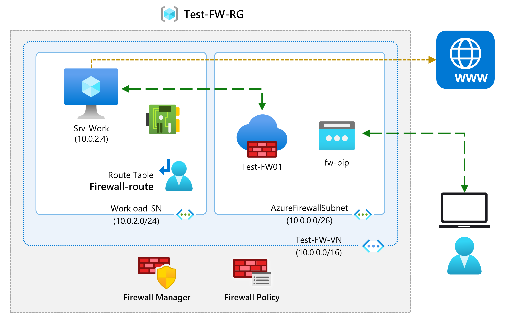
   
## Task 1: Create a virtual network and subnets

In this task, you will create a single virtual network with two subnets.

1. On Azure Portal page, in **Search resources, services and docs (G+/)** box at the top of the portal, enter **Virtual network**, and then select **Virtual 
   network** under services.

1. Select **+ Create**.

1. On the Create virtual network of **Basic** tab specify the following information to create Virtual Network.

     |  **Setting**     | **Value**            |
     | ---------------- | ------------------   |
     | Resource group   |  **Test-FW-RG-<inject key="DeploymentID" enableCopy="false"/>** |
     | Name             |  **Test-FW-VN**       |
     | Region           |  **<inject key="Region" enableCopy="false"/>**  |

1. Navigate to the **IP Addresses** tab and enter IPv4 address space **10.0.0.0/16** if not already there by default. 

1. Under **Subnet name**, select the word **default**.

1. In the **Edit subnet** pane, specify the following and then click on **Save (6)**.

    |  **Setting**     | **Value**            |
    | ---------------- | ------------------   | 
    | Subnet purpose  | Select **Azure Firewall (1)**|
    | Name             | (Pre-populated) **AzureFirewallSubnet (2)**|
    | IPv4 address range | Select **10.0.0.0/16 (3)** |
    | Starting address | **10.0.1.0 (4)** |
    | Size      | **/26 (5)** |

    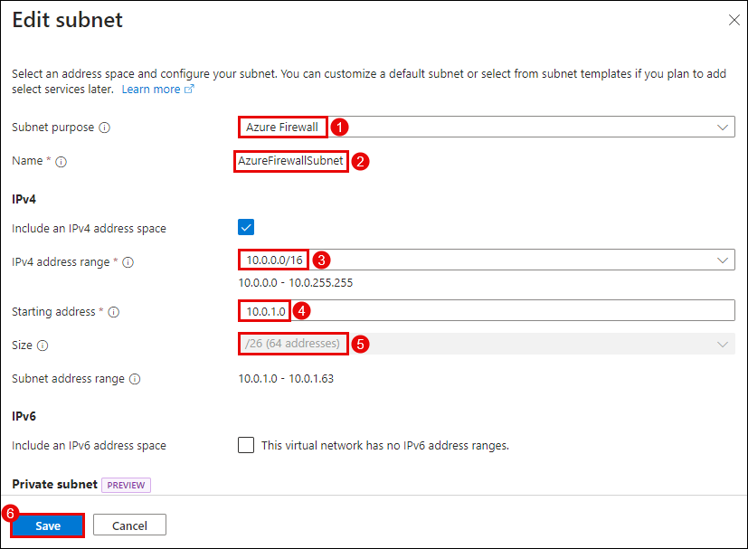

1. Select **+ Add a subnet**, to create another subnet, which will host the workload server that you will create shortly.
    
1. In the **Add a subnet** page, specify the following and then select **Add (6)**.

    |  **Setting**     | **Value**            |
    | ---------------- | ------------------   | 
    | Subnet purpose  | Select **Default (1)**|
    | Name             | **Workload-SN (2)**|
    | IPv4 address range | Select **10.0.0.0/16 (3)** |
    | Starting address | **10.0.2.0 (4)** |
    | Size      | **/24 (5)** |

   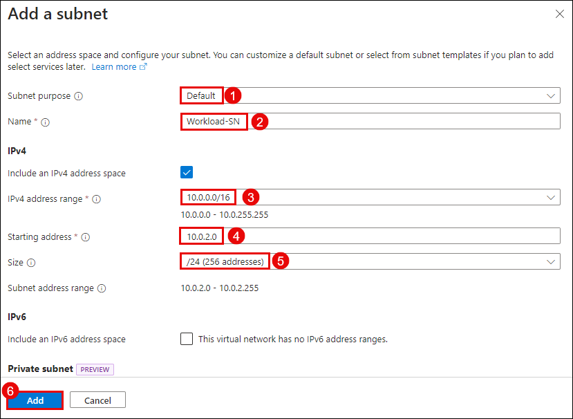
   
1. Select **Review + create** and  **Create**.

   > **Congratulations** on completing the task! Now, it's time to validate it. Here are the steps:
   > - Navigate to the Lab Validation Page, from the upper right corner in the lab guide section.
   > - Hit the Validate button for the corresponding task. You can proceed to the next task if you receive a success message.
   > - If not, carefully read the error message and retry the step, following the instructions in the lab guide.
   > - If you need any assistance, please contact us at labs-support@spektrasystems.com. We are available 24/7 to help you out.


## Task 2: Create a virtual machine

In this task, you will create the workload virtual machine and place it in the Workload-SN subnet created previously.

1. On the Azure portal, select the **Cloud shell** (**[>_]**)  button at the top of the page to the right of the search box. This opens a cloud shell pane at the bottom of the portal.

   

1. The first time you open the Cloud Shell, you may be prompted to choose the type of shell you want to use (*Bash* or *PowerShell*). If so, select **PowerShell**.

   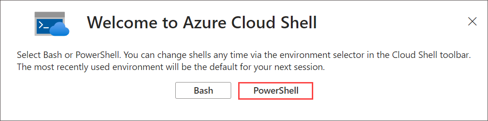

1. On **Getting started** window choose **Mount storage account** then under **Storage account subscription** select your available subscription from the dropdown and click on **Apply**.
   
     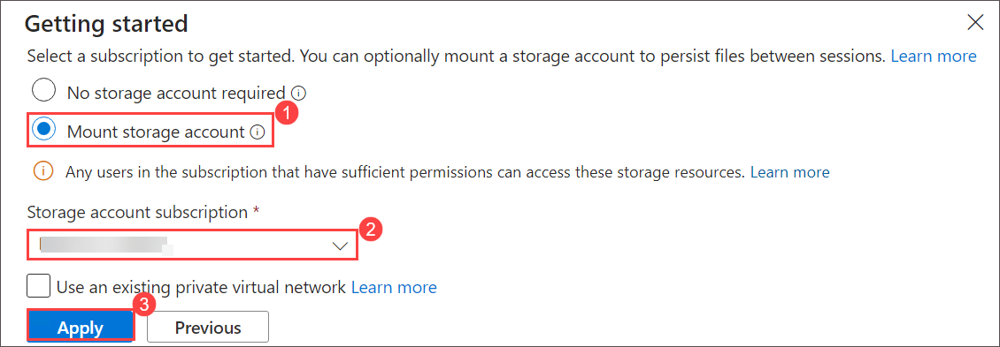
   
1. Within the Mount storage account pane, select **I want to create a storage account** and click **Next**.

     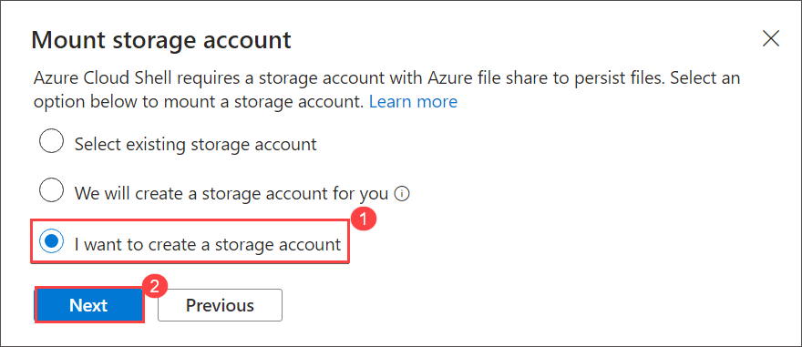
   
1.  Please make sure you have selected your resource group **Test-FW-RG-<inject key="DeploymentID" enableCopy="false"/>** and then select **Region** **<inject key="Region" enableCopy="false"/>** and enter **blob<inject key="DeploymentID" enableCopy="false"/>** for the **Storage account name** and enter **blobfileshare<inject key="DeploymentID" enableCopy="false"/>** for the  **File share** , then click on **Create**.

1. On the toolbar of the Cloud Shell pane, select the Select **Manage files** icon, in the drop-down menu, select **Upload** and upload the following files 
   **firewall.json** and **firewall.parameters.json** into the Cloud Shell home directory one by one from the source folder **C:\AllFiles\AZ-700-Designing-and- 
   Implementing-Microsoft-Azure-Networking-Solutions-prod\Allfiles\Exercises\M06**.

     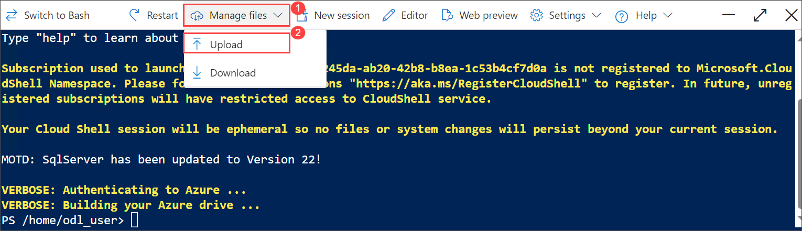

1. Deploy the following ARM templates to create the VM needed for this exercise:

   ```powershell
   $RGName = "Test-FW-RG-<inject key="DeploymentID" enableCopy="false"/>"
   
   New-AzResourceGroupDeployment -ResourceGroupName $RGName -TemplateFile firewall.json -TemplateParameterFile firewall.parameters.json
   ```

   >**Note**: You will be prompted to provide an Admin password, enter **Pa55w.rd!!**.

1. When the deployment is complete, go to the Azure portal home page, then search and select **Virtual Machines**.

1. Verify that the virtual machine has been created.

1. Select **Srv-Work** virtual machine.

1. On the **Overview** page of **Srv-Work**, within the left navigation pane, under the **Networking** section, select **Network settings** and make a note of the **Private IP address** for this VM (e.g., **10.0.2.4**) you may need this in next coming tasks.
 
## Task 3: Deploy the firewall and firewall policy

In this task, you will deploy the firewall into the virtual network with a firewall policy configured.

1. On Azure Portal page, in **Search resources, services and docs (G+/)** box at the top of the portal, enter **Firewalls (1)**, and then select **Firewalls (1)** under 
   services.

   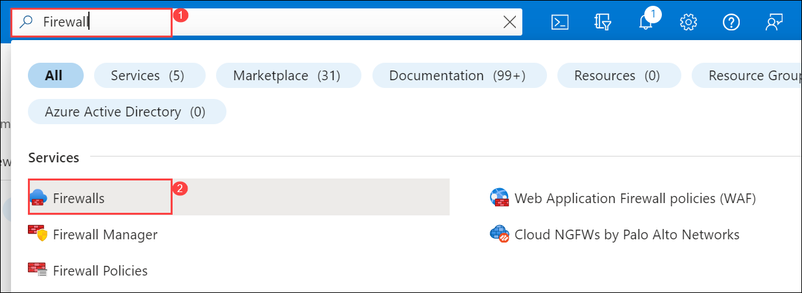
  
1. On the **Firewall** page, select **+ Create**.

1. On the **Basics** tab, create a firewall using the information in the table below and navigate to the **Review + create (11)** tab.

   | **Setting**              | **Value**                                                    |
   | --------------------     | ------------------------------------------------------------ |
   | Subscription             | Select your subscription **(1)**                                    |
   | Resource group           | **Test-FW-RG-<inject key="DeploymentID" enableCopy="false"/> (2)**   |
   | Firewall name            | **Test-FW01 (3)**                                                |
   | Region                   | **<inject key="Region" enableCopy="false"/> (4)**               |
   | Firewall SKU             | **Standard (5)**                                                 |
   | Firewall management      | **Use a Firewall Policy to manage this firewall (6)**            |
   | Firewall policy          | Select **Add new**<br /> Name: **fw-test-pol (7)**<br />         |
   | Choose a virtual network | **Use existing (8)**                                             |
   | Virtual network          | **Test-FW-VN (9)**                                               |
   | Public IP address        | Select **Add new**<br /> Name: **fw-pip (10)**                    |
   |||

   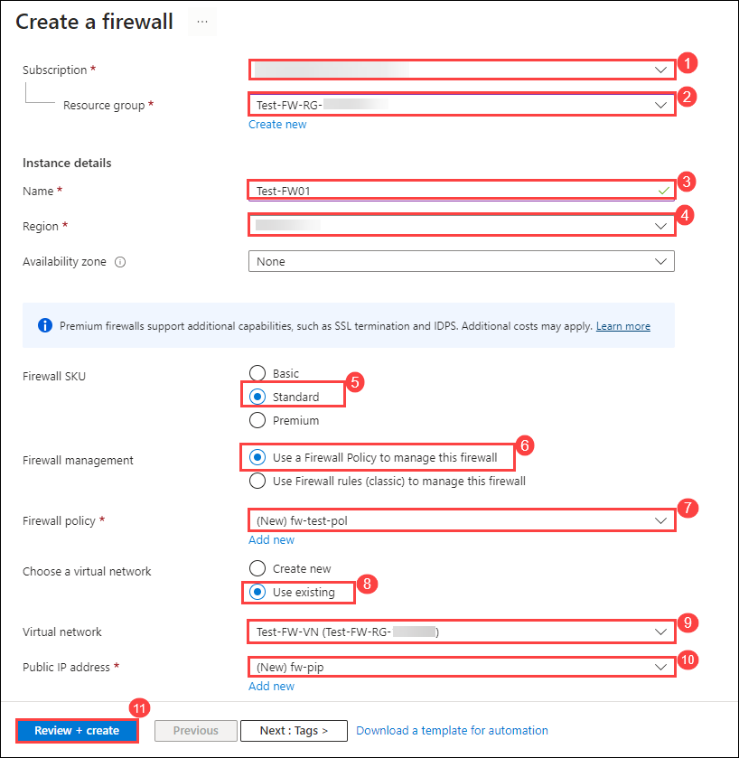

1. Select **Create** and wait for the firewall deployment to complete.

1. When deployment of the firewall is completed, select **Go to resource**.

1. On the **Overview** page of **Test-FW01**, on the right of the page, make a note of the **Firewall private IP** for this firewall (e.g., **10.0.1.4**) you may need this in coming tasks.

1. In the menu on the left, under **Settings**, select **Public IP configuration**.

1. Make a note of the address under **IP Address** for the **fw-pip** public IP configuration (e.g., **20.90.136.51**) you may need this in coming tasks.

    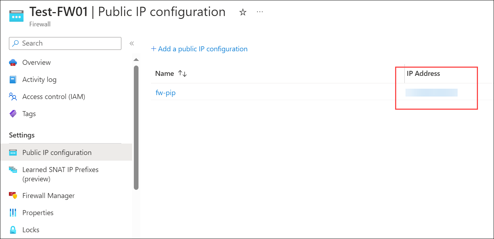

   > **Congratulations** on completing the task! Now, it's time to validate it. Here are the steps:
   > - Navigate to the Lab Validation Page, from the upper right corner in the lab guide section.
   > - Hit the Validate button for the corresponding task. You can proceed to the next task if you receive a success message.
   > - If not, carefully read the error message and retry the step, following the instructions in the lab guide.
   > - If you need any assistance, please contact us at labs-support@spektrasystems.com. We are available 24/7 to help you out.

## Task 4: Create a default route

In this task, on the Workload-SN subnet, you will configure the outbound default route to go through the firewall.

1. On Azure Portal page, in **Search resources, services and docs (G+/)** box at the top of the portal, enter **Route tables (1)**, and then select **Route tables (2)** 
   under services.

     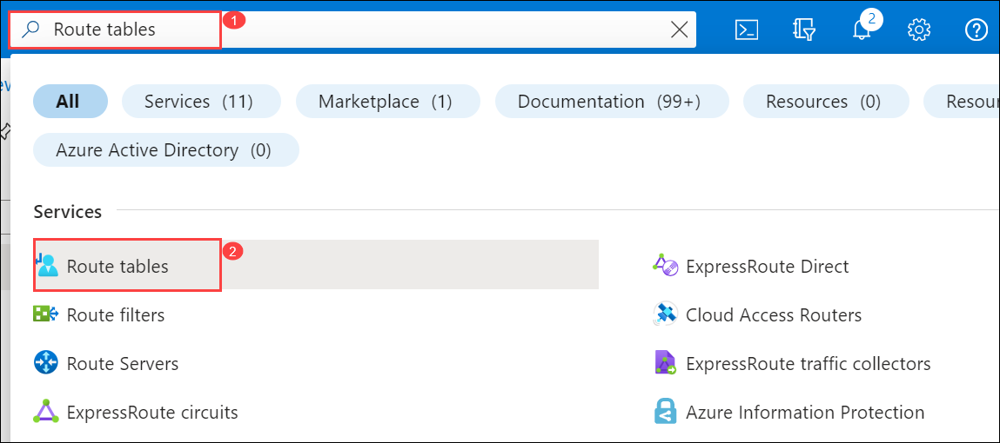
   
1. On the **Route table** page, select **+ Create**.

1. On the **Basics** tab, create a new route table using the information in the table below.

   | **Setting**              | **Value**                |
   | ------------------------ | ------------------------ |
   | Subscription             | Select your subscription |
   | Resource group           | **Test-FW-RG-<inject key="DeploymentID" enableCopy="false"/>**  |
   | Region                   | **<inject key="Region" enableCopy="false"/>** |
   | Name                     | **Firewall-route**       |
   | Propagate gateway routes | **Yes**                  |

1. Select **Review + create**.

1. Select **Create**.

1. After deployment completes, select **Go to resource**.

1. On the **Firewall-route** page, from the left navigation menu, under **Settings**, select **Subnets** and then select **+ Associate**, specify the following and **OK (3)**.

   | **Setting**              | **Value**                |
   | ------------------------ | ------------------------ |
   | Virtual Network          | select **Test-FW-VN (1)**    |
   | Subnet                   | **Workload-SN (2)**          |

   **Note**:  Make sure that you select only the Workload-SN subnet for this route, otherwise your firewall won't work correctly.

    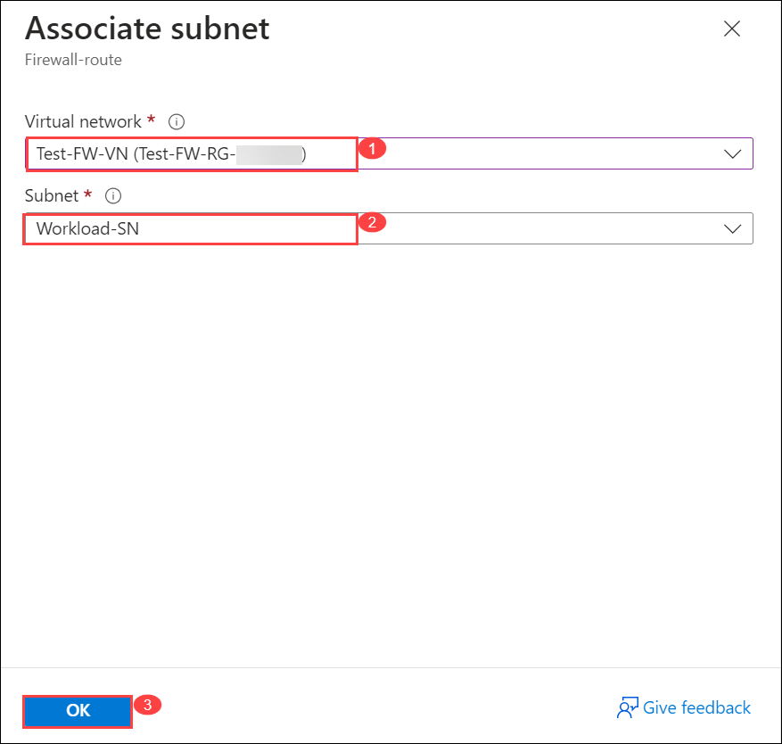

   
1. From the left navigation menu, under **Settings**, select **Routes** and then select **+ Add (6)**.

   | **Setting**                              | **Value**                |
   | --------------------------------------   | ------------------------ |
   | **Route name**                           | **fw-dg (1)**                |
   | **Destination type**                     | **IP address (2)**           |
   | **Destination IP addresses/CIDR ranges** |  **0.0.0.0/0 (3)**           |
   | **Next hop type**                        | **Virtual appliance (4)**    |
   | **Next hop address**                     | Enter the private IP address for the firewall that you noted previously **(5)** (e.g., **10.0.1.4**) |
   
    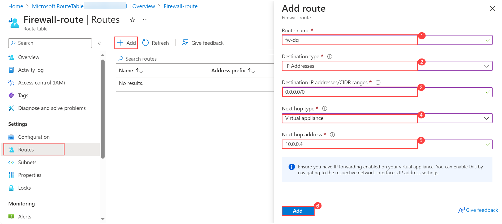

   > **Congratulations** on completing the task! Now, it's time to validate it. Here are the steps:
   > - Navigate to the Lab Validation Page, from the upper right corner in the lab guide section.
   > - Hit the Validate button for the corresponding task. You can proceed to the next task if you receive a success message.
   > - If not, carefully read the error message and retry the step, following the instructions in the lab guide.
   > - If you need any assistance, please contact us at labs-support@spektrasystems.com. We are available 24/7 to help you out.

 
## Task 5: Configure an application rule

In this task, you will add an application rule that allows outbound access to www.google.com.

1. On the Azure portal home page, from top left corner of page click **Show portal menu** and select **All resources**.

    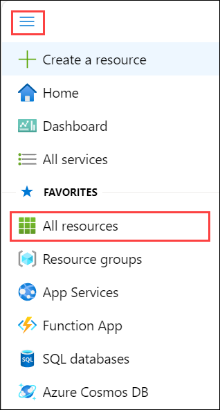

1. In the list of resources, select your firewall policy, **fw-test-pol**.

1. From the left navigation menu, under **Settings** section, select **Application Rules**.

1. Select **+ Add a rule collection**.

1. On the **Add a rule collection** page, create a new application rule using the information in the table below, and select **Add (7)**.

   | **Setting**            | **Value**                                 |
   | ---------------------- | ----------------------------------------- |
   | Name                   | **App-Coll01 (1)**                            |
   | Rule collection type   | **Application (2)**                           |
   | Priority               | **200 (3)**                                   |
   | Rule collection action | **Allow (4)**                                 |
   | Rule collection group  | **DefaultApplicationRuleCollectionGroup (5)** |
   | **Rules Section**      |                                           |
   | Name                   | **Allow-Google**                          |
   | Source type            | **IP Address**                            |
   | Source                 | **10.0.2.0/24**                           |
   | Protocol               | **http,https**                            |
   | Destination type       | **FQDN**                                  |
   | Destination            | **www.google.com (6)**                        |
   |||
   
   .png)

   > **Congratulations** on completing the task! Now, it's time to validate it. Here are the steps:
   > - Navigate to the Lab Validation Page, from the upper right corner in the lab guide section.
   > - Hit the Validate button for the corresponding task. You can proceed to the next task if you receive a success message.
   > - If not, carefully read the error message and retry the step, following the instructions in the lab guide.
   > - If you need any assistance, please contact us at labs-support@spektrasystems.com. We are available 24/7 to help you out.


## Task 6: Configure a network rule

In this task, you will add a network rule that allows outbound access to two IP addresses at port 53 (DNS).

1. On the **fw-test-pol** page, from the left navigation menu, under **Settings** section, select **Network Rules**.

1. Select **+ Add a rule collection**.

1. On the **Add a rule collection** page, create a new network rule using the information in the table below, and select **Add (7)**.

   | **Setting**            | **Value**                                                    |
   | ---------------------- | ------------------------------------------------------------ |
   | Name                   | **Net-Coll01 (1)**                                               |
   | Rule collection type   | **Network (2)**                                                  |
   | Priority               | **200 (3)**                                                      |
   | Rule collection action | **Allow (4)**                                                    |
   | Rule collection group  | **DefaultNetworkRuleCollectionGroup (5)**                        |
   | **Rules Section**      |                                                              |
   | Name                   | **Allow-DNS**                                                |
   | Source type            | **IP Address**                                               |
   | Source                 | **10.0.2.0/24**                                              |
   | Protocol               | **UDP**                                                      |
   | Destination Ports      | **53**                                                       |
   | Destination Type       | **IP Address**                                               |
   | Destination            | **209.244.0.3, 209.244.0.4 (6)** <br />These are public DNS servers operated by Century Link. |

   ​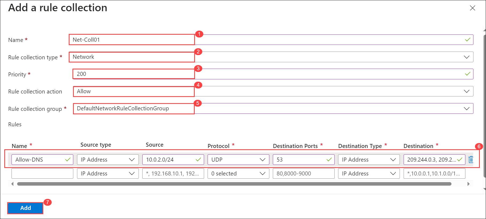

   > **Congratulations** on completing the task! Now, it's time to validate it. Here are the steps:
   > - Navigate to the Lab Validation Page, from the upper right corner in the lab guide section.
   > - Hit the Validate button for the corresponding task. You can proceed to the next task if you receive a success message.
   > - If not, carefully read the error message and retry the step, following the instructions in the lab guide.
   > - If you need any assistance, please contact us at labs-support@spektrasystems.com. We are available 24/7 to help you out.

## Task 7: Configure a Destination NAT (DNAT) rule

In this task, you will add a DNAT rule that allows you to connect a remote desktop to the Srv-Work virtual machine through the firewall.

1. On the **fw-test-pol** page, from the left navigation menu, under **Settings** section, select **DNAT Rules**.

1. Select **+ Add a rule collection**.

1. On the **Add a rule collection** page, create a new DNAT rule using the information in the table below.

   | **Setting**           | **Value**                                                    |
   | --------------------- | ------------------------------------------------------------ |
   | Name                  | **rdp (1)**                                                      |
   | Rule collection type  | **DNAT (2)**                                                     |
   | Priority              | **200 (3)**                                                      |
   | Rule collection group | **DefaultDnatRuleCollectionGroup (5)**                           |
   | **Rules Section**     |                                                              |
   | Name                  | **rdp-nat**                                                  |
   | Source type           | **IP Address**                                               |
   | Source                | *                                                            |
   | Protocol              | **TCP**                                                      |
   | Destination Ports     | **3389**                                                     |
   | Destination           | Enter the firewall public IP address from **fw-pip** that you noted earlier.<br />**e.g. - 20.90.136.51** |
   | Translated type       | **IP Address**                                                     |
   | Translated address or    | Enter the private IP address from **Srv-Work** that you noted earlier.<br />**e.g. - 10.0.2.4** |
   | Translated port       | **3389 (6)**                                                     |
   |||

   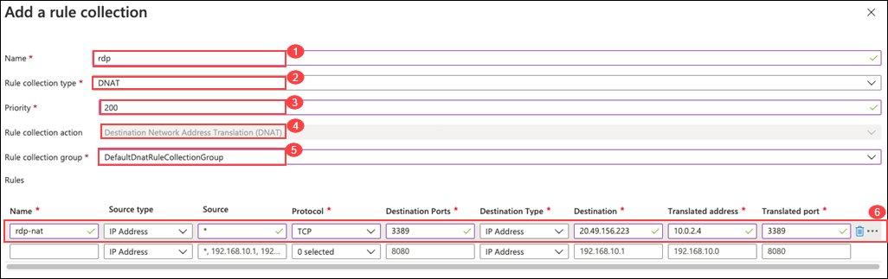

1. Select **Add**.

   > **Congratulations** on completing the task! Now, it's time to validate it. Here are the steps:
   > - Navigate to the Lab Validation Page, from the upper right corner in the lab guide section.
   > - Hit the Validate button for the corresponding task. You can proceed to the next task if you receive a success message.
   > - If not, carefully read the error message and retry the step, following the instructions in the lab guide.
   > - If you need any assistance, please contact us at labs-support@spektrasystems.com. We are available 24/7 to help you out.

 ## Task 8: Change the primary and secondary DNS address for the server's network interface

For testing purposes in this exercise, in this task, you will configure the Srv-Work server's primary and secondary DNS addresses. However, this is not a general Azure Firewall requirement.

1. On Azure Portal page, in **Search resources, services and docs (G+/)** box at the top of the portal, enter **Resource groups**, and then select **Resource 
   groups** under services.

1. In the list of resource groups, select your resource group, **Test-FW-RG-<inject key="DeploymentID" enableCopy="false"/>**.

1. In the list of resources in this resource group, select the **Network interface** for the **Srv-Work** virtual machine (e.g., **srv-work-nic**).

1. From the left navigation menu, under **Settings**, select **DNS servers**.

1. Under **DNS servers**, select **Custom**.

1. Enter **209.244.0.3** in the **Add DNS server** text box, and **209.244.0.4** in the next text box.

1. Select **Save**.

   

1. Restart the **Srv-Work** virtual machine.

   > **Congratulations** on completing the task! Now, it's time to validate it. Here are the steps:
   > - Navigate to the Lab Validation Page, from the upper right corner in the lab guide section.
   > - Hit the Validate button for the corresponding task. You can proceed to the next task if you receive a success message.
   > - If not, carefully read the error message and retry the step, following the instructions in the lab guide.
   > - If you need any assistance, please contact us at labs-support@spektrasystems.com. We are available 24/7 to help you out.


## Task 9: Test the firewall

In this final task, you will test the firewall to verify that the rules are configured correctly and working as expected. This configuration will enable you to connect a remote desktop connection to the Srv-Work virtual machine through the firewall, via the firewall's public IP address.

1. Within Labvm from start menu, open **Remote Desktop Connection**.

1. On the **Computer** box, enter the firewall's public IP address followed by **:3389** (e.g., **20.90.136.51:3389**) and select **Connect**.

    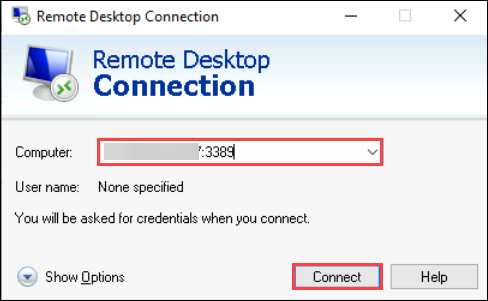
 
1. On the **Enter your credentials** dialog box, log into the **Srv-Work** server virtual machine, on the **Username** box, enter **TestUser** and Password  
   **Pa55w.rd!!**.

1. Select **OK**.

1. Select **Yes** on the certificate message.

1. Open Internet Explorer and browse to **https://www.google.com**

1. On the **Security Alert** dialog box, select **OK**.

1. Select **Close** on the Internet Explorer security alerts that may pop-up.

1. You should see the Google home page.

    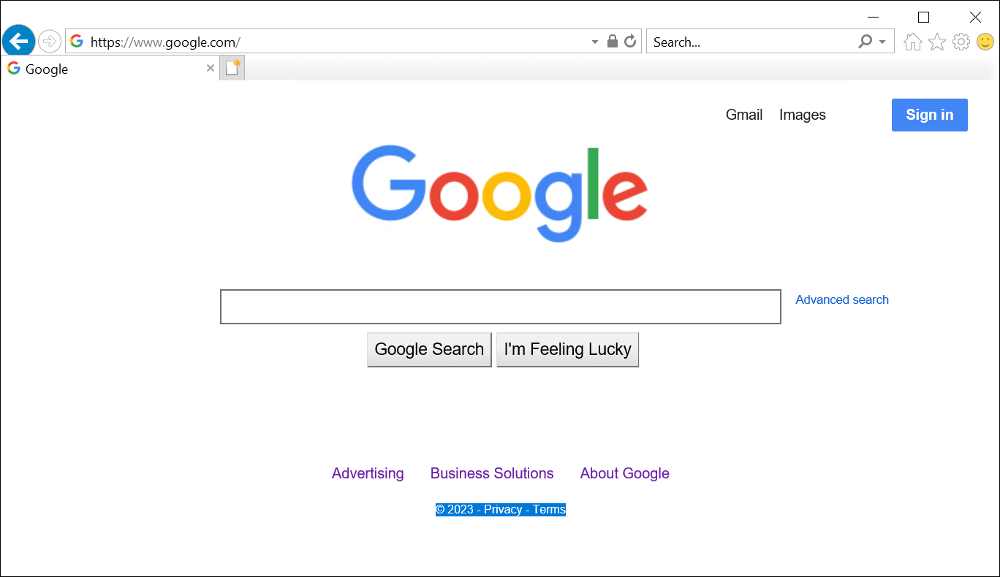

1. Browse to **https://www.microsoft.com**

1. You should be blocked by the firewall.

    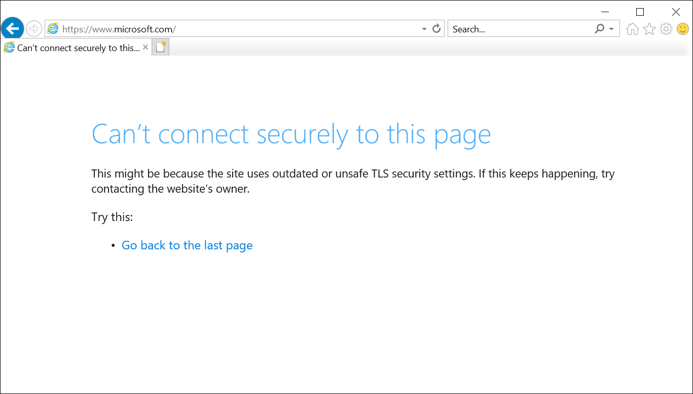


## Review

In this lab, you have completed:

+  Create a virtual network and subnets
+  Create a virtual machine
+  Deploy the firewall and firewall policy
+  Create a default route
+  Configure an application rule
+  Configure a network rule
+  Configure a Destination NAT (DNAT) rule
+  Change the primary and secondary DNS address for the server's network interface
+  Test the firewall
 
## You have successfully completed the lab.
