# Module 06-Unit 9 Secure your virtual hub using Azure Firewall Manager

## Lab scenario
In this lab, you will create the spoke virtual network and create a secured virtual hub, then you will connect the hub and spoke virtual networks and route traffic to your hub. Next you will deploy the workload servers, then create a firewall policy and secure your hub, and finally you will test the firewall.

**Note:** An **[interactive lab simulation](https://mslabs.cloudguides.com/guides/AZ-700%20Lab%20Simulation%20-%20Secure%20your%20virtual%20hub%20using%20Azure%20Firewall%20Manager)** is available that allows you to click through this lab at your own pace. You may find slight differences between the interactive simulation and the hosted lab, but the core concepts and ideas being demonstrated are the same.

## Lab objectives
In this lab, you will complete the following tasks:

+ Task 1: Create two spoke virtual networks and subnets
+ Task 2: Create the secured virtual hub
+ Task 3: Connect the hub and spoke virtual networks
+ Task 4: Deploy the servers
+ Task 5: Create a firewall policy and secure your hub
+ Task 6: Associate the firewall policy
+ Task 7: Route traffic to your hub
+ Task 8: Test the application rule
+ Task 9: Test the network rule
  
## Estimated time: 35 minutes

## Architecture Diagram

  ‎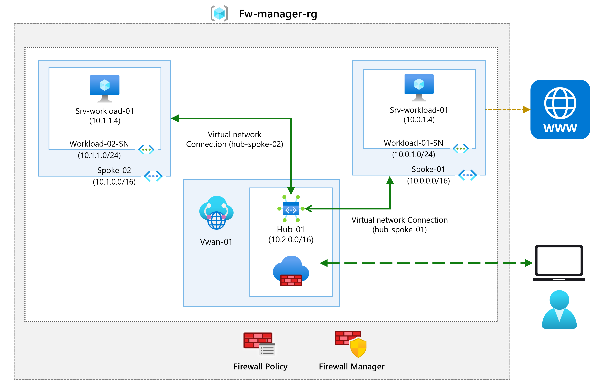

## Exercise 1: Create a hub and spoke architecture

In this part of the lab, you will create the spoke virtual networks and subnets where you will place the workload servers. Then you will create the secured virtual hub and connect the hub and spoke virtual networks.

### Task 1: Create two spoke virtual networks and subnets

In this task, you will create the two spoke virtual networks each containing a subnet that will host your workload servers. 

1. On Azure Portal page, in **Search resources, services and docs (G+/)** box at the top of the portal, enter **Virtual networks**, and then select **Virtual 
   networks** under services.

1. Select **+ Create**.

1. In **Resource group** select **fw-manager-rg-<inject key="DeploymentID" enableCopy="false"/>** .

1. In **Virtual network name**, enter **Spoke-01**.

1. In **Region**, select **<inject key="Region" enableCopy="false"/>**.

1. Select **Next**.

1. Keep the options as default in Security page, select **Next**.

1. In **IPv4 address space**, replace the existing IPv4 address space with this **10.0.0.0/16**.

    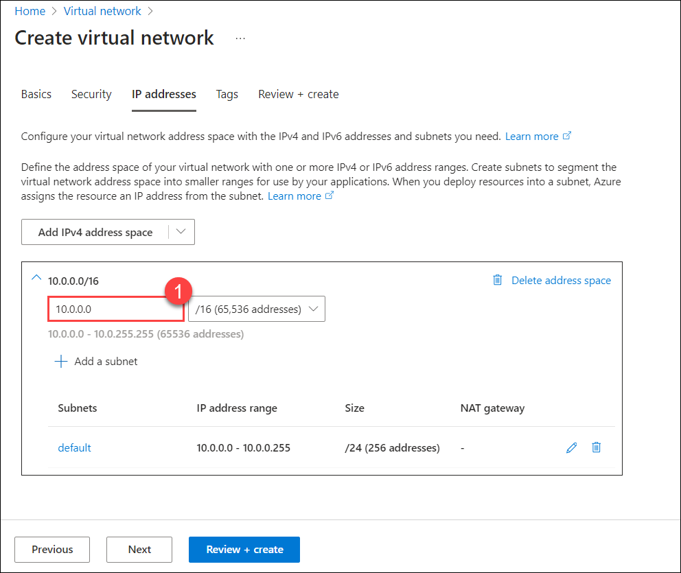

    >**Note:** Delete any other address spaces listed here, such as 10.1.0.0/16.

1. Under Subnets name, select the word **default**. In the **Edit subnet** dialog box, change the name to **Workload-01-SN**. Change the **Starting address** to 
   **10.0.1.0**. Select Subnet size : **/24(256 addresses)**.

1. Select **Save**.

1. Select **Review + create**.

1. Select **Create**.

1. Repeat steps 1 to 12 above to create another similar virtual network and subnet but using the following information:

    - Resource Group: Select **fw-manager-rg-<inject key="DeploymentID" enableCopy="false"/>**
    - **Virtual network name**: **Spoke-02**
    - Address space: **10.1.0.0/16** - (delete any other listed address spaces)
    - Subnet name: **Workload-02-SN**
    - **Starting address**: **10.1.1.0**
    - **Select Subnet size** : **/24(256 addresses)**.


  > **Congratulations** on completing the task! Now, it's time to validate it. Here are the steps:
  > - Navigate to the Lab Validation Page, from the upper right corner in the lab guide section.
  > - Hit the Validate button for the corresponding task. You can proceed to the next task if you receive a success message.
  > - If not, carefully read the error message and retry the step, following the instructions in the lab guide.
  > - If you need any assistance, please contact us at labs-support@spektrasystems.com. We are available 24/7 to help you out.

### Task 2: Create the secured virtual hub

In this task you will create your secured virtual hub using Firewall Manager.

1. From the Azure portal home page, from top left corner of page click **Show portal menu**, select **All services**.

    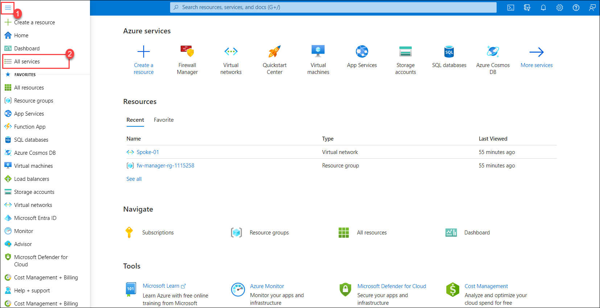

1. In the search box, type **firewall manager** and select **Firewall Manager** when it appears.

1. On the **Firewall Manager** page, click **Virtual Hubs** on left pane in **Deployments** section.

1. On the **Virtual Hubs** page, select **+ Create new secured virtual hub**.

    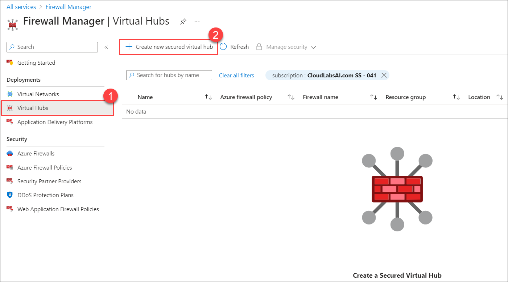

1. For **Resource group**, select **fw-manager-rg-<inject key="DeploymentID" enableCopy="false"/>**.

1. For **Region**, select **<inject key="Region" enableCopy="false"/>**.

1. For the **Secured virtual hub name**, enter **Hub-01**.

1. For **Hub address space**, enter **10.2.0.0/16**.

1. Choose **New vWAN**.

1. In **Virtual WAN Name**, enter **Vwan-01**.

1. Select **Next : Azure Firewall >**.
    
    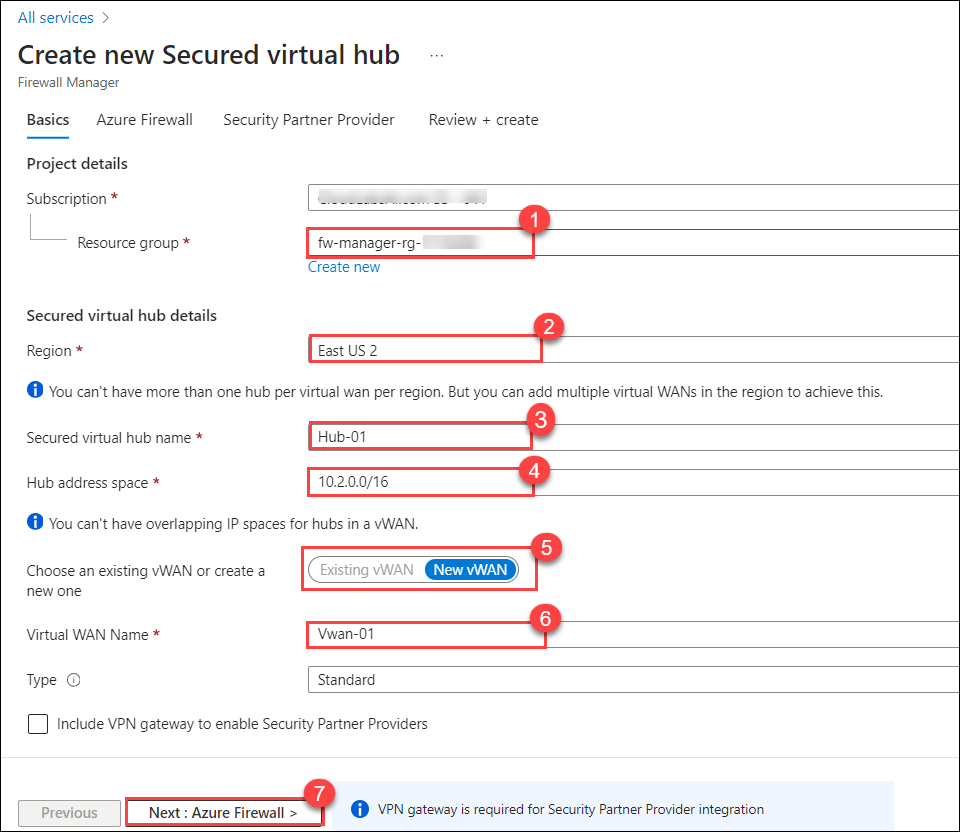

1. On **Azure Firewall** tab enter **2** for **Specify number of the Public IP addresses**.

1. Select **Next : Security Partner Provider >**.

1. Select **Next : Review + create >**

1. Select **Create**.

    >**NOTE** : This can take up to 30 minutes to deploy.

1. When the deployment completes, from the Azure portal home page, select **All services**.

1. In the search box, enter **firewall manager** and select **Firewall Manager** when it appears.

1. On the **Firewall Manager** page, select **Virtual hubs** under Deployments.

1. Select **Hub-01**.

1. Select **Public IP configuration** under **Azure Firewall**, from the left-hand navigation pane.

1. Note down the public IP address (e.g., **51.143.226.18**), which you will use later.

    > **Congratulations** on completing the task! Now, it's time to validate it. Here are the steps:
    > - Navigate to the Lab Validation Page, from the upper right corner in the lab guide section.
    > - Hit the Validate button for the corresponding task. You can proceed to the next task if you receive a success message.
    > - If not, carefully read the error message and retry the step, following the instructions in the lab guide.
    > - If you need any assistance, please contact us at labs-support@spektrasystems.com. We are available 24/7 to help you out.

### Task 3: Connect the hub and spoke virtual networks

In this task you will connect the hub and spoke virtual networks. This is commonly known as peering.

1. On Azure Portal page, in **Search resources, services and docs (G+/)** box at the top of the portal, enter **Resource groups**, and then select **Resource 
   groups** under services.

2. Select the **fw-manager-rg-<inject key="DeploymentID" enableCopy="false"/>** resource group, then select the **Vwan-01** virtual WAN under **Resources** section.

3. From the left-hand navigation pane, under **Connectivity**, select **Virtual network connections**.

4. Select **+ Add connection**.

5. For **Connection name**, enter **hub-spoke-01**.

6. For **Hubs**, select **Hub-01**.

7. For **Resource group**, select **fw-manager-rg-<inject key="DeploymentID" enableCopy="false"/>**.

8. For **Virtual network**, select **Spoke-01**.

9. Select **Create**.
   
10. Repeat steps 4 to 9 above to create another similar connection but using the **Connection name** of **hub-spoke-02** to connect the **Virtual network** of 
    **Spoke-02**

### Task 4: Deploy the servers

1. On the Azure portal select the **Cloud shell** (**[>_]**)  button at the top of the page to the right of the search box. This opens a cloud shell pane at the bottom of the portal.

   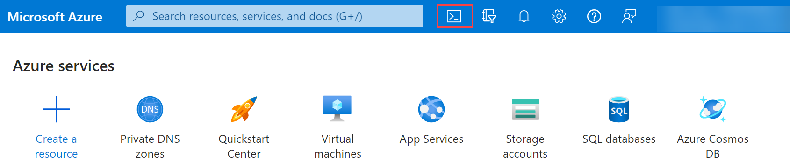

1. The first time you open the Cloud Shell, you may be prompted to choose the type of shell you want to use (*Bash* or *PowerShell*). If so, select **PowerShell**.

   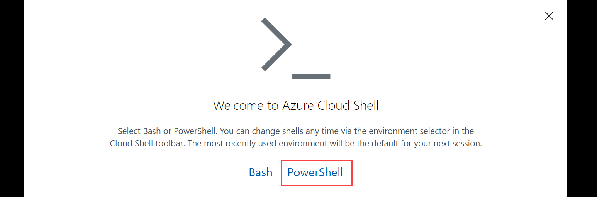
   
1. If you are prompted to create storage for your Cloud Shell, ensure your subscription is selected and click on **Show advanced settings**. Please make sure you have selected your resource group **fw-manager-rg-<inject key="DeploymentID" enableCopy="false"/>** and enter **blob<inject key="DeploymentID" enableCopy="false"/>** for the **Storage account** and enter **blobfileshare<inject key="DeploymentID" enableCopy="false"/>** for the  **File share** , then click on **Create Storage**.

    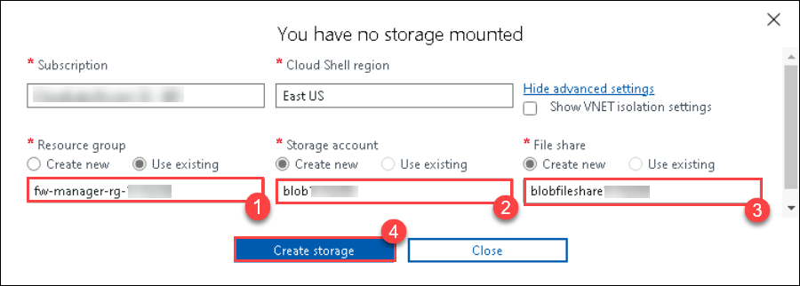

1. In the toolbar of the Cloud Shell pane, select the **Upload/Download files** icon, in the drop-down menu, select **Upload** and upload the following files **FirewallManager.json** and **FirewallManager.parameters.json** into the Cloud Shell home directory one by one from the source folder **C:\AllFiles\AZ-700-Designing-and-Implementing-Microsoft-Azure-Networking-Solutions-prod\Allfiles\Exercises\M06**.

    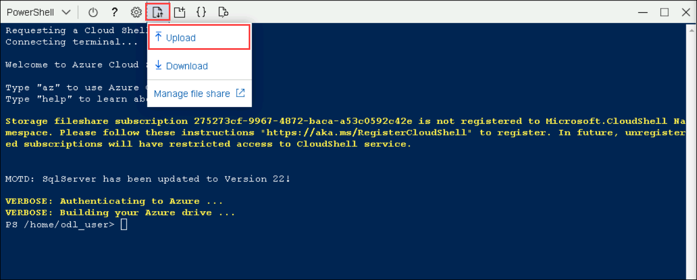

1. Deploy the following ARM templates to create the VM needed for this exercise:

     >**Important**: Please replace fw-manager-rg-DID with **fw-manager-rg-<inject key="DeploymentID" enableCopy="false"/>**

   ```powershell
   $RGName = "fw-manager-rg-DID"
   
   New-AzResourceGroupDeployment -ResourceGroupName $RGName -TemplateFile FirewallManager.json -TemplateParameterFile FirewallManager.parameters.json
   ```
1.  You will be prompted to provide an admin password. provide adminPassword: **Pa55w.rd!!**
  
1. Once the deployment has finished, navigate to the Azure portal home page, and proceed to select **Virtual Machines**.

1. Select **Srv-workload-01** VM. On the **Overview** page of **Srv-workload-01**, in the left-hand pane, select **Network Settings** under the **Networking** section, and note down the **NIC Private IP** (e.g., **10.0.1.4**), after this close it.

    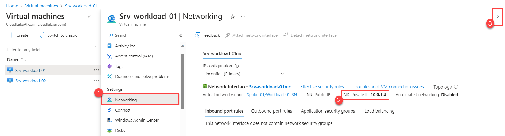

1. Now, select **Srv-workload-02** VM. On the **Overview** page of **Srv-workload-02**, in the left-hand pane, select **Networking** under the **Settings** section, and note down the **NIC Private IP** (e.g., **10.1.1.4**).


   > **Congratulations** on completing the task! Now, it's time to validate it. Here are the steps:
   > - Navigate to the Lab Validation Page, from the upper right corner in the lab guide section.
   > - Hit the Validate button for the corresponding task. You can proceed to the next task if you receive a success message.
   > - If not, carefully read the error message and retry the step, following the instructions in the lab guide.
   > - If you need any assistance, please contact us at labs-support@spektrasystems.com. We are available 24/7 to help you out.

### Task 5: Create a firewall policy and secure your hub

In this task you will first create your firewall policy, then secure your hub. The firewall policy will define collections of rules to direct traffic on one or more Secured virtual hubs.

1. On Azure Portal page, in **Search resources, services and docs (G+/)** box at the top of the portal, enter **Firewall Manager**, and then select **Firewall 
   Manager** under services.

   **Note**: If the Firewall Manager icon does not appear on the homepage, then select **All services**. Then in the search box, enter **firewall manager** and select **Firewall Manager** when it appears.

1. On **Firewall Manager** page, from the left-hand navigation pane, under security, select **Azure Firewall Policies**.

1. Select **+ Create Azure Firewall Policy**.

1. On **Resource group**, select **fw-manager-rg-<inject key="DeploymentID" enableCopy="false"/>**.

1. Under **Policy details**, for the **Name**, enter **Policy-01**.

1. For **Region**, select **<inject key="Region" enableCopy="false"/>**.

1. On **Policy tier**, select **Standard**.

1. Select **Next : DNS Settings >**.

1. Select **Next : TLS Inspection >**.

1. Select **Next : Rules >**.

1. On the **Rules** tab, select **+ Add a rule collection**.

1. On the **Add a rule collection** page, in **Name**, enter **App-RC-01**.

1. For **Rule collection type**, select **Application**.

1. For **Priority**, enter **100**.

1. Ensure **Rule collection action** is **Allow**.

1. Under **Rules**, in **Name** enter **Allow-msft**.

1. For the **Source type**, select **IP Address**.

1. For **Source**, enter *.

1. For **Protocol**, enter **http,https**.

1. Ensure **Destination Type** is **FQDN**.

1. For **Destination**, enter *.microsoft.com

    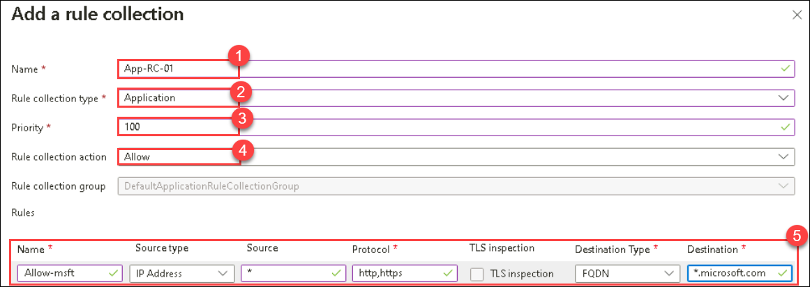

1. Select **Add**.

1. For adding a DNAT rule, you can connect a remote desktop to the Srv-workload-01 VM. On **Create an Azure Firewall Policy** page, select **+ Add a rule collection**.

1. For **Name**, enter **dnat-rdp**.

1. For **Rule collection type**, select **DNAT**.

1. For **Priority**, enter **100**.

1. Under **Rules**, in **Name** enter **Allow-rdp**.

1. For the **Source type**, select **IP Address**.

1. For **Source**, enter *.

1. For **Protocol**, select **TCP**.

1. For **Destination Ports**, enter **3389**.

1. For **Destination**, enter the firewall virtual hub public IP address that you noted down earlier.

1. For **Translated type**, select **IP Address**.

1. For **Translated address**, enter the NIC private IP address for **Srv-workload-01** that you noted down earlier (e.g., **10.0.1.4**).

1. For **Translated port**, enter **3389**.

1. Select **Add**.

1. To add a Network rule so you can connect a remote desktop from Srv-workload-01 to Srv-workload-02 VM, on **Create an Azure Firewall Policy** page, select **+ Add a rule collection**.

1. For **Name**, enter **vnet-rdp**.

1. For **Rule collection type**, select **Network**.

1. For **Priority**, enter **100**.

1. For **Rule collection action**, select **Allow**.

1. Under **Rules**, in **Name** enter **Allow-vnet**.

1. For the **Source type**, select **IP Address**.

1. For **Source**, enter *.

1. For **Protocol**, select **TCP**.

1. For **Destination Ports**, enter **3389**.

1. For **Destination Type**, select **IP Address**.

1. For **Destination**, enter the private IP address for **Srv-workload-02** that you noted down earlier (e.g., **10.1.1.4**).

1. Select **Add**.

1. You should now have 3 rule collections listed.

1. Select **Review + create**.

1. Select **Create**.

### Task 6: Associate the firewall policy

In this task you will associate the firewall policy with the virtual hub.

1. On Azure Portal page, in **Search resources, services and docs (G+/)** box at the top of the portal, enter **Firewall Manager**, and then select **Firewall 
   Manager** under services.

   **Note**: If the Firewall Manager icon does not appear on the homepage, then select **All services**. Then in the search box, enter **firewall manager** and select **Firewall Manager** when it appears.

1. On **Firewall Manager**, under **Security**, select **Azure Firewall Policies**.

1. Select the checkbox for **Policy-01** and  Select **Manage associations&gt;Associate hubs**.

   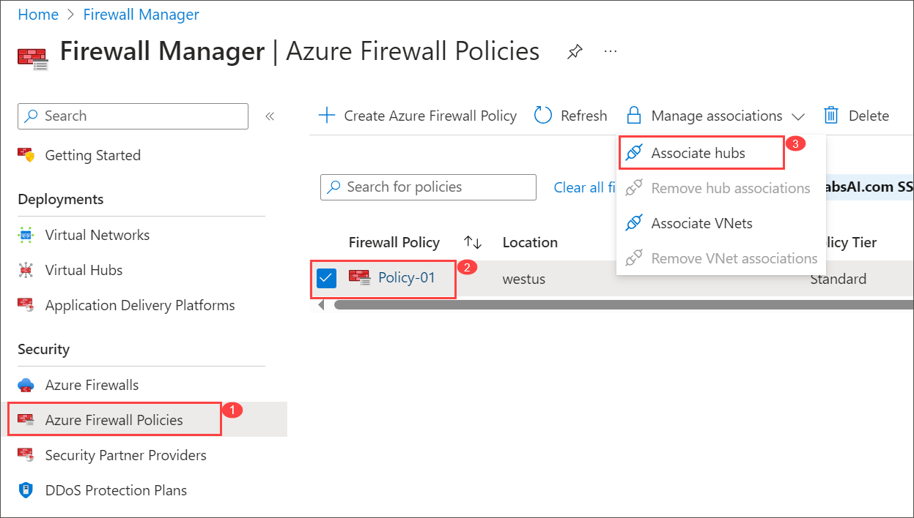

1. Select the checkbox for **Hub-01**.

1. Select **Add**.

1. When the policy has been attached, select **Refresh**. The association should be displayed.

 ### Task 7: Route traffic to your hub

In this task you will ensure that network traffic gets routed through your firewall.

1. On **Firewall Manager** page, from left-hand navigation pane select **Virtual hubs**.

1. Select **Hub-01**.

1. From left-hand navigation pane, under **Settings**, select **Security configuration**.

1. On **Internet traffic**, select **Azure Firewall**.

1. On **Private traffic**, select **Send via Azure Firewall**.

1. Select **Save**. 

    >**Note:** On **Secure internet traffic** pop-up, select **OK**.

1. This will take a few minutes to complete.

1. Once configuration has completed, ensure that under **INTERNET TRAFFIC** and **PRIVATE TRAFFIC**, it says **Secured by Azure Firewall** for both hub-spoke connections.

### Task 8: Test the application rule

In this part of the exercise, you will connect a remote desktop to the firewall public IP address, which is NATed to Srv-Workload-01. You will then use a web browser to test the application rule and connect a remote desktop to Srv-Workload-02 to test the network rule.

In this task you will test the application rule to confirm that it works as expected.

1. Within LabVM, from the start menu search and open **Remote Desktop Connection**.

1. On the **Computer** box, enter the **firewall's public IP address** (e.g., **51.143.226.18**).

1. Select **Show Options**.

1. On the **Username** box, enter **TestUser**.

1. Select **Connect**.

1. On the **Enter your credentials** dialog box, log into the **Srv-workload-01** server virtual machine, by using the password **Pa55w.rd!!** provided during deployment.

1. Select **OK**.

1. Select **Yes** on the certificate message.

    >**Note:** If **Network** pop-up appears,select **Yes** and minimize the **Server Manager** page.

1. Open Internet Explorer and select **OK** in the **Set up Internet Explorer 11** dialog box.

1. Browse to **https://www.microsoft.com**.

1. On the **Security Alert** dialog box, select **OK**.

1. Select **Close** on the Internet Explorer security alerts that may pop-up.

1. You should see the Microsoft home page.

1. Browse to **https://www.google.com**.

1. Select **Close** on the Internet Explorer security alerts that may pop-up.

1. You should be blocked by the firewall.

    

1. So, you have verified that you can connect to the one allowed FQDN but are blocked from all others.

### Task 9: Test the network rule

In this task you will test the network rule to confirm that it works as expected.

1. While still logged in to the **Srv-workload-01** RDP session, from this **Srv-workload-01** remote session, from start menu search and open **Remote Desktop 
   Connection**.

1. On the **Computer** box, enter the **private IP address** of **Srv-workload-02** (e.g., **10.1.1.4**). Click **Connect**.

1. On the **Enter your credentials** dialog box, log in to the **Srv-workload-02** server by using the username **TestUser**, and the password **Pa55w.rd!!**

1. Select **OK**.

1. Select **Yes** on the certificate message.

    >**Note:** If **Network** pop-up appears,select **Yes** and minimize the **Server Manager** page.

   

1. So, now you have verified that the firewall network rule is working, as you have connected a remote desktop from one server to another server located in another virtual network.

1. Close both RDP sessions to disconnect them.


### Review
In this lab, you have completed:
- Created two spoke virtual networks and subnets
- Created the secured virtual hub
- Connected the hub and spoke virtual networks
- Deployed the servers
- Created a firewall policy and secure your hub
- Associated the firewall policy
- Routed traffic to your hub
- Tested the application rule
- Tested the network rule

### You have successfully completed the lab
