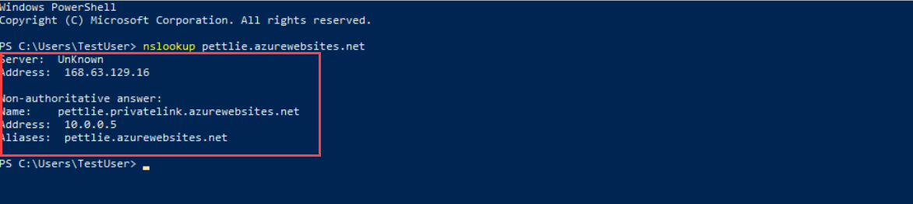
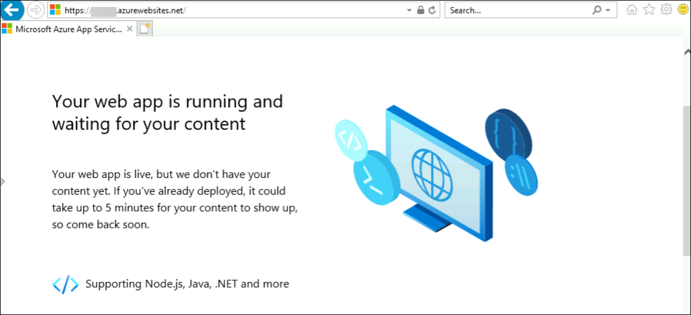

# Module 07-Unit 6 Create an Azure private endpoint using Azure PowerShell

Get started with Azure Private Link by using a Private Endpoint to connect securely to an Azure web app. There are many ways to create Endpoints including Portal, CLI, PowerShell etc. 

**Note:** An **[interactive lab simulation](https://mslabs.cloudguides.com/guides/AZ-700%20Lab%20Simulation%20-%20Create%20an%20Azure%20private%20endpoint%20using%20Azure%20PowerShell)** is available that allows you to click through this lab at your own pace. You may find slight differences between the interactive simulation and the hosted lab, but the core concepts and ideas being demonstrated are the same.


In this exercise, you will:

+ Task 1: Deploy the prerequisite web app
+ Task 2: Create a virtual network and bastion host
+ Task 3: Create a test virtual machine
+ Task 4: Create a Private Endpoint
+ Task 5: Configure the private DNS zone
+ Task 6: Test connectivity to the Private Endpoint


## Estimated time: 45 minutes

## Task 1: Deploy the prerequisite web app

You'll create a Private Endpoint for an Azure web app and deploy a virtual machine to test the private connection.

Private Endpoints can be created for different kinds of Azure services, such as Azure SQL and Azure Storage.

- An Azure Web App with a PremiumV2-tier or higher app service plan deployed in your Azure subscription.

- Below steps will guide you through creating the required resource group and web app.

1. Find and open **parameters.json** from File explorer in **C:\AllFiles\AZ-700-Designing-and-Implementing-Microsoft-Azure-Networking-Solutions-prod\Allfiles\Exercises\M07** folder, open it in VS and find the line "value": "GEN-UNIQUE". Replace the placeholder GEN-UNIQUE string with a unique value for your webapp name and Save this change.

1. On the Azure portal, select the **Cloud shell** (**[>_]**)  button at the top of the page to the right of the search box. This opens a cloud shell pane at the bottom of the portal.

   

1. The first time you open the Cloud Shell, you may be prompted to choose the type of shell you want to use (*Bash* or *PowerShell*). If so, select **PowerShell**.

   

1. If you are prompted to create storage for your Cloud Shell, ensure your subscription is selected and click on **Show advanced settings**. Please make sure you have selected your resource group **CreatePrivateEndpointQS-rg-<inject key="DeploymentID" enableCopy="false"/>** and enter **blob<inject key="DeploymentID" enableCopy="false"/>** for the **Storage account** and enter **blobfileshare<inject key="DeploymentID" enableCopy="false"/>** for the  **File share** , then click on **Create Storage**.

1. On the toolbar of the Cloud Shell pane, select the **Upload/Download files** icon, in the drop-down menu, select **Upload** and upload the following files **template.json** and **parameters.json** from **C:\AllFiles\AZ-700-Designing-and-Implementing-Microsoft-Azure-Networking-Solutions-prod\Allfiles\Exercises\M07** into the Cloud Shell home directory one by one.

   **Note**: If you choose to install and use PowerShell locally, this example requires the Azure PowerShell module version 5.4.1 or later. Run ```Get-Module -ListAvailable Az``` to find the installed version. If you need to upgrade, see [Install Azure PowerShell module](https://docs.microsoft.com/en-us/powershell/azure/install-az-ps). If you're running PowerShell locally, you also need to run ```Connect-AzAccount``` to create a connection with Azure.


1. Deploy the following ARM templates to create the PremiumV2-tier Azure Web App needed for this exercise:

   **Important**: Please replace **CreatePrivateEndpointQS-rg**  with **CreatePrivateEndpointQS-rg-<inject key="DeploymentID" enableCopy="false"/>**

   ```powershell
   $RGName = "CreatePrivateEndpointQS-rg"
   
   New-AzResourceGroupDeployment -ResourceGroupName $RGName -TemplateFile template.json -TemplateParameterFile parameters.json
   ```

   **Note**: If you receive an error (for example while looking into the Deployment status in the Portal) like "Website with given name GEN-UNIQUE already exists." please make sure to go to the step 1 mentioned above regarding editing the template.

## Task 2: Create a virtual network and bastion host

You'll create a virtual network, subnet, and bastion host.

The bastion host will be used to connect securely to the virtual machine for testing the Private Endpoint.

Create a virtual network and bastion host with:

- New-AzVirtualNetwork

- New-AzPublicIpAddress

- New-AzBastion

**Important**: Please replace **CreatePrivateEndpointQS-rg**  with **CreatePrivateEndpointQS-rg-<inject key="DeploymentID" enableCopy="false"/>**

```PowerShell
## Create backend subnet config. ##

$subnetConfig = New-AzVirtualNetworkSubnetConfig -Name myBackendSubnet -AddressPrefix 10.0.0.0/24

## Create Azure Bastion subnet. ##

$bastsubnetConfig = New-AzVirtualNetworkSubnetConfig -Name AzureBastionSubnet -AddressPrefix 10.0.1.0/24

## Create the virtual network. ##

$parameters1 = @{

 Name = 'MyVNet'

 ResourceGroupName = 'CreatePrivateEndpointQS-rg'

 Location = 'eastus'

 AddressPrefix = '10.0.0.0/16'

 Subnet = $subnetConfig, $bastsubnetConfig

}

$vnet = New-AzVirtualNetwork @parameters1

## Create public IP address for bastion host. ##

$parameters2 = @{

 Name = 'myBastionIP'

 ResourceGroupName = 'CreatePrivateEndpointQS-rg'

 Location = 'eastus'

 Sku = 'Standard'

 AllocationMethod = 'Static'

}

$publicip = New-AzPublicIpAddress @parameters2

## Create bastion host ##

$parameters3 = @{

 ResourceGroupName = 'CreatePrivateEndpointQS-rg'

 Name = 'myBastion'

 PublicIpAddress = $publicip

 VirtualNetwork = $vnet

}

New-AzBastion @parameters3
```

## Task 3: Create a test virtual machine

In this section, you'll create a virtual machine that will be used to test the Private Endpoint.

Create the virtual machine with the following commands:

- Get-Credential (Note: You will be prompted to provide an Admin password.)

- New-AzNetworkInterface

- New-AzVM

- New-AzVMConfig

- Set-AzVMOperatingSystem

- Set-AzVMSourceImage

- Add-AzVMNetworkInterface

**Important**: Please replace **CreatePrivateEndpointQS-rg**  with **CreatePrivateEndpointQS-rg-<inject key="DeploymentID" enableCopy="false"/>**

```PowerShell
## Set credentials for server admin and password. ##

$cred = Get-Credential

## Command to get virtual network configuration. ##

$vnet = Get-AzVirtualNetwork -Name myVNet -ResourceGroupName CreatePrivateEndpointQS-rg

## Command to create network interface for VM ##

$parameters1 = @{

 Name = 'myNicVM'

 ResourceGroupName = 'CreatePrivateEndpointQS-rg'

 Location = 'eastus'

 Subnet = $vnet.Subnets[0]

}

$nicVM = New-AzNetworkInterface @parameters1

## Create a virtual machine configuration.##

$parameters2 = @{

 VMName = 'myVM'

 VMSize = 'Standard_DS1_v2'

}

$parameters3 = @{

 ComputerName = 'myVM'

 Credential = $cred

}

$parameters4 = @{

 PublisherName = 'MicrosoftWindowsServer'

 Offer = 'WindowsServer'

 Skus = '2019-Datacenter'

 Version = 'latest'

}

$vmConfig = New-AzVMConfig @parameters2 | Set-AzVMOperatingSystem -Windows @parameters3 | Set-AzVMSourceImage @parameters4 | Add-AzVMNetworkInterface -Id $nicVM.Id

## Create the virtual machine ##

New-AzVM -ResourceGroupName 'CreatePrivateEndpointQS-rg' -Location 'eastus' -VM $vmConfig 


```
**Note**: You will be prompted to provide UserName enter **TestUser** and Admin password enter **Pa55w.rd!!**

**Note**: Azure provides an ephemeral IP for Azure Virtual Machines which aren't assigned a public IP address, or are in the backend pool of an internal Basic Azure Load Balancer. The ephemeral IP mechanism provides an outbound IP address that isn't configurable.

**Note**: The ephemeral IP is disabled when a public IP address is assigned to the virtual machine or the virtual machine is placed in the backend pool of a Standard Load Balancer with or without outbound rules. If a Azure Virtual Network NAT gateway resource is assigned to the subnet of the virtual machine, the ephemeral IP is disabled.

**Note**: For more information on outbound connections in Azure, see Using Source Network Address Translation (SNAT) for outbound connections.

## Task 4: Create a Private Endpoint

In this section, you'll create the Private Endpoint and connection using:

- New-AzPrivateLinkServiceConnection

- New-AzPrivateEndpoint

**Important**: Please replace **CreatePrivateEndpointQS-rg**  with **CreatePrivateEndpointQS-rg-<inject key="DeploymentID" enableCopy="false"/>**

```PowerShell
## Place web app into variable. This assumes that only one web app exists in the resource group. ##

$webapp = Get-AzWebApp -ResourceGroupName CreatePrivateEndpointQS-rg

## Create Private Endpoint connection. ##

$parameters1 = @{

 Name = 'myConnection'

 PrivateLinkServiceId = $webapp.ID

 GroupID = 'sites'

}

$privateEndpointConnection = New-AzPrivateLinkServiceConnection @parameters1

## Place virtual network into variable. ##

$vnet = Get-AzVirtualNetwork -ResourceGroupName 'CreatePrivateEndpointQS-rg' -Name 'myVNet'

## Disable private endpoint network policy ##

$vnet.Subnets[0].PrivateEndpointNetworkPolicies = "Disabled"

$vnet | Set-AzVirtualNetwork

## Create private endpoint

$parameters2 = @{

 ResourceGroupName = 'CreatePrivateEndpointQS-rg'

 Name = 'myPrivateEndpoint'

 Location = 'eastus'

 Subnet = $vnet.Subnets[0]

 PrivateLinkServiceConnection = $privateEndpointConnection

}

New-AzPrivateEndpoint @parameters2 
```

## Task 5: Configure the private DNS zone

In this section you'll create and configure the private DNS zone using:

- New-AzPrivateDnsZone

- New-AzPrivateDnsVirtualNetworkLink

- New-AzPrivateDnsZoneConfig

- New-AzPrivateDnsZoneGroup

**Important**: Please replace **CreatePrivateEndpointQS-rg**  with **CreatePrivateEndpointQS-rg-<inject key="DeploymentID" enableCopy="false"/>**

```PowerShell
## Place virtual network into variable. ##

$vnet = Get-AzVirtualNetwork -ResourceGroupName 'CreatePrivateEndpointQS-rg' -Name 'myVNet'

## Create private dns zone. ##

$parameters1 = @{

 ResourceGroupName = 'CreatePrivateEndpointQS-rg'

 Name = 'privatelink.azurewebsites.net'

}

$zone = New-AzPrivateDnsZone @parameters1

## Create dns network link. ##

$parameters2 = @{

 ResourceGroupName = 'CreatePrivateEndpointQS-rg'

 ZoneName = 'privatelink.azurewebsites.net'

 Name = 'myLink'

 VirtualNetworkId = $vnet.Id

}

$link = New-AzPrivateDnsVirtualNetworkLink @parameters2

## Create DNS configuration ##

$parameters3 = @{

 Name = 'privatelink.azurewebsites.net'

 PrivateDnsZoneId = $zone.ResourceId

}

$config = New-AzPrivateDnsZoneConfig @parameters3

## Create DNS zone group. ##

$parameters4 = @{

 ResourceGroupName = 'CreatePrivateEndpointQS-rg'

 PrivateEndpointName = 'myPrivateEndpoint'

 Name = 'myZoneGroup'

 PrivateDnsZoneConfig = $config

}

New-AzPrivateDnsZoneGroup @parameters4 
```

## Task 6: Test connectivity to the Private Endpoint

In this section, you'll use the virtual machine you created in the previous step to connect to the web app across the Private Endpoint.

1. On Azure Portal page, in **Search resources, services and docs (G+/)**, enter **Resource groups**, and then select **Resource groups** under services.

1. Select **CreatePrivateEndpointQS-rg-<inject key="DeploymentID" enableCopy="false"/>**.

1. Select **myVM**.

1. On the overview page for **myVM**, select **Connect**.

1. Select the blue **Go to Bastion** button.

1. Enter the username **TestUser** and password **Pa55w.rd!!** that you entered during the virtual machine creation, If popup blocker is preventing the new window, select allow popup blocker and Connect again.

1. Within **myVM** open Windows PowerShell on the server after you connect.

1. Enter nslookup &lt;your- webapp-name&gt;.azurewebsites.net. Replace &lt;your-webapp-name&gt; with the name of the web app you created in the previous steps. You'll receive a message similar to what is displayed below:

     ```
     Server: UnKnown
     
     Address: 168.63.129.16
     
     Non-authoritative answer:
     
     Name: mywebapp8675.privatelink.azurewebsites.net
     
     Address: 10.0.0.5
     
     Aliases: mywebapp8675.azurewebsites.net 
     ```  

     

1. A private IP address of **10.0.0.5** is returned for the web app name. This address is in the subnet of the virtual network you created previously.

1. In the bastion connection to **myVM**, open Internet Explorer.
   
1. Enter the url of your web app, **https://&lt;your-webapp-name&gt;.azurewebsites.net**
   
1. You'll receive the default web app page if your application hasn't been deployed:
 
   

1. Close the connection to **myVM**. 

## You have successfully completed the lab.
