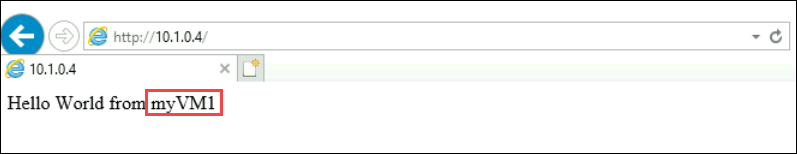
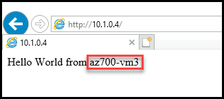

# Module 08-Unit 3 Monitor a load balancer resource using Azure Monitor

## Lab scenario
In this lab, you will create an internal load balancer for the fictional Contoso Ltd organization. Then you will create a Log Analytics workspace, and use Azure Monitor Insights to view information about your internal load balancer. You will view the Functional Dependency View, then view detailed metrics for the load balancer resource, and view resource health information for the load balancer. Finally, you will configure the load balancer's diagnostic settings to send metrics to the Log Analytics workspace you created. 

>**Note:** An **[interactive lab simulation](https://mslabs.cloudguides.com/guides/AZ-700%20Lab%20Simulation%20-%20Monitor%20a%20load%20balancer%20resource%20using%20Azure%20Monitor)** is available that allows you to click through this lab at your own pace. You may find slight differences between the interactive simulation and the hosted lab, but the core concepts and ideas being demonstrated are the same.


>**Note:** You may find slight differences between the instructions and the Azure portal interface, but the core concept is the same. 

## Lab objectives
In this lab, you will complete the following tasks:

+ Task 1: Create the virtual network
+ Task 2: Create the load balancer
+ Task 3: Create a backend pool
+ Task 4: Create a health probe
+ Task 5: Create a load balancer rule
+ Task 6: Create backend servers
+ Task 7: Add VMs to the backend pool
+ Task 8: Install IIS on the VMs
+ Task 9: Test the load balancer
+ Task 9.1: Create test VM
+ Task 9.2: Connect to the test VM to test the load balancer
+ Task 10: Create a Log Analytics Workspace
+ Task 11: Use Functional Dependency View
+ Task 12: View detailed metrics
+ Task 13: View resource health
+ Task 14: Configure diagnostic settings


## Estimated time: 55 minutes

## Architecture diagram


### Task 1: Create the virtual network

In this section, you will create a virtual network and a subnet.

1. On the Azure portal home page, in **Search resources, services and docs** search for **Virtual Networks** and select virtual networks.

1. Select **+ Create**.

1. On the **Basics** tab, use the information in the table below to create the virtual network.

   | **Setting**    | **Value**                                           |
   | -------------- | --------------------------------------------------- |
   | Subscription   | Select your subscription                            |
   | Resource group | Select **IntLB-RG-<inject key="DeploymentID" enableCopy="false"/>**   |
   | Name           | **IntLB-VNet**                                      |
   | Region         | **<inject key="Region" enableCopy="false"/>**                                   |

1. Select **Next**.

1. On **Enable Azure Bastion** select the checkbox, then enter the information from the table below.

    | **Setting**                       | **Value**                                              |
    | --------------------------------- | ------------------------------------------------------ |
    | Azure Bastion host name                      | **myBastionHost**                                      |
    | Azure Bastion Public IP address                 | Select **Create a public IP address** > Name: **myBastionIP** > select **OK** |
   
1. Select **Next**.

1. On the **IP addresses** tab, click on  **Add IPv4 address space** box, and in new **IPV4 address space**, enter **10.1.0.0/16**.

1. Select **+ Add a subnet**.

1. On the **Add a subnet** pane, provide a subnet name of **myBackendSubnet**, and a subnet address range of **10.1.0.0/24**.

1. Select **Add**.

1. Select **Review + create**.

1. Select **Create**.

   >**Note:** The deployment will take time.

   > **Congratulations** on completing the task! Now, it's time to validate it. Here are the steps:
   > - Navigate to the Lab Validation Page, from the upper right corner in the lab guide section.
   > - Hit the Validate button for the corresponding task. You can proceed to the next task if you receive a success message.
   > - If not, carefully read the error message and retry the step, following the instructions in the lab guide.
   > - If you need any assistance, please contact us at labs-support@spektrasystems.com. We are available 24/7 to help you out.

### Task 2: Create the load balancer

In this section, you will create an internal Standard SKU load balancer. The reason we are creating a Standard SKU load balancer here in the exercise, instead of a Basic SKU load balance, is for later exercises that require a Standard SKU version of the load balancer.

1.  On the Azure home page, in the search bar, enter **Load Balancer** and select **Load Balancer**.

1.  Select **+ Create** on the **Load Balancer** page.

1.  On the **Basics** tab, use the information in the table below to create the load balancer.
    

      | **Setting**           | **Value**                |
      | --------------------- | ------------------------ |
      | Subscription          | Select your subscription |
      | Resource group        | Select IntLB-RG-<inject key="DeploymentID" enableCopy="false"/>              |
      | Name                  | **myIntLoadBalancer**    |
      | Region                | **<inject key="Region" enableCopy="false"/>**         |
      | SKU                   | **Standard**             |
      | Type                  | **Internal**             |

1. Select **Next : Frontend IP configurations**.

   | **Setting**           | **Value**                |
   | --------------------- | ------------------------ |
   |          |             | 
   | Frontend IP configuration tab | + Add a frontend IP configuration |
   | Name                  | **LoadBalancerFrontEnd** |
   | Virtual network       | **IntLB-VNet**           |
   | Subnet                | **myBackendSubnet**      |
   | IP address assignment | **Dynamic**              |

1. Select **Add**.

1. Select **Review + create**.
   
1. Select **Create**.

   > **Congratulations** on completing the task! Now, it's time to validate it. Here are the steps:
   > - Navigate to the Lab Validation Page, from the upper right corner in the lab guide section.
   > - Hit the Validate button for the corresponding task. You can proceed to the next task if you receive a success message.
   > - If not, carefully read the error message and retry the step, following the instructions in the lab guide.
   > - If you need any assistance, please contact us at labs-support@spektrasystems.com. We are available 24/7 to help you out.

### Task 3: Create a backend pool

The backend address pool contains the IP addresses of the virtual NICs connected to the load balancer.

1. On the Azure portal home page, select **All resources**, under **resources** section, select **myIntLoadBalancer** from the resources list.

   

1. From left-hand navigation pane, under **Settings**, select **Backend pools**, and then select **+ Add**.

1. On the **Add backend pool** page, enter the information from the table below.

   | **Setting**     | **Value**            |
   | --------------- | -------------------- |
   | Name            | **myBackendPool**    |
   | Virtual network | **IntLB-VNet**       |
   | Backend Pool Configuration   | **NIC** |

1. Select **Save**.

   > **Congratulations** on completing the task! Now, it's time to validate it. Here are the steps:
   > - Navigate to the Lab Validation Page, from the upper right corner in the lab guide section.
   > - Hit the Validate button for the corresponding task. You can proceed to the next task if you receive a success message.
   > - If not, carefully read the error message and retry the step, following the instructions in the lab guide.
   > - If you need any assistance, please contact us at labs-support@spektrasystems.com. We are available 24/7 to help you out.

### Task 4: Create a health probe

The load balancer monitors the status of your app with a health probe. The health probe adds or removes VMs from the load balancer based on their response to health checks. Here you will create a health probe to monitor the health of the VMs.

1. From the **Backend pools** page of your load balancer, from left-hand navigation pane, under **Settings**, select **Health probes**, then select **+ Add**.

1. On the **Add health probe** page, enter the information from the table below.

   | **Setting**         | **Value**         |
   | ------------------- | ----------------- |
   | Name                | **myHealthProbe** |
   | Protocol            | **HTTP**          |
   | Port                | **80**            |
   | Path                | **/**             |
   | Interval            | **15**            |

1. Select **Save**.

   
 
   > **Congratulations** on completing the task! Now, it's time to validate it. Here are the steps:
   > - Navigate to the Lab Validation Page, from the upper right corner in the lab guide section.
   > - Hit the Validate button for the corresponding task. You can proceed to the next task if you receive a success message.
   > - If not, carefully read the error message and retry the step, following the instructions in the lab guide.
   > - If you need any assistance, please contact us at labs-support@spektrasystems.com. We are available 24/7 to help you out.


### Task 5: Create a load balancer rule

A load balancer rule is used to define how traffic is distributed to the VMs. You define the frontend IP configuration for the incoming traffic and the backend IP pool to receive the traffic. The source and destination port are defined in the rule. Here you will create a load balancer rule.

1. From the **Backend pools** page of your load balancer, from left-hand navigation pane, under **Settings**, select **Load balancing rules**, then select **+ Add**.

1. On the **Add load balancing rule** page, enter the information from the table below.

   | **Setting**            | **Value**                |
   | ---------------------- | ------------------------ |
   | Name                   | **myHTTPRule**           |
   | IP Version             | **IPv4**                 |
   | Frontend IP address    | **LoadBalancerFrontEnd** |
   | Backend pool           | **myBackendPool**        |
   | Protocol               | **TCP**                  |
   | Port                   | **80**                   |
   | Backend port           | **80**                   |
   | Health probe           | **myHealthProbe**        |
   | Session persistence    | **None**                 |
   | Idle timeout (minutes) | **15**                   |
   | Enable Floating IP            | **Unchecked**             |

1. Select **Save**.

### Task 6: Create backend servers

In this section, you will create three VMs for the backend pool of the load balancer, add the VMs to the backend pool, and then install IIS on the three VMs to test the load balancer.

1. On the Azure portal select the **Cloud shell** (**[>_]**)  button at the top of the page to the right of the search box. This opens a cloud shell pane at the bottom of the portal.

   

1. The first time you open the Cloud Shell, you may be prompted to choose the type of shell you want to use (*Bash* or *PowerShell*). If so, select **PowerShell**.

   
   
1. If you are prompted to create storage for your Cloud Shell, ensure your subscription is selected and click on **Show advanced settings**. Please make sure you have selected your resource group **IntLB-RG-<inject key="DeploymentID" enableCopy="false"/>** and enter **blob<inject key="DeploymentID" enableCopy="false"/>** for the **Storage account** and enter **blobfileshare<inject key="DeploymentID" enableCopy="false"/>** for the  **File share** , then click on **Create Storage**.

1. On the toolbar of the Cloud Shell pane, select the **Upload/Download files** icon, in the drop-down menu, select **Upload** and upload the following files **azuredeploy.json**, **azuredeploy.parameters.vm1.json**, **azuredeploy.parameters.vm2.json** and **azuredeploy.parameters.vm3.json** into the Cloud Shell home directory one by one from the source folder **C:\AllFiles\AZ-700-Designing-and-Implementing-Microsoft-Azure-Networking-Solutions-prod\Allfiles\Exercises\M08**.

   

1. Deploy the following ARM templates to create the virtual network, subnets, and VMs needed for this exercise:

    **Important**: Please replace IntLB-RG-DID with **IntLB-RG-<inject key="DeploymentID" enableCopy="false"/>**

   ```powershell
   $RGName = "IntLB-RG-DID"
   
   New-AzResourceGroupDeployment -ResourceGroupName $RGName -TemplateFile azuredeploy.json -TemplateParameterFile azuredeploy.parameters.vm1.json
   New-AzResourceGroupDeployment -ResourceGroupName $RGName -TemplateFile azuredeploy.json -TemplateParameterFile azuredeploy.parameters.vm2.json
   New-AzResourceGroupDeployment -ResourceGroupName $RGName -TemplateFile azuredeploy.json -TemplateParameterFile azuredeploy.parameters.vm3.json
   ```
  
1. You will be prompted to provide an Admin password. Provide Admin password Password: **Pa55w.rd!!**
     
   > **Note:** This will take several minutes to deploy and and you will be prompted to provide password for three times for 
    each VM deployment. When deployment completed, close the powershell.

   > **Congratulations** on completing the task! Now, it's time to validate it. Here are the steps:
   > - Navigate to the Lab Validation Page, from the upper right corner in the lab guide section.
   > - Hit the Validate button for the corresponding task. You can proceed to the next task if you receive a success message.
   > - If not, carefully read the error message and retry the step, following the instructions in the lab guide.
   > - If you need any assistance, please contact us at labs-support@spektrasystems.com. We are available 24/7 to help you out.

### Task 7: Add VMs to the backend pool

1. On the Azure portal home page, select **All resources**, under **Resources**, select **myIntLoadBalancer** from the resources list.

1. From the left-hand navigation pane, under **Settings**, select **Backend pools**, and then select **myBackendPool**.

1. Under IP Configuration, click **+ Add**.
  
1. Select the checkboxes for all 3 VMs (**myVM1**, **myVM2**, and **myVM3**), then select **Add**.

1. On the **myBackendPool** page, select **Save**.
 
### Task 8: Install IIS on the VMs

1. On the Azure portal home page, search for **Virtual machines**, select **Virtual machines**, select **myVM1**.

1. On the **Overview** page, select **Connect**, under **Configured connection** section, select **Go to Bastion**.

1. In the **Username** box, enter **TestUser** and in the **Password** box, enter the password you provided during deployment, then select **Connect**.

   >**Note:** If an error appears, which says **A popup blocker is preventing new window from opening. Please allow popups and retry.** TOn the top of the page, select the box, which says **Always allows pop-ups and redirects from https://portal.azure.com**, and select **Done**. Repeat step-9.

1. The **myVM1** window will open in another browser tab.

   >**Note:** Select **Allow**, on the pop-up which says, **See text and images copied to the clipboard**.

1. If a **Networks** pane appears, select **Yes**. Minimize the **Server Manager** page.

1. Select the **Windows Start icon** in the bottom left corner of the window, then select the **Windows PowerShell** tile.

    **Note** : Kindly use **>>** icon clipboard within bastion session to copy and paste the commands into poweeshell.

1. To install IIS, run the following command in PowerShell: 

   ```powershell
   Install-WindowsFeature -name Web-Server -IncludeManagementTools
   ```

1. To remove the existing default web home page, run the following command in PowerShell: 

   ```powershell
   Remove-Item C:\inetpub\wwwroot\iisstart.htm
   ```

1. To add a new default web home page and add content to it, run the following command in PowerShell: 

   ```powershell
   Add-Content -Path "C:\inetpub\wwwroot\iisstart.htm" -Value $("Hello World from " + $env:computername)
   ```

1. Close the Powershell session.

1. Close the Bastion session **myVM1** by closing the browser tab.

1. Repeat steps 1-11 above twice more to install IIS and the updated default home page on the **myVM2** and **myVM3** virtual machines.

### Task 9: Test the load balancer

In this section, you will create a test VM, and then test the load balancer.

#### Task 9.1: Create test VM

> **Note:** You may find slight differences between the instructions and the Azure portal interface, but the core concept is the same. 

1. On the Azure home page, in **Search resources, services, and docs**, enter **Virtual Machines** and select virtual machines. 

1. Select **+ Create > Azure virtual machine**, on the **Basics** tab, use the information in the table below to create the first VM.

   | **Setting**          | **Value**                                    |
   | -------------------- | -------------------------------------------- |
   | Subscription         | Select your subscription                     |
   | Resource group       | **IntLB-RG-<inject key="DeploymentID" enableCopy="false"/>**                                 |
   | Virtual machine name | **myTestVM**                                 |
   | Region               |  **<inject key="Region" enableCopy="false"/>**                            |
   | Availability options | **No infrastructure redundancy required**    |
   | Image                | Select **configure VM generation**, select **Generation 1**, select **Apply**. Now, select **Windows Server 2019 Datacenter - Gen 1**   |
   | Size                 | **Standard_DS2_v3 - 2 vcpu, 8 GiB memory** |
   | Username             | **TestUser**                                 |
   | Password             | **Provide a secure password**                |
   | Confirm password     | **Provide a secure password**                |

1. Select **Next : Disks >**, then select **Next : Networking**. 

1. On the **Networking** tab, use the information in the table below to configure networking settings.

   | **Setting**                                                  | **Value**                     |
   | ------------------------------------------------------------ | ----------------------------- |
   | Virtual network                                              | **IntLB-VNet**                |
   | Subnet                                                       | **myBackendSubnet**           |
   | Public IP                                                    | Change to **None**            |
   | NIC network security group                                   | **Advanced**                  |
   | Configure network security group                             | Select the existing **myNSG** |
   | Load balancing                                               | **None** (or unchecked)       |

1. Select **Review + create**.

1. Select **Create**.

1. Wait for this last VM to be deployed before moving forward with the next task.

   > **Congratulations** on completing the task! Now, it's time to validate it. Here are the steps:
   > - Navigate to the Lab Validation Page, from the upper right corner in the lab guide section.
   > - Hit the Validate button for the corresponding task. You can proceed to the next task if you receive a success message.
   > - If not, carefully read the error message and retry the step, following the instructions in the lab guide.
   > - If you need any assistance, please contact us at labs-support@spektrasystems.com. We are available 24/7 to help you out.

#### Task 9.2: Connect to the test VM to test the load balancer

1. On the Azure portal home page, select **All resources**, under **Resources**, select **myIntLoadBalancer** from the resources list.

1. On the **Overview** page, make a note of the **Private IP address**, or copy it to the clipboard. 

   >**Note:** you may have to select **See more** to see the **Private IP address**.

1. Select **Home**, then on the Azure portal home page, from top left corner of page click **Show portal menu** and select **All resources**, under **Resources**, select **myTestVM** virtual machine that you just created.

1. On the **Overview** page, select **Connect**, under **Configured connection** section, select **Go to Bastion**.

1. In the **Username** box, enter **TestUser** and in the **Password** box, enter the password you created during **myTestVM** virtual machine deployment, then 
   select **Connect**.

   >**Note:** If an error appears, which says **A popup blocker is preventing new window from opening. Please allow popups and retry.** On the top of the page, select the box, which says **Always allows pop-ups and redirects from https://portal.azure.com**, and select **Done**. Repeat step-5.

1. The **myTestVM** window will open in another browser tab.

1. If a **Networks** pane appears, select **Yes**. Minimize the **Server manager** page.

1. Select the **Internet Explorer** icon in the task bar to open the web browser.

1. Select **OK** on the **Set up Internet Explorer 11** dialog box.

1. Enter (or paste) the **Private IP address** (e.g. 10.1.0.4) from the previous step into the address bar of the browser and press Enter.

1. The default web home page of the IIS Web server is displayed in the browser window. One of the three virtual machines in the backend pool will respond.
   
   

1. If you select the refresh button in the browser a few times, you will see that the response comes randomly from the different VMs in the backend pool of the internal load balancer.

   

1. Close the **myTestVM** browser tab.

### Task 10: Create a Log Analytics Workspace

1. On the Azure home page, in **Search resources, services, and docs**, enter **Log Analytics**, and select **Log Analytics workspaces** from the filtered list.

1. Select **+ Create**. 

1. On the **Create Log Analytics workspace** page, on the **Basics** tab, use the information in the table below to create the workspace.

   | **Setting**    | **Value**                |
   | -------------- | ------------------------ |
   | Subscription   | Select your subscription |
   | Resource group | **IntLB-RG-<inject key="DeploymentID" enableCopy="false"/>**             |
   | Name           | **myLAworkspace**        |
   | Region         | **West US**              |

1. Select **Review + Create**, then select **Create**.

   > **Congratulations** on completing the task! Now, it's time to validate it. Here are the steps:
   > - Navigate to the Lab Validation Page, from the upper right corner in the lab guide section.
   > - Hit the Validate button for the corresponding task. You can proceed to the next task if you receive a success message.
   > - If not, carefully read the error message and retry the step, following the instructions in the lab guide.
   > - If you need any assistance, please contact us at labs-support@spektrasystems.com. We are available 24/7 to help you out.

### Task 11: Use Functional Dependency View

1. On the Azure portal home page, select **All resources**, under **Resources**, select **myIntLoadBalancer**.

1. From the left-hand navigation pane, under **Monitoring**, select **Insights**.

1. This page view is known as Functional Dependency View, and in this view, you get a useful interactive diagram, which illustrates the topology of the selected network resource - in this case a load balancer. For Standard Load Balancers, your backend pool resources are color-coded with Health Probe status indicating the current availability of your backend pool to serve traffic.

1. Use the **Zoom In (+)** and **Zoom Out (-)** buttons in the bottom right corner of the page, to zoom in and out of the topology diagram (alternatively you can use your mouse wheel if you have one). You can also drag the topology diagram around the page to move it.

1. Hover over the **LoadBalancerFrontEnd** component in the diagram, then hover over the **myBackendPool** component. 

1. Notice that you can use the links in these pop-up windows to view information about these load balancer components and open their respective Azure portal blades.

1. To download a .SVG file copy of the topology diagram, select **Download topology**, and save the file in your **Downloads** folder. 

1. In the top right corner, select **View metrics** to reopen the metrics pane on the right-hand side of the screen.

1. The Metrics pane provides a quick view of some key metrics for this load balancer resource, in the form of bar and line charts. 

### Task 12: View detailed metrics

1. To view more comprehensive metrics for this network resource, select **View detailed metrics**.

1. This opens a large full **Metrics** page in the Azure Network Insights platform. The first tab you land on is the **Overview** tab, which shows the availability status of the load balancer and overall Data Throughput and Frontend and Backend Availability for each of the Frontend IPs attached to your Load Balancer. These metrics indicate whether the Frontend IP is responsive and the compute instances in your Backend Pool are individually responsive to inbound connections.

1. Select the **Frontend &amp; Backend Availability** tab and scroll down the page to see the Health Probe Status charts. If you see **values that are lower than 100** for these items, it indicates an outage of some kind on those resources.

1. Select the **Data Throughput** tab and scroll down the page to see the other data throughput charts.

1. Hover over some of the data points in the charts, and you will see that the values change to show the exact value at that point in time.

1. Select the **Flow Distribution** tab and scroll down the page to see the charts under the **VM Flow Creation and Network Traffic** section. 

### Task 13: View resource health

1. To view the health of your Load Balancer resources, on the Azure home page, in **Search resources, services, and docs**, enter **Monitor** and select **Monitor**.

1. On the **Monitor | Overview** page, in the left-hand menu select **Service Health**.

1. On the **Service Health | Service issues** page, in the left-hand menu select **Resource Health**.

1. On the **Service Health | Resource health** page, in the **Resource type** drop-down list, scroll down the list and select **Load balancer**.

1. Then select the name of your load balancer from the list.

1. The **Resource health** page will identify any major availability issues with your load balancer resource. If there are any events under the **Health History** section, you can expand the health event to see more detail about the event. You can even save the detail about the event as a PDF file for later review and for reporting.

 
### Task 14: Configure diagnostic settings

1. On the Azure portal home page, under **Resources**, select **myIntLoadBalancer**.

1. From left-hand navigation menu, under **Monitoring**, select **Diagnostic settings**, then select **+ Add diagnostic setting**.

1. On the **Diagnostic setting** page, in the name box, enter **myLBDiagnostics**.

1. Select the **AllMetrics** checkbox, then select the **Send to Log Analytics workspace** checkbox.

1. Select your subscription from the list, then select **myLAworkspace <inject key="Region" enableCopy="false"/>** from the workspace drop-down list.

1. Select **Save**.

### Review
In this lab, you have completed:
- Created the virtual network
- Created the load balancer
- Created a backend pool
- Created a health probe
- Created a load balancer rule
- Created backend servers
- Added VMs to the backend pool
- Installed IIS on the VMs
- Tested the load balancer
- Created test VM
- Connected to the test VM to test the load balancer
- Created a Log Analytics Workspace
- Used Functional Dependency View
- Viewed detailed metrics
- Viewed resource health
- Configured diagnostic settings

### You have successfully completed the lab
